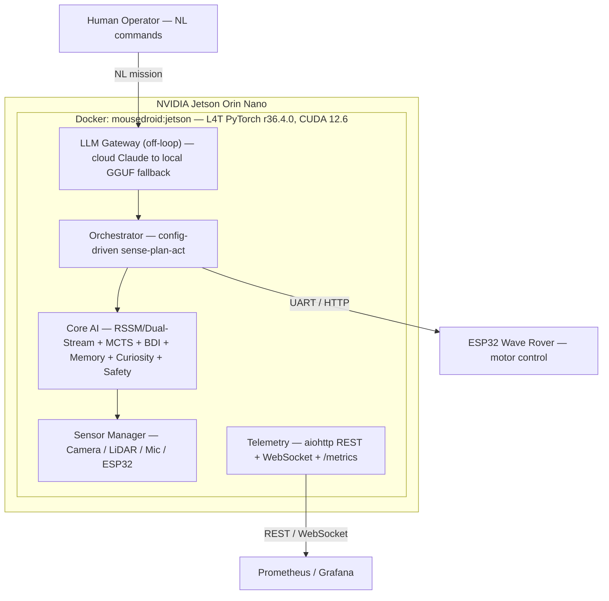

# MouseDroid

**An autonomous Star Wars MSE-6 "mouse droid" — real-time navigation and obstacle avoidance on an NVIDIA Jetson Orin Nano.**

*A hands-on edge-AI / robotics portfolio project.* A physical MSE-6 replica that senses, plans, and drives itself on constrained edge hardware, built around a config-driven 30 Hz sense–plan–act loop (RSSM latent dynamics → MCTS planning → ESP32 motor control), with a cloud/local LLM brain for natural-language missions running *outside* the real-time loop.

[](https://github.com/ianshank/mouse-droid-agi/actions/workflows/ci.yml)
[](scripts/check_branch_coverage.py)
[](LICENSE)
[](pyproject.toml)
[](docker-compose.jetson.yml)

## Contents

[Overview](#overview) · [Architecture](#architecture) · [Quick Start](#quick-start) · [Configuration](#configuration) · [MCP](#mcp--model-context-protocol) · [Project Structure](#project-structure) · [Design Principles](#design-principles) · [Training](#training) · [Testing](#testing) · [Deployment](#deployment) · [Roadmap](#roadmap) · [Contributing](#contributing) · [License](#license) · [Hardware BOM](#hardware-bom) · [Author](#author) · [Citation](#citation)

---

## Overview

MouseDroid is a physical MSE-6 droid replica that navigates autonomously, avoids obstacles, follows natural-language commands, and improves from experience — all on an NVIDIA Jetson Orin Nano.

The robot is built on a Waveshare Wave Rover chassis, controlled by an ESP32 microcontroller, and powered by a ribbon-connected CSI camera (IMX708 in the production build), USB LiDAR, and USB audio. All high-level reasoning runs on a Jetson Orin Nano. The chassis is driven over two axes — linear and angular — with no lateral axis and no wheel encoders; both facts are config contracts (`esp32.command_set`, `esp32.chassis_has_wheel_encoders`) rather than assumptions baked into the drivers.

The current production baseline is camera + LiDAR + USB audio + ESP32 on Jetson. The HC-SR04 ultrasonic path and the robot-arm platform remain parked outside the active delivery scope.

The Jetson validation path is aligned with the runtime path: smoke scripts, remote validation, and sensor verification all load the same config overlays and reuse the same factory-backed hardware checks as the application.

Planning and architecture docs live under `docs/planning/` and `docs/analysis/` to keep the repo root focused on runtime code and deployment assets. See [`docs/README.md`](docs/README.md) for the full documentation index.

### Cognitive stack

> **Design framing.** The cognitive stack is organised around a "10 Pillars of the Ideal
> Neural Network" research framing — an engineering compass, not a claim of general
> intelligence. Every module below is real, unit-tested code; the honest distinction is **what
> is wired into the running droid versus what is implemented but not yet in the loop.** (LOC
> figures are approximate non-test source lines — a rough maturity proxy, not a quality metric.)

#### Wired into the runtime loop

Built by `factory.py` and driven by the 30 Hz sense-plan-act orchestrator.

| Pillar | Module | What it does |
| ------ | ------ | ------------ |
| World Model | `world_model/` (+ `training/domain_randomization`) | Dual-Stream CfC/GRU RSSM latent dynamics + MCTS planning; per-episode sim-to-real domain randomization drives RSSM pretraining (~2.6k LOC) |
| Cognitive Architecture | `cognitive/` | Dual-cadence BDI + metacognitive loop (~1.2k LOC) |
| Continual Learning | `learning/` | EWC + progressive neural networks (~3.0k LOC) |
| Memory Systems | `memory/` | Working, episodic, semantic, consolidation (~0.6k LOC) |
| Reward Modelling | `reward/` | Constitutional multi-objective reward (~0.6k LOC) |
| Safety & Alignment | `safety/` | Constitutional RL + runtime safety monitor — joint limits, E-stop (~0.9k LOC) |
| Curiosity & Exploration | `curiosity/` | ICM intrinsic reward + novelty decay; wired via `build_curiosity_module` when memory is enabled (~0.3k LOC) |

#### Factory-instantiated, default-OFF pending a soak decision

Wired by `factory.py` (the builder is called, metrics-registered) but gated behind an
`Optional` config block that defaults `None` — same posture as on-device incremental learning
(M6). Byte-identical to pre-feature behaviour when the config block is absent.

| Pillar | Module | What it does |
| ------ | ------ | ------------ |
| Growth & Distillation | `growth/` | Regression-objective (MSE) knowledge distillation to a compact student policy (~0.1k LOC); `factory.py::build_growth_coordinator`. `KnowledgeDistiller` also supports a legacy KL+CE `"classification"` objective, but the wired call site passes `objective="regression"`. |

#### Implemented and unit-tested — not yet wired into the loop

Complete, tested modules (`tests/unit/{meta,scaling}/`) that exist as library code but are
not yet instantiated by the factory / orchestrator. The engineering is done; the integration is not.

| Pillar | Module | What it does |
| ------ | ------ | ------------ |
| Meta-Learning | `meta/` | MAML inner/outer loop + in-context adaptation (~0.2k LOC) |
| Scaling | `scaling/` | Sparse top-k Mixture-of-Experts + adaptive-compute halting (~0.2k LOC) |

#### Parked

| Platform | Module | Status |
| -------- | ------ | ------ |
| Robot-Arm Platform | `arm/` | Four-layer hierarchical manipulation (Tower of Hanoi → laundry sorting); implemented + tested, but outside the active delivery scope |

---

## Architecture



Full C4 diagrams (Context → Container → Component → Code) live in [`docs/architecture/c4-overview.md`](docs/architecture/c4-overview.md) and the comprehensive [Hardened Autonomous Architecture Guide](docs/architecture/autonomous-hardened-architecture.md).

**Runtime / validation alignment.** `src/mousedroid/validation/runtime.py` centralises config-overlay resolution and factory-backed checks for camera, mic, speaker, and LiDAR; the smoke and validate scripts reuse that same layer. The USB-C smoke gate, the cloud/local LLM gateway with pre-egress prompt-injection filtering, and the sim-first RSSM pretraining path all sit **outside** the 30 Hz reactive loop — sense-plan-act stays deterministic and LLM-free. See [`docs/runbooks/jetson-rover-smoke.md`](docs/runbooks/jetson-rover-smoke.md), [`docs/architecture/c4-usbc-smoke.md`](docs/architecture/c4-usbc-smoke.md), and [`docs/architecture/c4-llm-gateway.md`](docs/architecture/c4-llm-gateway.md).

---

## Quick Start

**Prerequisites:** Python 3.10+; an NVIDIA Jetson Orin Nano (or any Linux/Windows machine for mock mode).

```bash
# Install (choose extras as needed)
pip install -e .                    # base
pip install -e ".[hardware,jetson]" # Jetson drivers + TensorRT
pip install -e ".[dev]"             # pytest, coverage, ruff, mypy

# Run in mock mode (no hardware required)
MOUSEDROID_MOCK_HARDWARE=true mousedroid

# Health check
mousedroid --health-check --config config/default.yaml
```

**Docker (Jetson GPU):**

```bash
docker compose -f docker-compose.jetson.yml build
MOUSEDROID_MOCK_HARDWARE=true docker compose -f docker-compose.jetson.yml up -d
```

For NVMe SSD setup, pre-flight validation, Jetson smoke/validation, and the Ten Pillars campaign, see the operator guides: [`docs/deployment.md`](docs/deployment.md) and [`docs/runbooks/`](docs/runbooks/).

---

## Configuration

All settings live in `config/default.yaml` and are validated by Pydantic v2. Override with additional YAML overlays. **No values are hardcoded** — every threshold, dimension, pin, and rate is configurable.

| File | Purpose |
| ---- | ------- |
| `config/default.yaml` | All defaults (mock hardware, safe thresholds) |
| `config/jetson_production.yaml` | Jetson Orin Nano production overrides |
| `config/mock_hardware.yaml` | Mock hardware for CI/development |
| `config/jetson_dual_stream.yaml` | Jetson + dual-stream CfC/GRU world model |

**Deliberative LLM tier (`llm:` block).** The live cloud/local mission-translation tier is configured in `config/jetson_production.yaml`: `backend: "anthropic"` (Claude primary), `fallback_backend: "llama_cpp"` (local GGUF, off-network), and `fallback_retry_cooldown_s` to re-probe a degraded primary. The Anthropic key is **never** stored in YAML — supply it via `ANTHROPIC_API_KEY` or `MOUSEDROID_LLM__API_KEY`, set in `/etc/mousedroid/docker.env`. See [`docs/runbooks/jetson-claude-pilot-deploy.md`](docs/runbooks/jetson-claude-pilot-deploy.md).

---

## MCP — Model Context Protocol

The optional MCP server (`src/mousedroid/mcp/`) exposes the `ToolRegistry`, recent `TelemetryFrame`s, the log ring buffer, redacted `Settings`, and episodic-memory snapshots to any MCP client. It is **disabled by default** behind the `mcp` extras group.

```bash
pip install -e ".[mcp]"
MOUSEDROID_MCP__ENABLED=true MOUSEDROID_MOCK_HARDWARE=true \
    python -m mousedroid --config config/default.yaml
```

Non-loopback transports require `MOUSEDROID_MCP_TOKEN`. Full surface, resources, and a client example: [`docs/api-reference.md`](docs/api-reference.md) and [`docs/MCP_OPERATOR_GUIDE.md`](docs/MCP_OPERATOR_GUIDE.md).

---

## Project Structure

```text
src/mousedroid/
├── agents/         # Navigation agents (protocol + navigation impl)
├── arm/            # Robot-arm platform (PARKED): perception/planning/control/environments/hardware
├── cli/            # argparse CLI wrappers (preflight, validate_pillars)
├── cloud/          # Cloud/GCP integration (Vertex AI training, digital twin)
├── cognitive/      # Dual-cadence BDI + metacognitive loop
├── common/         # Shared utilities (common/tools/ registry, common/time)
├── comms/          # ESP32 drivers: serial, WiFi, mock
├── config/         # Pydantic settings schema + YAML loader (single source of truth)
├── curiosity/      # Intrinsic Curiosity Module (ICM)
├── diagnostics/    # Power-chain + USB-C smoke diagnostics
├── efficiency/     # TensorRT compilation, runtime profiler
├── experience/     # LMDB experience logger + record format
├── factory.py      # Dependency-injection wiring (only place concrete types are imported)
├── growth/         # Knowledge distillation (VLA teacher → compact student)
├── hardware/       # Camera, LiDAR, audio, motor, OLED-display drivers + protocols
├── harness/        # Agent harness — task tracker, hooks, journal, skills, HITL, replanner
├── health/         # Jetson health monitor (GPU temp/load)
├── learning/       # EWC + progressive nets + on-device incremental learning
├── llm_gateway/    # NL → GoalVector via cloud Claude / local llama_cpp failover (off-loop)
├── logging/        # structlog setup
├── main.py         # CLI entry point (mousedroid.main:cli_entry)
├── mcp/            # Model Context Protocol server (stdio/SSE/HTTP)
├── memory/         # Working, episodic, semantic memory + consolidation
├── meta/           # MAML + in-context meta-learning (not yet wired)
├── orchestrator/   # 30 Hz sense-plan-act loop
├── resilience/     # Circuit breaker + retry wrappers
├── reward/         # Constitutional multi-objective reward
├── safety/         # Constitutional monitor + runtime safety + Three Laws
├── scaling/        # Sparse MoE routing + adaptive compute (not yet wired)
├── security/       # Prompt-injection filter + secret hygiene
├── sensing/        # Sensor manager + fusion + observation bundle
├── sim/            # MuJoCo / Isaac Lab simulation backends
├── skills/         # Builtin skill specs (OpenClaw)
├── telemetry/      # aiohttp REST + WebSocket + Prometheus /metrics + frame builder
├── tools/          # Tool registry for agentic tool dispatch
├── training/       # In-package training helpers (real-episode replay loop)
├── utils/          # Misc shared helpers
├── validation/     # Preflight + 10-pillar validation + runtime checks + latency stats
├── vla/            # Vision-Language-Action policy protocol + teacher adapter
├── voice/          # Rocky voice engine (Piper TTS + speaker)
└── world_model/    # RSSM + Dual-Stream CfC/GRU RSSM, MCTS planner, bounded-context memory
```

Supporting trees: `config/` (YAML overlays + `prometheus/`, `grafana/`, `loki/`), `training/` (offline GPU pipeline), `tests/` (unit / integration / property / regression / e2e / hardware / performance / smoke), `scripts/` + `tools/`, and `docs/`, `deployments/`, `docker/`, `cloud/`, `openspec/`.

---

## Design Principles

- **Protocol-based DI** — components are `@runtime_checkable Protocol` interfaces; `factory.py` is the only place concrete types are imported.
- **Asyncio throughout** — all I/O is async; blocking calls run via `asyncio.to_thread()`. No threading primitives.
- **Structured logging** — `structlog` everywhere (JSON in production, coloured console in dev). Never `print()`.
- **Zero hardcoded values** — every pin, port, dimension, and threshold comes from the Pydantic schema.
- **Three Laws safety** — `safety/three_laws.py` encodes Asimov's Three Laws as hard constraints, integrated into the Constitutional-RL PPO loop via `ConstitutionalChecker`.

See [`docs/CHARTER.md`](docs/CHARTER.md) §4 for the full non-negotiable invariant list.

---

## Training

Offline training runs a 4-phase pipeline (outside the runtime loop, on a GPU host):

| Phase | Script | Description |
| ----- | ------ | ----------- |
| 2.1 | `train_rssm.py` | Pretrain RSSM world model on synthetic sequences |
| 2.1b | `train_dual_stream_rssm.py` | Dual-stream CfC/GRU RSSM pretraining (experimental) |
| 2.2 | `warmstart_policy.py` | Warm-start MCTS policy from latent stats + UCB tuning |
| 2.3a | `collect_annotations.py` | Collect labelled intention annotations |
| 2.3b | `train_bdi.py` | Train BDI sub-networks: Belief → Desire → Intention → Affect |
| 2.4 | `train_constitutional_rl.py` | PPO fine-tuning with Constitutional + Three Laws constraints |

```bash
# Full pipeline (phase 0 data → 1 RSSM → 2 warmstart → 3 BDI → 4 constitutional-RL)
python training/run_pipeline.py
python training/run_pipeline.py --phases 0,1                 # merged data + RSSM baseline
python training/run_pipeline.py --resume training/results/rssm_epoch_10.pt
python training/upload_weights.py --repo ianshank/mousedroid-weights
```

The optional **Dual-Stream CfC/GRU RSSM** (liquid-network hybrid; GRU slow stream + CfC fast reflex stream) is disabled by default (`cfc_hidden_dim=0`). Activation gate, training commands, and weight-pull config: [`docs/training.md`](docs/training.md).

---

## Testing

```bash
pytest tests/                                                  # all
pytest tests/ --cov=src/mousedroid --cov-report=term-missing   # with coverage
pytest tests/ -n auto                                          # fast parallel
pytest tests/unit/ tests/integration/ tests/regression/        # by category
```

The enforced gate is **90% line coverage** (`--cov-fail-under=90` repo-wide, plus
`scripts/check_branch_coverage.py` for changed files). Branch coverage is measured and
reported for `tools/claude_hooks/` only, where it is advisory until a baseline exists —
so it is deliberately not claimed as enforced here. Beyond lint/type/test, CI runs the sub-10-second smoke tier, `config-compat` (schema-drift), `actionlint` (workflow lint), a cyclomatic-complexity gate (`ruff C901`, max 15; [ADR-014](docs/architecture/ADR-014-cyclomatic-complexity-gate.md)), the `local-gates` job (settings identity, workforce-hooks mypy + coverage, skill validator, doc hygiene, ratchet-budget early warning), and an advisory performance tier (`.github/advisory_stages.yaml`). Full strategy: [`docs/testing.md`](docs/testing.md).

```bash
ruff check src/ tests/ tools/ && ruff format --check src/ tests/ tools/ && ruff check scripts/
mypy src/ --strict --ignore-missing-imports
```

---

## Deployment

```bash
sudo bash scripts/deploy_jetson.sh                                    # deploy to Jetson
cp scripts/mousedroid.service /etc/systemd/system/ && systemctl enable --now mousedroid
```

**No firmware flash is required.** The ESP32 runs stock Waveshare
`General_Driver` firmware and the host speaks its command set directly
(`esp32.command_set: waveshare_stock`). This repo ships no ESP32 firmware —
`scripts/flash_esp32.sh` is a bring-your-own-binary helper, not a build step,
and flashing is only relevant if you deliberately replace the vendor firmware.
See [`docs/architecture/c4-esp32-command-set.md`](docs/architecture/c4-esp32-command-set.md).

Full bring-up (probe-first ESP32, systemd/Docker service, watchdog): [`docs/deployment.md`](docs/deployment.md), [`docs/runbooks/jetson-full-bringup.md`](docs/runbooks/jetson-full-bringup.md), and 19-step deployment runbook: [`docs/planning/JETSON_DEPLOY_RUNBOOK.md`](docs/planning/JETSON_DEPLOY_RUNBOOK.md).

---

## Roadmap

The canonical forward roadmap is [`NEXT_STEPS.md`](NEXT_STEPS.md) (forward-looking only; landed work lives in [`CHANGELOG.md`](CHANGELOG.md), and machine-readable "what's next" is `features.yaml` + `python scripts/select_next.py`). Deeper planning: [`docs/planning/`](docs/planning/). Architecture index: [`docs/architecture/c4-overview.md`](docs/architecture/c4-overview.md).

---

## Contributing

See [`CONTRIBUTING.md`](CONTRIBUTING.md) for setup, quality gates, and workflow, and [`docs/CHARTER.md`](docs/CHARTER.md) for the project's invariants. Agentic contributors (Claude Code, subagents, MCP clients) should read [`AGENTS.md`](AGENTS.md) and [`SKILLS.md`](SKILLS.md) — the behavioural contracts for this repo. Security policy: [`SECURITY.md`](SECURITY.md).

---

## License

MIT License — see [LICENSE](LICENSE) for details.

---

## Hardware BOM

| Component | Part | Notes |
| --------- | ---- | ----- |
| SBC | NVIDIA Jetson Orin Nano 8GB | Primary compute |
| Storage | Samsung NVMe 500 GB SSD | Docker data + swap |
| Chassis | Waveshare Wave Rover | ESP32 onboard, stock `General_Driver` firmware; no wheel encoders, no lateral axis |
| Camera | IMX708 over Jetson CSI | Production build. The IMX500 AI Camera (onboard ML inference) is supported by the same `jetson_csi` backend but is not what the rover ships with. |
| LiDAR | FHL-LD19 360 2D | UART /dev/ttyUSB1, 230400 baud |
| Audio | Wonrabai USB Sound Card | Combo mic + 8 5W speaker |
| Battery | 3S LiPo 11.1V | Min cutoff 9.5V |

HC-SR04 support remains in the codebase but is not part of the active Jetson production baseline.

---

## Author

**Ian Cruickshank** — [github.com/ianshank](https://github.com/ianshank)

## Citation

If you use this project, please cite it — see [`CITATION.cff`](CITATION.cff).
