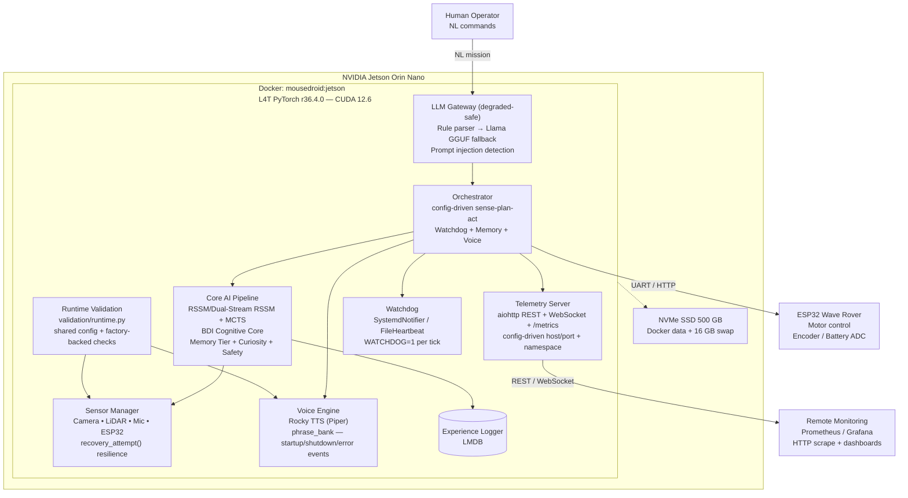

# MouseDroid

**An autonomous Star Wars MSE-6 "mouse droid" — real-time navigation and obstacle avoidance on an NVIDIA Jetson Orin Nano.**

*A hands-on edge-AI / robotics portfolio project.* A physical MSE-6 replica that senses, plans, and drives itself on constrained edge hardware, built around a config-driven 30 Hz sense–plan–act loop (RSSM latent dynamics → MCTS planning → ESP32 motor control), with a cloud/local LLM brain for natural-language missions running *outside* the real-time loop.

[](tests/)
[](scripts/check_branch_coverage.py)
[](pyproject.toml)
[](pyproject.toml)
[](pyproject.toml)
[](Dockerfile.jetson)
[](docker-compose.jetson.yml)
[](CHANGELOG.md)

---

## ▶ Demo

> **[ TODO — drop the 60-second clip here: the droid navigating and avoiding obstacles live on the Jetson. ]**
>
> This clip is the headline artifact — the first thing a reviewer should see. Host it as a
> **GitHub Release asset** or an external link (never commit the video into the repo, or it
> re-creates the exact history bloat this project just removed — see
> [`docs/runbooks/history-purge.md`](docs/runbooks/history-purge.md)), then embed the
> `user-images.githubusercontent.com/…/clip.mp4` URL right here so it renders inline.

---

## Overview

MouseDroid is a physical MSE-6 droid replica that navigates autonomously, avoids obstacles, follows natural-language commands, and improves from experience — all on an NVIDIA Jetson Orin Nano.

The robot is built on a Wave Rover mecanum-wheel chassis, controlled by an ESP32 microcontroller, and powered by a ribbon-connected Raspberry Pi AI Camera (IMX500), USB LiDAR, and USB audio. All high-level reasoning runs on a Jetson Orin Nano.

The current production baseline is camera + LiDAR + USB audio + ESP32 on Jetson. The HC-SR04 ultrasonic path and the robot-arm platform remain parked outside the active delivery scope.

The Jetson validation path is aligned with the runtime path: smoke scripts, remote validation, and sensor verification all load the same config overlays and reuse the same factory-backed hardware checks as the application.

Planning and architecture docs now live under `docs/planning/` and `docs/analysis/` to keep the repo root focused on runtime code and deployment assets.

### Cognitive stack

> **Design framing.** The cognitive stack is organised around a "10 Pillars of the Ideal
> Neural Network" research framing — an engineering compass, not a claim of general
> intelligence. Every module below is real, unit-tested code; the honest distinction is **what
> is wired into the running droid versus what is implemented but not yet in the loop.** (LOC
> figures are approximate non-test source lines — a rough maturity proxy, not a quality metric.)

#### Wired into the runtime loop

Built by `factory.py` and driven by the 30 Hz sense-plan-act orchestrator.

| Pillar | Module | What it does |
| ------ | ------ | ------------ |
| World Model | `world_model/` (+ `training/domain_randomization`) | Dual-Stream CfC/GRU RSSM latent dynamics + MCTS planning; per-episode sim-to-real domain randomization drives RSSM pretraining (~2.6k LOC) |
| Cognitive Architecture | `cognitive/` | Dual-cadence BDI + metacognitive loop (~1.2k LOC) |
| Continual Learning | `learning/` | EWC + progressive neural networks (~3.0k LOC) |
| Memory Systems | `memory/` | Working, episodic, semantic, consolidation (~0.6k LOC) |
| Reward Modelling | `reward/` | Constitutional multi-objective reward (~0.6k LOC) |
| Safety & Alignment | `safety/` | Constitutional RL + runtime safety monitor — joint limits, E-stop (~0.9k LOC) |
| Curiosity & Exploration | `curiosity/` | ICM intrinsic reward + novelty decay; wired via `build_curiosity_module` when memory is enabled (~0.3k LOC) |

#### Implemented and unit-tested — not yet wired into the loop

Complete, tested modules (`tests/unit/{meta,growth,scaling}/`) that exist as library code but are
not yet instantiated by the factory / orchestrator. The engineering is done; the integration is not.

| Pillar | Module | What it does |
| ------ | ------ | ------------ |
| Meta-Learning | `meta/` | MAML inner/outer loop + in-context adaptation (~0.2k LOC) |
| Growth & Distillation | `growth/` | KL+CE knowledge distillation to smaller models (~0.1k LOC) |
| Scaling | `scaling/` | Sparse top-k Mixture-of-Experts + adaptive-compute halting (~0.2k LOC) |

#### Parked

| Platform | Module | Status |
| -------- | ------ | ------ |
| Robot-Arm Platform | `arm/` | Four-layer hierarchical manipulation (Tower of Hanoi → laundry sorting); implemented + tested, but outside the active delivery scope |

---

## Architecture



See [docs/architecture.md](docs/architecture.md) for full C4 diagrams (Context → Container → Component → Code), including runtime validation/smoke alignment and CI quality-gate architecture.

### Runtime Validation Alignment

- `src/mousedroid/validation/runtime.py` centralises config overlay resolution and factory-backed runtime checks for camera, microphone, speaker, and LiDAR flows.
- `scripts/jetson_smoke_test.sh`, `scripts/jetson_validate.sh`, and `scripts/verify_sensors.py` now reuse that layer instead of resolving hardware paths independently.
- `JetsonCSICamera` falls back from the Jetson-native path to GStreamer and then V4L2 using config-driven `camera.device_path`.
- LD19 scan completeness is driven by config (`scan_acquisition_timeout_s`, `min_scan_coverage_deg`) and validated with the same coverage semantics the driver uses.
- **USB-C smoke gate (PR #106):** `python scripts/check_usbc_devices.py --config config/jetson_production.yaml` runs a fast, no-orchestrator probe asserting every `usbc_discovery.required_endpoints` entry resolves under `/dev/serial/by-id/`. The Jetson smoke pipeline runs this as a blocking stage before opening the serial port; `factory.py:_resolve_esp32_serial_via_usbc_discovery` auto-overrides a stale literal `esp32.serial_port` when the live by-id path differs (rover swap). Full operator runbook: [`docs/runbooks/jetson-rover-smoke.md`](docs/runbooks/jetson-rover-smoke.md). C4 component diagram: [`docs/architecture/c4-usbc-smoke.md`](docs/architecture/c4-usbc-smoke.md).
- **Power-chain probe (PR #106):** `src/mousedroid/diagnostics/power_chain.py:assert_power_chain` runs battery → send_velocity → emergency_stop and asserts the e-stop latency against `ESP32Config.emergency_stop_budget_ms`. Defaults to zero-velocity so an untethered rover does not roll while the smoke runs unattended — override via `MOUSEDROID_ESP32__SMOKE_TEST_ALLOW_MOTION=true` only when the rover is on rollers or tethered.
- **Anthropic Claude LLM gateway + cloud/local failover (PR #107 — now deployed live):** The deliberative mission-translation path (natural language → `GoalVector`) runs **live on the Jetson rover** with cloud Claude (Anthropic Messages API) as the primary NL→`GoalVector` translator and a local Phi-3-mini (`llama_cpp`) off-network fallback, composed by `FallbackLLMGateway`. **Invariant:** this tier sits entirely OUTSIDE the 30 Hz reactive control loop — RSSM → MCTS → ESP32 stays deterministic and LLM-free, so there is no LLM in the E-stop path. Install extras via `pip install -e ".[anthropic,llm]"`, and supply the key via `ANTHROPIC_API_KEY` env var (the SDK reads natively) or `MOUSEDROID_LLM__API_KEY` for `SecretStr` wrapping — never in YAML. The composite re-probes a degraded primary every `LLMConfig.fallback_retry_cooldown_s` (default 30 s) so a transient WAN dropout does not pin the rover to the local model. Verify the path live with the dry-run probe `python scripts/translate_mission.py --mission "patrol left then stop"`, which translates a single NL mission into a `GoalVector` through the real factory (no motors) and prints which tier served. Operator runbook: [`docs/runbooks/jetson-claude-pilot-deploy.md`](docs/runbooks/jetson-claude-pilot-deploy.md). C4 diagram: [`docs/architecture/c4-llm-gateway.md`](docs/architecture/c4-llm-gateway.md).
- **Sim-first RSSM world-model training (Physical-AI Phase 5 + vision fine-tune):** A MuJoCo (classic) skid-steer physics simulator (`rover.sim.backend: mujoco`) generates episodes that pretrain the RSSM dynamics core; a follow-on phase renders an RGB camera and extracts vision features (the deployed non-learned `MeanPoolExtractor` — no CNN trained) to fine-tune the model with vision ON, transferring the vision-OFF checkpoint via `checkpoint_migration`. Both phases are **opt-in** (`training.rssm_pretrain_enabled` / `training.rssm_vision_finetune_enabled`, default OFF) and run **offline, OUTSIDE the 30 Hz reactive loop** — the blocking torch loop runs in `asyncio.to_thread` so the thermal-pause safety check is never starved. Run via `python -m mousedroid.training.pipeline_orchestrator --config <training.yaml>`. C4 diagram: [`docs/architecture/c4-rssm-sim-pretraining.md`](docs/architecture/c4-rssm-sim-pretraining.md).

---

## Quick Start

### Prerequisites

- Python 3.10+
- NVIDIA Jetson Orin Nano (or any Linux/Windows machine for mock mode)
- Wave Rover chassis with ESP32 controller
- Raspberry Pi AI Camera IMX500 (optional — mock available)

### Installation

```bash
# Base install
pip install -e .

# With hardware drivers (Jetson only)
pip install -e ".[hardware]"

# With TensorRT acceleration (Jetson only)
pip install -e ".[hardware,jetson]"

# With local LLM
pip install -e ".[llm]"

# Development (includes pytest, coverage, ruff, mypy)
pip install -e ".[dev]"
```

### Docker Deployment (GPU — Jetson Only)

The L4T PyTorch container provides GPU-accelerated CUDA 12.6 on Jetson Orin Nano:

```bash
# Build the container image (first run pulls ~10 GB base)
docker compose -f docker-compose.jetson.yml build

# Start with GPU + mock hardware
MOUSEDROID_MOCK_HARDWARE=true docker compose -f docker-compose.jetson.yml up -d

# Verify GPU
docker exec mousedroid python3 -c "import torch; print(torch.cuda.is_available())"
# True

# Shell into container
docker exec -it mousedroid bash

# Or use the deploy script
sudo bash scripts/docker_deploy.sh
```

### NVMe SSD Setup (Recommended)

The Orin Nano has 8 GB shared RAM. For memory-intensive builds (e.g. llama-cpp-python CUDA compilation), the 500 GB NVMe SSD provides fast swap and Docker storage:

```bash
# Partition, format, mount SSD
sudo sfdisk /dev/nvme0n1 <<< ",,L"
sudo mkfs.ext4 -L ssd /dev/nvme0n1p1
sudo mkdir -p /mnt/ssd && sudo mount /dev/nvme0n1p1 /mnt/ssd

# Add to fstab for persistence
echo "/dev/nvme0n1p1 /mnt/ssd ext4 defaults,noatime 0 2" | sudo tee -a /etc/fstab

# Create 16 GB swap on SSD
sudo fallocate -l 16G /mnt/ssd/swapfile
sudo chmod 600 /mnt/ssd/swapfile && sudo mkswap /mnt/ssd/swapfile
sudo swapon /mnt/ssd/swapfile
echo "/mnt/ssd/swapfile none swap sw 0 0" | sudo tee -a /etc/fstab

# Move Docker data to SSD
sudo systemctl stop docker
sudo rsync -aP /var/lib/docker/ /mnt/ssd/docker/
# Set data-root in /etc/docker/daemon.json → "/mnt/ssd/docker"
sudo systemctl start docker
```

> See [ADR-l4t-container](docs/architecture/ADR-l4t-container.md) for architecture details.

### Run in Mock Mode (no hardware required)

```bash
MOUSEDROID_MOCK_HARDWARE=true mousedroid
# or
mousedroid --mock-hardware
```

### Health Check

```bash
mousedroid --health-check --config config/default.yaml
```

### Pre-Flight Validation

Before starting the service, validate all hardware is present. Two equivalent entry points:

```bash
# Bash entry point — coloured diagnostics, suitable for systemd ExecStartPre.
bash scripts/preflight_check.sh

# Override device paths if non-standard.
MOUSEDROID_ESP32_DEV=/dev/ttyUSB1 \
MOUSEDROID_CAMERA_DEV=/dev/video1 \
bash scripts/preflight_check.sh

# Python entry point — Pydantic-typed PreflightReport, machine-parseable.
python -m mousedroid.cli.preflight                     # text output
python -m mousedroid.cli.preflight --json              # JSON report
python -m mousedroid.cli.preflight --checks camera,esp32  # filter to subset
python -m mousedroid.cli.preflight --mock-hardware     # smoke wiring without devices

# Trend tracking — persist each run to a journal and flag run-over-run
# regressions (status downgrade / new FAIL / latency creep). Opt-in; exits 1
# on a detected regression. Sensitivity is operator-tunable (no hardcoded gate).
python -m mousedroid.cli.preflight --journal-path var/preflight_trend.jsonl
python -m mousedroid.cli.preflight --journal-path var/preflight_trend.jsonl --trend \
    --trend-slow-ratio 1.5 --trend-slow-floor-s 0.05
```

Both exit `0` when every check is `OK` or `WARN` (the latter is operator-actionable — e.g. CSI ribbon
disconnect — but not a stop ship). Exit `1` only on `FAIL` (real driver crash or missing device).
The systemd service units run the bash entry point automatically as `ExecStartPre`.

### Jetson Validation / Smoke

Use the shared runtime validation layer when checking a target Jetson from the host:

```bash
# Host-driven remote validation (select step: verify, pytest, smoke)
bash scripts/jetson_validate.sh ian@<jetson-ip> --step smoke

# Local sensor verification using the same runtime overlay resolution as the app
python scripts/verify_sensors.py --json

# Full hardware smoke (all stages inside the Docker container)
bash scripts/jetson_full_smoke_run.sh

# Full on-device validation (PR #116) — static CI -> cold-hardware -> warm-live,
# one timestamped report under reports/jetson_full_validation/<UTC>/SUMMARY.md
bash scripts/jetson_full_validation.sh            # all phases
bash scripts/jetson_full_validation.sh --phases 0,1,3  # an ordered subset
bash scripts/jetson_full_validation.sh --no-cache # force re-run cached static CI
bash scripts/jetson_full_validation.sh --dry-run  # print the plan, run nothing
bash scripts/jetson_full_validation.sh --help     # env tunables + selectors
```

The full-validation wrapper composes the smoke run together with `ci.sh`, the `preflight` /
`validate_pillars` CLIs, the live `/metrics` scrape, and the deliberative-gateway checks, following
the runbook's cold-then-warm discipline (it `docker stop`s the container for exclusive-device
sensor checks and always restarts it via a `trap`). It tolerates the functionally-dead ESP32
(serial/motor/power are non-blocking; no motion is armed) and has **no hardcoded values** — every
port/timeout/namespace is env-overridable. Phase 1 (static CI) is **cached on the committed
source SHA** — a clean tree unchanged since the last green run SKIPs it (`--no-cache` forces a
re-run); hardware/live phases are never cached. See `docs/runbooks/jetson-full-validation.md`.

**Latency-regression probes.** `tools/llm_latency_probe.py --iterations N` and
`tools/lidar_telemetry_probe.py` emit p50/p95/p99 summaries (gateway round-trip,
LiDAR→WebSocket frame jitter) via the pure `mousedroid.validation.latency_stats`
helper — turning single-shot presence checks into tail-latency gates. C4 component
diagram: [`docs/architecture/c4-validation-efficiency.md`](docs/architecture/c4-validation-efficiency.md).

Runtime overlays may be supplied explicitly or through `MOUSEDROID_CONFIGS` / `MOUSEDROID_JETSON_CONFIGS`, keeping smoke and validation paths aligned with deployed configuration.

> **Jetson deployment note**: when the system is managed via `scripts/mousedroid-docker.service`,
> the production overlay is synced automatically by `scripts/sync_jetson_overlay.sh` before
> `preflight_check.sh` runs. Manual copying is only needed for ad-hoc runs outside that service path.

### Ten Pillars Validation

The pillar-validation campaign verifies every cognitive pillar end-to-end on the Jetson — the
pytest test suite plus, for the pillars that expose a factory builder, a live in-container probe
(the remaining pillars validate via in-process pytest delegation):

```bash
# Run the full campaign (all 10 pillars, ~10 min on Jetson)
bash scripts/validate_pillar.sh all

# Run a single pillar (e.g. memory)
bash scripts/validate_pillar.sh memory

# Available pillars:
# world_model  cognitive  memory  continual  meta
# curiosity    growth     reward  scaling    safety
```

Each pillar run writes a row to `ten_pillars.log` (Markdown table) in the smoke run directory,
and the full SUMMARY.md produced by `scripts/jetson_full_smoke_run.sh` appends the table as a
`## Ten Pillars Validation` section.

**Latest campaign result** (`2026-04-26T23:55:42Z`): **Overall: PASS — 20/20 checks green**
(10 pytest stages + 10 factory probes; Jetson Orin Nano, CUDA 12.6, TensorRT 10.4.0).

See [docs/planning/TEN_PILLARS_VALIDATION.md](docs/planning/TEN_PILLARS_VALIDATION.md) for the
full operator validation plan, per-pillar pass criteria, and telemetry requirements.

#### Programmatic pillar dispatch (`validate_all_pillars`)

An async API + thin CLI mirroring the preflight entry points:

```bash
# Dry-run the dispatcher (CI-safe; lists every pillar as SKIPPED in ~µs).
python -m mousedroid.cli.validate_pillars --dry-run

# JSON report against a subset of pillars.
python -m mousedroid.cli.validate_pillars --pillars safety,world_model --json
```

Exit `0` on `OK` or `DEGRADED`; exit `1` only on `FAIL`. Six pillars (safety / world_model / memory /
cognitive / reward / curiosity) use Pattern A (factory-builder smoke); four (continual / meta /
scaling / growth) use Pattern B (in-process `pytest.main` delegation). The CLI runs as a CI gate
between typecheck and tests via `scripts/ci.sh`.

#### Telemetry-dashboard verification probe

When the operator wants to verify the dashboard data path on a live Jetson without standing up the
full orchestrator (e.g. when the rover is detached and the ESP32 / CSI aren't reachable):

```bash
# Spins up real LiDAR → publisher → telemetry server on port 8090, then connects a WS client.
docker exec mousedroid python3 /opt/mousedroid/tools/lidar_telemetry_probe.py
```

The probe binds a non-default port so it doesn't collide with the running orchestrator on `8080`,
and prints the per-frame `n_points` count for the first frames received. See
`SMOKE_REPORT.md` Addendum A for the live-Jetson run results.

### Spec-Driven Development Harness

A schema-validated feature catalog makes "done" mechanically checkable: a feature is
`done` only when its `validation_command` exits 0 under the runner — there is no
hand-set flag to game. This is an additive CI/agent tooling layer; the rover runtime
is untouched. See [`HARNESS_SPEC.md`](HARNESS_SPEC.md),
[`docs/architecture/ADR-012-spec-driven-harness.md`](docs/architecture/ADR-012-spec-driven-harness.md),
and [`docs/architecture/c4-spec-harness.md`](docs/architecture/c4-spec-harness.md).

```bash
# Pick the next feature to work on (honours the dependency DAG — don't eyeball features.yaml)
python scripts/select_next.py

# Validate the catalog + run every `done` feature's command for a tier
python scripts/validate.py --tier fast            # inner loop / every push
python scripts/validate.py --tier fast,slow       # nightly
python scripts/validate.py --check F-005          # a single feature, any tier
```

The enforcement logic lives in the importable, unit-tested module
`src/mousedroid/harness/spec.py` (100% covered); `scripts/validate.py` and
`scripts/select_next.py` are thin CLI shims. CI gates it via
`.github/workflows/harness.yml` (fast on push/PR, fast+slow nightly) and the fast
tier also runs in `scripts/ci.sh`. The `hardware` tier runs only on the self-hosted
Jetson runner.

### Rocky Voice Engine (Piper TTS)

The Rocky personality voice engine uses [Piper TTS](https://github.com/rhasspy/piper) for local neural synthesis. The Jetson Docker image bakes in the model at build time:

- **Model**: `en_US-lessac-medium.onnx` + `.onnx.json` (baked into Docker layer at build; non-fatal if HuggingFace is unreachable at build time)
- **Config**: `voice.enabled`, `voice.tts_model_path`, `voice.personality_to_model_map`,
  `voice.event_intensity_thresholds`, `voice.output_volume`, `voice.tts_sample_rate`, and
  `voice.cooldown_s` — all in `config/jetson_production.yaml`
- **Smoke status**: ✅ PASS — `voice | PASS` (39,424 audio samples generated, `20260425T192408Z`)

Events that trigger Rocky: startup, shutdown, obstacle detected, critical error, sensor recovery.

### Telemetry and Prometheus Metrics

The telemetry stack exposes both interactive APIs and Prometheus-compatible metrics:

```bash
# REST + websocket telemetry (default)
curl http://127.0.0.1:8080/api/v1/status

# Prometheus text exposition (includes memory, curiosity, LLM, voice metrics)
curl http://127.0.0.1:8080/metrics
```

`/metrics` names are derived from `cfg.metrics.namespace`, so metric naming is fully config-driven.

**LLM-gateway observability (PR #115).** The deliberative Claude tier exports four config-gated
families (gated by one flag, `MetricsConfig.track_llm_gateway`, default on; pure-add — absent until
first write):

```bash
curl -fsS http://127.0.0.1:8080/metrics \
  | grep -E 'mousedroid_llm_(tokens_total|gateway_latency_ms|gateway_served_total|latency_budget_exceeded_total)'
```

- `{ns}_llm_tokens_total{model,token_type}` — input/output token usage
- `{ns}_llm_gateway_latency_ms` — round-trip latency histogram
- `{ns}_llm_gateway_served_total{tier,outcome}` — cloud-vs-local served split
- `{ns}_llm_latency_budget_exceeded_total{model}` — fires on the `anthropic_gateway_slow` branch

Label values are validated against fixed low-cardinality sets (out-of-set values dropped), and the
budget threshold comes from `cfg.llm.latency_target_ms` — no hardcoded values. See
`docs/architecture/c4-llm-gateway.md` (Observability).

**Training experiment logging (MLflow).** The offline GPU pre-training pipeline can log params,
per-phase + per-step metrics, and artifacts to MLflow. It is wired via Protocol-DI through the
factory as a NEVER-None `ExperimentLoggerProtocol`: the default `NoOpExperimentLogger` is a
byte-identical no-op, so the path is unconditional and **defaults OFF**. Opt in per-config:

```yaml
observability:
  experiment_logger:
    backend: mlflow            # "none" (default) | "mlflow"
    tracking_uri: file:./mlruns
    experiment_name: mousedroid
    run_name: my-pipeline      # optional; falls back to "pipeline"
    log_step_every_n: 10       # throttle per-step metric writes on long runs
    log_artifacts: true        # resolved-Settings snapshot + per-phase checkpoints
```

`PipelineOrchestrator` emits a parent run per pipeline + a child run per phase (nested via the
`mlflow.parentRunId` tag) and consumes `run_name` + `log_artifacts`; `OfflineRLTrainer` (CQL/IQL)
logs per-step losses and consumes `log_step_every_n` as its throttle (config→trainer wiring in the
orchestrator's offline-RL phases is follow-up). All protocol methods are total (never raise on
backend failure), and
`build_experiment_logger` degrades to NoOp on a missing `[mlflow]` extra **or** a construction
failure — observability is best-effort, never load-bearing. The CLI entry point
(`python -m mousedroid.training.pipeline_orchestrator --config <yaml>`) resolves the logger from
config, so the YAML opt-in takes effect with no code change. Install via `pip install -e ".[mlflow]"`.
Operator runbook: [`docs/runbooks/mlflow-local-ui.md`](docs/runbooks/mlflow-local-ui.md); C4 diagram:
[`docs/architecture/c4-experiment-logger.md`](docs/architecture/c4-experiment-logger.md).

### Unified Dashboard (camera + lidar + sensor-fusion) over WiFi

The telemetry server serves a single overview page at `/` (redirects to `/dashboard`) that renders
the live camera (MJPEG), the lidar polar plot, a **sensor-fusion panel** (per-modality liveness +
the `fused` summary on every `TelemetryFrame`), and safety/health/battery/motor status — all from one
`/ws` connection. It binds `0.0.0.0:8080` and advertises mDNS, so any device on the WiFi can reach it:

```bash
# From a phone/laptop on the same network (token-gated):
http://<rover-ip>:8080/?token=$MOUSEDROID_TELEMETRY_TOKEN
http://mousedroid-telemetry.local:8080/?token=$MOUSEDROID_TELEMETRY_TOKEN   # via mDNS
```

The page derives its origin from `window.location` (no hardcoded host/port) and carries the token via
`?token=`. `GET /api/v1/network` advertises the rover's `server_url` + `mdns_name`. For the full
deploy-and-run-everything sequence (incl. the probe-first real-motor attempt), see
`docs/runbooks/jetson-full-bringup.md`.

### Watchdog Integration

When deployed via systemd, the watchdog is enabled automatically:

```bash
# Native service — watchdog fires WATCHDOG=1 after each successful tick
sudo systemctl start mousedroid

# Docker service — file heartbeat for Docker HEALTHCHECK
sudo systemctl start mousedroid-docker
docker inspect mousedroid | grep -A5 Health
```

In mock/dev mode, `NullNotifier` is used — no external dependency required.

### Workstation Dashboard Verification (PR #104)

The Jetson telemetry server is bearer-token-gated, but modern browsers
can't easily inject an Authorization header. PR #104 adds a local
reverse proxy that bridges the gap:

```bash
# CLI form — recommended for launch.json
python tools/dashboard_proxy.py 8081 http://192.168.55.1:8080 "$JETSON_TOKEN"
python tools/dashboard_proxy.py 8082 http://192.168.55.1:3000   # Grafana (no token)
python tools/dashboard_proxy.py 8083 http://192.168.55.1:9090   # Prometheus

# PowerShell launcher (Windows) — picks up dev_dashboard.yaml or env
pwsh -File launch_dashboard.ps1
```

Then browse `http://127.0.0.1:8081/lidar`, `:8081/camera/stream`,
`:8081/api/v1/sensors` etc. The proxy forwards HTTP, MJPEG streams, and
WebSocket frames transparently — see
[`docs/architecture/c4-dashboard-proxy.md`](docs/architecture/c4-dashboard-proxy.md)
for the full component + sequence diagrams.

#### Dashboard-mode escape hatches

When verifying the dashboard against a Jetson that *isn't* fully wired
up (ESP32 unplugged, container missing GStreamer plugin), flip the
schema-driven dev toggles:

| YAML / env | Effect |
|------------|--------|
| `esp32.enabled: false` / `MOUSEDROID_ESP32__ENABLED=false` | Factory resolves `MockESP32Driver` even with `mock_hardware=False`. Orchestrator boots without an ESP32. |
| `camera.v4l2_grayscale_extract: true` (default) | IMX708 Bayer workaround for the V4L2 fallback path — sensor would otherwise produce solid green. |
| `camera.snapshot_jpeg_quality: 1..100` (default 90) | Pillow JPEG quality for `/camera/frame.jpg`. |

Reference YAML: [`config/dev_dashboard.yaml.example`](config/dev_dashboard.yaml.example).

### Run with Custom Config

```bash
mousedroid --config config/default.yaml config/jetson_production.yaml
```

---

## Configuration

All settings are defined in `config/default.yaml` and validated by Pydantic v2. Override with additional YAML files:

| File | Purpose |
| ---- | ------- |
| `config/default.yaml` | All defaults (mock hardware, safe thresholds) |
| `config/jetson_production.yaml` | Jetson Orin Nano production overrides (cognitive core, HF weights, telemetry, Prometheus metrics, safety) |
| `config/mock_hardware.yaml` | Mock hardware for CI/development |
| `config/local_training.yaml` | Local GPU training with GPU-available check |
| `config/jetson_dual_stream.yaml` | Jetson + dual-stream CfC/GRU world model (requires human activation) |
| `config/jetson_sdcard_64gb.yaml` | Jetson on SD card (64 GB) resource limits |

No values are hardcoded — every threshold, dimension, pin, and rate is configurable.

### Deliberative LLM tier (`llm:` block)

The live cloud/local mission-translation tier (PR #107) is configured in the
`llm:` block of `config/jetson_production.yaml`:

- `backend: "anthropic"` — Claude as the primary NL→`GoalVector` translator.
- `model_name: "claude-haiku-4-5"` — lowest-latency on-rover default; swap to a
  Sonnet id for harder multi-step mission language.
- `fallback_backend: "llama_cpp"` + `model_path` (Phi-3-mini GGUF) — off-network
  local fallback so the rover stays autonomous when `api.anthropic.com` is unreachable.
- `fallback_retry_cooldown_s: 30.0` — seconds before the composite re-probes a
  degraded primary (tune lower for bench, higher behind a flaky uplink).

The Anthropic key is **never** stored in YAML. Supply it via `ANTHROPIC_API_KEY`
(the SDK resolves it natively) or the schema-mapped `MOUSEDROID_LLM__API_KEY`
override, set in `/etc/mousedroid/docker.env` on the rover.

---

## MCP — Model Context Protocol

The optional **MCP server** (`src/mousedroid/mcp/`) exposes the existing `ToolRegistry`,
recent `TelemetryFrame`s, the structlog ring buffer, the redacted `Settings`, and (optionally)
episodic memory snapshots to any MCP-compliant client (Claude Code, Claude Desktop, the
`mcp.client` Python SDK, ...). It is **disabled by default** and ships behind an optional
`mcp` extras group, so existing deployments are unaffected until you opt in.

### Enable

1. Install with the optional dep group:

   ```bash
   pip install -e ".[dev,telemetry,mcp]"
   ```

2. Set `mcp.enabled: true` in your YAML (or use the env var override):

   ```yaml
   # config/default.yaml — already shipped, just flip enabled
   mcp:
     enabled: true
     transport: stdio          # stdio | sse | streamable_http
     host: "127.0.0.1"         # loopback only by default
     expose_actuation_tools: false
   ```

   Equivalent env-var override (no YAML edit required):

   ```bash
   MOUSEDROID_MCP__ENABLED=true \
   MOUSEDROID_MOCK_HARDWARE=true \
       python -m mousedroid --config config/default.yaml
   ```

3. For non-loopback transports (`host != 127.0.0.1` over `sse` / `streamable_http`),
   set the bearer-token env var first — `MCPConfig` refuses to load otherwise:

   ```bash
   export MOUSEDROID_MCP_TOKEN="$(openssl rand -hex 32)"
   ```

### What's exposed

| Surface | Default | Notes |
|---------|---------|-------|
| **Tools** | All `ToolRegistry` entries except `actuation_tools` | Toggle `expose_actuation_tools` to surface them; the safety monitor still gates dispatch |
| **Resources** | `mousedroid://telemetry/{latest,recent}`, `mousedroid://logs/tail`, `mousedroid://config/redacted`, `mousedroid://memory/episodes/recent` | Per-provider toggles in `MCPConfig.resources`; secrets redacted by configurable regex |
| **Prompts** | `diagnose-last-failure`, `summarise-recent-telemetry`, `arm-task-status` | Plain templates — no on-device LLM call |

### Connect

```python
import asyncio
from mcp.client.stdio import StdioServerParameters, stdio_client
from mcp import ClientSession

async def main() -> None:
    params = StdioServerParameters(
        command="python",
        args=["-m", "mousedroid", "--config", "config/default.yaml"],
        env={"MOUSEDROID_MCP__ENABLED": "true",
             "MOUSEDROID_MOCK_HARDWARE": "true"},
    )
    async with stdio_client(params) as (read, write):
        async with ClientSession(read, write) as session:
            tools = await session.list_tools()
            print([t.name for t in tools.tools])
            result = await session.call_tool("health_check", {})
            print(result.content)

asyncio.run(main())
```

For Claude Desktop, point its `mcp.servers` config at the same `command` /`args` block.

See [`docs/MCP_NEXT_STEPS.md`](docs/MCP_NEXT_STEPS.md) for the planned SDK adapter, transport
bind-up, and operator UI work — and `docs/architecture.md` Level 3f for the full component
diagram.

---

## Project Structure

```text
src/mousedroid/
├── agents/           # Navigation agents (protocol + navigation impl)
├── cognitive/        # BDI model, metacognition, constitutional RL
├── comms/            # ESP32 drivers: serial, WiFi, mock
├── config/           # Pydantic settings schema + YAML loader
├── curiosity/        # Intrinsic Curiosity Module (ICM)
├── efficiency/       # TensorRT compilation, runtime profiler
├── experience/       # LMDB experience logger + record format
├── factory.py        # Dependency injection factory functions
├── growth/           # Knowledge distillation
├── hardware/         # Camera, LiDAR, audio, motor drivers + protocols
├── health/           # Jetson health monitor (GPU temp/load)
├── learning/         # EWC + progressive neural networks
├── llm_gateway/      # Natural language → velocity via local LLM
├── logging/          # structlog setup
├── main.py           # CLI entry point
├── mcp/              # Optional Model Context Protocol server (stdio/SSE/HTTP)
├── memory/           # Working, episodic, semantic memory + consolidation
├── meta/             # MAML + in-context meta-learning
├── orchestrator/     # Main sense-plan-act loop
├── reward/           # Multi-objective reward model
├── safety/           # Safety context + constitutional monitor + Three Laws
├── scaling/          # MoE routing + adaptive compute
├── sensing/          # Sensor manager + observation bundle
├── tools/            # Tool registry for agentic tool dispatch
├── voice/            # Rocky voice engine (TTS + speaker)
└── world_model/      # RSSM + Dual-Stream CfC/GRU RSSM, MCTS planner

training/             # Offline GPU training pipelines
├── run_pipeline.py           # Phase 0→1→2→3→4 orchestrator; --resume for checkpoint continuation
├── train_rssm.py             # Phase 2.1: RSSM pretraining on synthetic data
├── warmstart_policy.py       # Phase 2.2: MCTS policy warm-start + UCB tuning
├── collect_annotations.py    # Phase 2.3a: BDI intention annotation collection
├── train_bdi.py              # Phase 2.3b: BDI sub-network training on annotations
├── train_constitutional_rl.py # Phase 2.4: PPO + Constitutional constraints
├── train_dual_stream_rssm.py  # Phase 2.2: Dual-stream CfC/GRU RSSM pretraining
├── upload_weights.py         # Push all weights to HuggingFace Hub (ianshank/mousedroid-weights)
├── data_generator.py         # Synthetic observation sequence generator
└── rssm_dataset.py           # PyTorch Dataset for RSSM sequences

scripts/
├── ci.sh                    # Local CI gate: lint/format → skill validator → doc hygiene → mypy → pillar dispatch → hardcoded-value gate → tests+coverage → performance → regression → harness fast tier → e2e → branch coverage → promtool → dead-code audit → promotion-lag → secret scan → health
├── check_branch_coverage.py # Changed-line coverage gate (≥85%) with Pydantic/torch resilience
├── preflight_check.sh       # Pre-flight hardware validation (devices, disk, config, weights)
├── verify_sensors.py        # Sensor verification script (runtime-aligned camera/lidar/audio checks) --json
├── deploy_jetson.sh         # Idempotent Jetson deployment (venv + systemd)
├── docker_deploy.sh         # Docker container build + deploy on Jetson
├── jetson_test_runner.sh    # Container test runner (unit/integration/e2e)
├── download_model.sh        # Download LLM weights from HuggingFace Hub
├── flash_esp32.sh           # ESP32 firmware flashing via esptool
├── mousedroid.service       # systemd unit (native; Type=notify, WatchdogSec=30)
└── mousedroid-docker.service # systemd unit (Docker; Type=notify, WatchdogSec=30, ExecStartPre=preflight)
```

---

## Design Principles

### Protocol-Based Dependency Injection

All components are defined as `@runtime_checkable Protocol` interfaces. Factory functions in `factory.py` are the only place that imports concrete types:

```python
# Protocols define the contract
class ESP32CommProtocol(Protocol):
    async def send_velocity(self, vx: float, vy: float, omega: float) -> None: ...

# Factory selects the implementation
def build_esp32_driver(cfg: Settings) -> ESP32CommProtocol:
    if cfg.mock_hardware:
        return MockESP32Driver(cfg.esp32)
    if cfg.esp32.protocol == "serial":
        return SerialESP32Driver(cfg.esp32)
    return WiFiESP32Driver(cfg.esp32)
```

### Asyncio Throughout

All I/O is async. Blocking calls (serial, file, HTTP) run via `asyncio.to_thread()`. No threading primitives are used.

### Structured Logging

All logging uses `structlog` with machine-readable JSON output in production and coloured console output in development.

```python
_log = get_logger(__name__)
_log.info("orchestrator_started", platform=cfg.platform)
```

### Zero Hardcoded Values

Every number — GPIO pins, network ports, model dimensions, safety thresholds — comes from the Pydantic config schema. Module-level constants document internal algorithm parameters.

### Three Laws Safety

The `safety/three_laws.py` module implements Asimov's Three Laws of Robotics as hard constraints:

- **Law 1** — Human harm avoidance (highest priority, triggers emergency stop)
- **Law 2** — Obey commands unless they conflict with Law 1
- **Law 3** — Self-preservation unless conflicting with Laws 1 or 2

Constitutional RL integrates these constraints directly into the PPO training loop via `ConstitutionalChecker`.

---

## Training Pipeline

Offline training now starts with Phase 0 synthetic data generation using the merged
domain-randomization baseline, then continues through RSSM pretraining, warm-start, BDI,
and constitutional RL.

```bash
# Run the full pipeline (phase 0 data generation → 1 RSSM → 2 warmstart → 3 BDI → 4 constitutional-RL)
python training/run_pipeline.py

# Run just the merged Phase 0+1 training baseline
python training/run_pipeline.py --phases 0,1

# Resume RSSM training (Phase 1) from a checkpoint
python training/run_pipeline.py --resume training/results/rssm_epoch_10.pt

# Upload trained weights to HuggingFace Hub
python training/upload_weights.py --repo ianshank/mousedroid-weights
```

### Dual-Stream CfC/GRU RSSM (Experimental)

The world model supports an optional **liquid neural network** hybrid architecture — a dual-stream CfC (Closed-form Continuous-time) / GRU RSSM:

- **GRU stream** (256-dim): Slow planning horizon
- **CfC stream** (64-dim): Fast sub-100ms adaptive reflexes via `ncps` liquid neural networks
- **Concat fusion**: Combined 320-dim hidden state feeds posterior, prior, and decoder

```bash
# Install CfC dependency
pip install -e ".[cfc]"

# Train dual-stream model (5-epoch validation)
python -m training.train_dual_stream_rssm \
    --config config/local_dual_stream_training.yaml \
    --data training/data/sequences.pt \
    --device cuda --validate-only

# Upload to HuggingFace
python -m training.upload_weights \
    --weights-dir weights/dual_stream_rssm \
    --repo ianshank/mousedroid-dual-stream-rssm
```

**Human activation gate:** CfC is disabled by default (`cfc_hidden_dim=0`). To activate on Jetson:

```bash
MOUSEDROID_MODEL__CFC_HIDDEN_DIM=64 docker compose -f docker-compose.jetson.yml up -d
```

Weights are automatically pulled at startup on the Jetson when `cognitive.enabled = true`:

```yaml
# config/jetson_production.yaml
cognitive:
  enabled: true
  huggingface_repo: ianshank/mousedroid-weights
  huggingface_subfolder: bdi   # downloads bdi/belief.npz → weights/bdi/belief.npz
  weights_dir: /opt/mousedroid/weights/bdi
```

---

## Testing

```bash
# Run all tests
pytest tests/

# With coverage report
pytest tests/ --cov=src/mousedroid --cov-report=term-missing

# Fast parallel run
pytest tests/ -n auto

# By category
pytest tests/unit/
pytest tests/integration/
pytest tests/e2e/
pytest tests/performance/
pytest tests/property/
pytest tests/regression/
```

### Validation Snapshot

- Local pre-PR validation for this branch covers `ruff`, `mypy --strict`, unit/property/integration with coverage, performance, regression, E2E, and health-check paths.
- CI execution is deterministic across Windows/Git Bash and Linux by resolving Python from `MOUSEDROID_PYTHON` or workspace virtualenv first, with a pre-test `Settings` identity smoke check.
- The enforced repository gate remains **85% coverage**, with the latest local run holding above 94% total coverage.
- Hardware-only timing assertions stay separated from mock-hardware CI paths; use the Jetson validation harness for real-device timing and smoke verification.

---

## Linting & Type Checking

```bash
# Lint
ruff check src/ tests/

# Format check
ruff format --check src/ tests/

# Type check
mypy src/ --strict --ignore-missing-imports
```

### CI quality gates

Beyond lint / type / test, three structural gates run in CI:

- **`config-compat`** (`.github/workflows/config-compat.yml`) — schema-drift gate
  asserting existing YAML overlays still load against the current Pydantic schema,
  enforcing the backwards-compatibility invariant (new config fields must have defaults).
- **`actionlint`** (Stage 0 of `.github/workflows/ci.yml`) — workflow-lint gate that
  validates the GitHub Actions workflow files themselves, catching invalid expressions
  that would otherwise silently startup-fail a run and disable a gate.
- **Cyclomatic-complexity gate** (`ruff` `C901`, `max-complexity = 15`, part of the
  lint stage) — every function stays under McCabe complexity 15. The `src/` baseline
  is empty (see [ADR-014](docs/architecture/ADR-014-cyclomatic-complexity-gate.md));
  `tests/regression/test_complexity_gate.py` pins the config and forbids re-opening a
  `src/` C901 baseline to dodge a decomposition.

---

## Deployment

### Flash ESP32

```bash
sudo bash scripts/flash_esp32.sh /dev/ttyUSB0 firmware/waverover_mousedroid.bin
```

### Deploy to Jetson

```bash
sudo bash scripts/deploy_jetson.sh
```

### Systemd Service

```bash
cp scripts/mousedroid.service /etc/systemd/system/
systemctl enable mousedroid
systemctl start mousedroid
```

---

## Training Pipelines

Offline training follows a 4-phase pipeline:

| Phase | Script | Description |
| ----- | ------ | ----------- |
| 2.1 | `train_rssm.py` | Pretrain RSSM world model on synthetic sequences |
| 2.1b | `train_dual_stream_rssm.py` | Dual-stream CfC/GRU RSSM pretraining (experimental) |
| 2.2 | `warmstart_policy.py` | Warm-start MCTS policy from latent stats + UCB tuning |
| 2.3a | `collect_annotations.py` | Collect labelled intention annotations (500 episodes) |
| 2.3b | `train_bdi.py` | Train BDI sub-networks: Belief → Desire → Intention → Affect |
| 2.4 | `train_constitutional_rl.py` | PPO fine-tuning with Constitutional + Three Laws constraints |

---

## Roadmap and Analysis

- [NEXT_STEPS.md](NEXT_STEPS.md) — **canonical forward-looking priorities** (landed work lives in [CHANGELOG.md](CHANGELOG.md); machine-readable "what's next" is `features.yaml` + `python scripts/select_next.py`)
- [docs/planning/NEXT_STEPS.md](docs/planning/NEXT_STEPS.md) — legacy v0.3.0-era roadmap (phase numbering annotated as legacy)
- [docs/planning/IMPLEMENTATION_PLAN.md](docs/planning/IMPLEMENTATION_PLAN.md) — implementation sequencing and dependencies
- [docs/planning/PLAN.md](docs/planning/PLAN.md) — self-healing resilience plan
- [docs/analysis/COVERAGE_ANALYSIS.md](docs/analysis/COVERAGE_ANALYSIS.md) — coverage strategy and enforcement notes

---

## Developed By

Ian Cruickshank

---

## Next Steps / Roadmap

The live roadmap is [NEXT_STEPS.md](NEXT_STEPS.md) (forward-looking only;
guarded by `tools/doc_hygiene.py`). Current critical path: ESP32 bench repair
→ the F-008 hardware gate (`python scripts/select_next.py`). Repo-hygiene
tooling added with the rev. B work streams (PR #151): secret scanning
([docs/runbooks/secret-scanning.md](docs/runbooks/secret-scanning.md)),
findings-only dead-code audit (`scripts/dead_code_audit.py`), validation
trend journaling + timer (`scripts/mousedroid-trend.timer`), and durable
host bootstrap (`scripts/host_bootstrap.sh`).

Highlights from the PR #104-era sprint (historical, kept for context):

- **Container rebuild with `nvarguscamerasrc`** — removes the need for
  `camera.v4l2_grayscale_extract`; IMX708 will be debayered + ISP-processed
  inside the container so `capture_raw_jpeg` produces a fully-formed RGB
  image without the green-channel-as-luma workaround.
- **Reverse-proxy hardening for Wi-Fi access** — `tools/dashboard_proxy.py`
  is intentionally loopback-only today. A follow-up will add CSRF +
  Origin checks so it can be bound to `0.0.0.0` safely for passenger
  observers on the rover's Wi-Fi AP.
- **Full Tower-of-Hanoi → laundry curriculum on the SO-ARM100** — the
  arm-platform code (`src/mousedroid/arm/`) is wired but the curriculum
  is currently sim-only. Phase-B (real-hardware sim2real) is next once
  the workstation Blackwell PyTorch upgrade lands.
- **Cloud weight OTA** — `cloud-weight-update-ota` ADR landed; runtime
  fetcher + safe-rollback still TODO. Tracked in
  `docs/architecture/ADR-010-cloud-weight-update-ota.md`.
- **Mission closed-loop safety projection** — see ADR-011. Currently the
  safety monitor short-circuits on hard limits; the projection-based
  guard is queued for the next sprint.

Architecture documentation:
[`docs/architecture/c4-overview.md`](docs/architecture/c4-overview.md) is
the index — 11 C4 component diagrams (dashboard proxy, orchestrator, arm
platform, USB-C smoke, LLM gateway, validation efficiency, spec harness,
on-device learning, experiment logger, RSSM pretraining) plus ADR-004…013.

## Contributing

1. Fork the repository
2. Create a feature branch: `git checkout -b feature/my-feature`
3. Follow the coding standards (ruff, mypy strict, Google docstrings)
4. Write tests — coverage must remain ≥85%; new schema fields require
   regression + AQA tests (see [PR #104 reference tests](tests/regression/test_pr104_aqa.py))
5. Read [`AGENTS.md`](AGENTS.md) and [`SKILLS.md`](SKILLS.md) if you're an
   agentic worker (Claude Code, subagents, MCP clients) — those are the
   behavioural contracts for this repo
6. Open a pull request — the body should describe *why* (the diff shows
   the *what*)

---

## License

MIT License — see [LICENSE](LICENSE) for details.

---

## Hardware BOM

| Component | Part | Notes |
| --------- | ---- | ----- |
| SBC | NVIDIA Jetson Orin Nano 8GB | Primary compute |
| Storage | Samsung NVMe 500 GB SSD | Docker data + swap |
| Chassis | Waveshare Wave Rover | Mecanum wheel, ESP32 onboard |
| Camera | Jetson CSI / Raspberry Pi AI Camera (IMX500) | Onboard ML inference |
| LiDAR | FHL-LD19 360 2D | UART /dev/ttyUSB1, 230400 baud |
| Audio | Wonrabai USB Sound Card | Combo mic + 8 5W speaker |
| Battery | 3S LiPo 11.1V | Min cutoff 9.5V |

HC-SR04 support remains in the codebase but is not part of the active Jetson production baseline.
