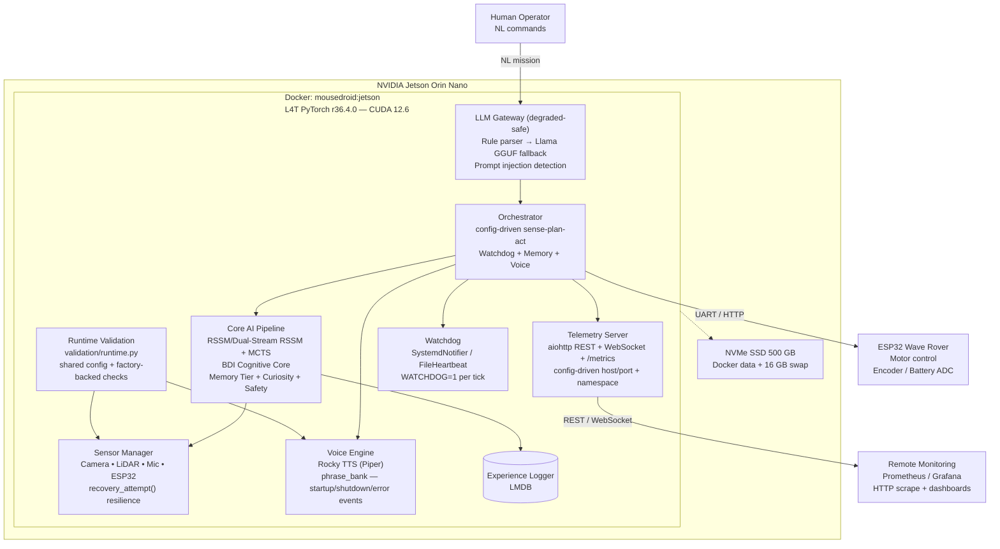

# MouseDroidAGI

**A Star Wars MSE-6 "Mouse Droid" autonomous navigation system powered by an Agentic World Model on NVIDIA Jetson Orin Nano.**

[](tests/)
[](scripts/check_branch_coverage.py)
[](pyproject.toml)
[](pyproject.toml)
[](pyproject.toml)
[](Dockerfile.jetson)
[](docker-compose.jetson.yml)
[](CHANGELOG.md)

---

## Overview

MouseDroidAGI implements the **10 Pillars of the Ideal Neural Network** as a cohesive agentic system that enables a physical MSE-6 droid replica to navigate autonomously, avoid obstacles, follow natural language commands, and continuously improve from experience.

The robot is built on a Wave Rover mecanum-wheel chassis, controlled by an ESP32 microcontroller, and powered by a ribbon-connected Raspberry Pi AI Camera (IMX500), USB LiDAR, and USB audio. All high-level reasoning runs on a Jetson Orin Nano.

The current production baseline is camera + LiDAR + USB audio + ESP32 on Jetson. The HC-SR04 ultrasonic path and the robot-arm platform remain parked outside the active delivery scope.

The Jetson validation path is aligned with the runtime path: smoke scripts, remote validation, and sensor verification all load the same config overlays and reuse the same factory-backed hardware checks as the application.

Planning and architecture docs now live under `docs/planning/` and `docs/analysis/` to keep the repo root focused on runtime code and deployment assets.

### The 10 Pillars

| Pillar | Module | Description |
| ------ | ------ | ----------- |
| 1. World Model | `world_model/` | Dual-Stream CfC/GRU RSSM latent dynamics + MCTS planning |
| 2. Cognitive Architecture | `cognitive/` | Dual-cadence BDI + metacognitive loop |
| 3. Memory Systems | `memory/` | Working, episodic, semantic, consolidation |
| 4. Continual Learning | `learning/` | EWC + progressive neural networks |
| 5. Meta-Learning | `meta/` | MAML + in-context adaptation |
| 6. Curiosity & Exploration | `curiosity/` | ICM intrinsic curiosity |
| 7. Growth & Distillation | `growth/` | Knowledge distillation to smaller models |
| 8. Reward Modelling | `reward/` | Constitutional multi-objective reward |
| 9. Scaling | `scaling/` | Mixture-of-Experts + adaptive compute |
| 10. Safety & Alignment | `safety/` | Constitutional RL + runtime safety monitor |

---

## Architecture



See [docs/architecture.md](docs/architecture.md) for full C4 diagrams (Context → Container → Component → Code), including runtime validation/smoke alignment and CI quality-gate architecture.

### Runtime Validation Alignment

- `src/mousedroid/validation/runtime.py` centralises config overlay resolution and factory-backed runtime checks for camera, microphone, speaker, and LiDAR flows.
- `scripts/jetson_smoke_test.sh`, `scripts/jetson_validate.sh`, and `scripts/verify_sensors.py` now reuse that layer instead of resolving hardware paths independently.
- `JetsonCSICamera` falls back from the Jetson-native path to GStreamer and then V4L2 using config-driven `camera.device_path`.
- LD19 scan completeness is driven by config (`scan_acquisition_timeout_s`, `min_scan_coverage_deg`) and validated with the same coverage semantics the driver uses.

---

## Quick Start

### Prerequisites

- Python 3.10+
- NVIDIA Jetson Orin Nano (or any Linux/Windows machine for mock mode)
- Wave Rover chassis with ESP32 controller
- Raspberry Pi AI Camera IMX500 (optional — mock available)

### Installation

```bash
# Base install
pip install -e .

# With hardware drivers (Jetson only)
pip install -e ".[hardware]"

# With TensorRT acceleration (Jetson only)
pip install -e ".[hardware,jetson]"

# With local LLM
pip install -e ".[llm]"

# Development (includes pytest, coverage, ruff, mypy)
pip install -e ".[dev]"
```

### Docker Deployment (GPU — Jetson Only)

The L4T PyTorch container provides GPU-accelerated CUDA 12.6 on Jetson Orin Nano:

```bash
# Build the container image (first run pulls ~10 GB base)
docker compose -f docker-compose.jetson.yml build

# Start with GPU + mock hardware
MOUSEDROID_MOCK_HARDWARE=true docker compose -f docker-compose.jetson.yml up -d

# Verify GPU
docker exec mousedroid python3 -c "import torch; print(torch.cuda.is_available())"
# True

# Shell into container
docker exec -it mousedroid bash

# Or use the deploy script
sudo bash scripts/docker_deploy.sh
```

### NVMe SSD Setup (Recommended)

The Orin Nano has 8 GB shared RAM. For memory-intensive builds (e.g. llama-cpp-python CUDA compilation), the 500 GB NVMe SSD provides fast swap and Docker storage:

```bash
# Partition, format, mount SSD
sudo sfdisk /dev/nvme0n1 <<< ",,L"
sudo mkfs.ext4 -L ssd /dev/nvme0n1p1
sudo mkdir -p /mnt/ssd && sudo mount /dev/nvme0n1p1 /mnt/ssd

# Add to fstab for persistence
echo "/dev/nvme0n1p1 /mnt/ssd ext4 defaults,noatime 0 2" | sudo tee -a /etc/fstab

# Create 16 GB swap on SSD
sudo fallocate -l 16G /mnt/ssd/swapfile
sudo chmod 600 /mnt/ssd/swapfile && sudo mkswap /mnt/ssd/swapfile
sudo swapon /mnt/ssd/swapfile
echo "/mnt/ssd/swapfile none swap sw 0 0" | sudo tee -a /etc/fstab

# Move Docker data to SSD
sudo systemctl stop docker
sudo rsync -aP /var/lib/docker/ /mnt/ssd/docker/
# Set data-root in /etc/docker/daemon.json → "/mnt/ssd/docker"
sudo systemctl start docker
```

> See [ADR-l4t-container](docs/architecture/ADR-l4t-container.md) for architecture details.

### Run in Mock Mode (no hardware required)

```bash
MOUSEDROID_MOCK_HARDWARE=true mousedroid
# or
mousedroid --mock-hardware
```

### Health Check

```bash
mousedroid --health-check --config config/default.yaml
```

### Pre-Flight Validation

Before starting the service, validate all hardware is present:

```bash
# Run pre-flight checks (device paths configurable via env vars)
bash scripts/preflight_check.sh

# Override device paths if non-standard
MOUSEDROID_ESP32_DEV=/dev/ttyUSB1 \
MOUSEDROID_CAMERA_DEV=/dev/video1 \
bash scripts/preflight_check.sh
```

Exits 0 if all required hardware is present; exits 1 with coloured diagnostics on failure.
The systemd service units run this automatically as `ExecStartPre`.

### Jetson Validation / Smoke

Use the shared runtime validation layer when checking a target Jetson from the host:

```bash
# Host-driven remote validation (select step: verify, pytest, smoke)
bash scripts/jetson_validate.sh ian@<jetson-ip> --step smoke

# Local sensor verification using the same runtime overlay resolution as the app
python scripts/verify_sensors.py --json

# Full hardware smoke (all stages inside the Docker container)
bash scripts/jetson_full_smoke_run.sh
```

Runtime overlays may be supplied explicitly or through `MOUSEDROID_CONFIGS` / `MOUSEDROID_JETSON_CONFIGS`, keeping smoke and validation paths aligned with deployed configuration.

> **Jetson deployment note**: when the system is managed via `scripts/mousedroid-docker.service`,
> the production overlay is synced automatically by `scripts/sync_jetson_overlay.sh` before
> `preflight_check.sh` runs. Manual copying is only needed for ad-hoc runs outside that service path.

### Ten Pillars Validation

The Ten Pillars campaign verifies every AGI pillar end-to-end on the Jetson — both the pytest test
suite and a live factory-backed in-container probe for each pillar:

```bash
# Run the full campaign (all 10 pillars, ~10 min on Jetson)
bash scripts/validate_pillar.sh all

# Run a single pillar (e.g. memory)
bash scripts/validate_pillar.sh memory

# Available pillars:
# world_model  cognitive  memory  continual  meta
# curiosity    growth     reward  scaling    safety
```

Each pillar run writes a row to `ten_pillars.log` (Markdown table) in the smoke run directory,
and the full SUMMARY.md produced by `scripts/jetson_full_smoke_run.sh` appends the table as a
`## Ten Pillars Validation` section.

**Latest campaign result** (`2026-04-26T23:55:42Z`): **Overall: PASS — 20/20 checks green**
(10 pytest stages + 10 factory probes; Jetson Orin Nano, CUDA 12.6, TensorRT 10.4.0).

See [docs/planning/TEN_PILLARS_VALIDATION.md](docs/planning/TEN_PILLARS_VALIDATION.md) for the
full operator validation plan, per-pillar pass criteria, and telemetry requirements.

### Rocky Voice Engine (Piper TTS)

The Rocky personality voice engine uses [Piper TTS](https://github.com/rhasspy/piper) for local neural synthesis. The Jetson Docker image bakes in the model at build time:

- **Model**: `en_US-lessac-medium.onnx` + `.onnx.json` (baked into Docker layer at build; non-fatal if HuggingFace is unreachable at build time)
- **Config**: `voice.enabled`, `voice.tts_model_path`, `voice.personality_to_model_map`,
  `voice.event_intensity_thresholds`, `voice.output_volume`, `voice.tts_sample_rate`, and
  `voice.cooldown_s` — all in `config/jetson_production.yaml`
- **Smoke status**: ✅ PASS — `voice | PASS` (39,424 audio samples generated, `20260425T192408Z`)

Events that trigger Rocky: startup, shutdown, obstacle detected, critical error, sensor recovery.

### Telemetry and Prometheus Metrics

The telemetry stack exposes both interactive APIs and Prometheus-compatible metrics:

```bash
# REST + websocket telemetry (default)
curl http://127.0.0.1:8080/api/v1/status

# Prometheus text exposition (includes memory, curiosity, LLM, voice metrics)
curl http://127.0.0.1:8080/metrics
```

`/metrics` names are derived from `cfg.metrics.namespace`, so metric naming is fully config-driven.

### Watchdog Integration

When deployed via systemd, the watchdog is enabled automatically:

```bash
# Native service — watchdog fires WATCHDOG=1 after each successful tick
sudo systemctl start mousedroid

# Docker service — file heartbeat for Docker HEALTHCHECK
sudo systemctl start mousedroid-docker
docker inspect mousedroid | grep -A5 Health
```

In mock/dev mode, `NullNotifier` is used — no external dependency required.

### Run with Custom Config

```bash
mousedroid --config config/default.yaml config/jetson_production.yaml
```

---

## Configuration

All settings are defined in `config/default.yaml` and validated by Pydantic v2. Override with additional YAML files:

| File | Purpose |
| ---- | ------- |
| `config/default.yaml` | All defaults (mock hardware, safe thresholds) |
| `config/jetson_production.yaml` | Jetson Orin Nano production overrides (cognitive core, HF weights, telemetry, Prometheus metrics, safety) |
| `config/mock_hardware.yaml` | Mock hardware for CI/development |
| `config/local_training.yaml` | Local GPU training with GPU-available check |
| `config/jetson_dual_stream.yaml` | Jetson + dual-stream CfC/GRU world model (requires human activation) |
| `config/jetson_sdcard_64gb.yaml` | Jetson on SD card (64 GB) resource limits |

No values are hardcoded — every threshold, dimension, pin, and rate is configurable.

---

## MCP — Model Context Protocol

The optional **MCP server** (`src/mousedroid/mcp/`) exposes the existing `ToolRegistry`,
recent `TelemetryFrame`s, the structlog ring buffer, the redacted `Settings`, and (optionally)
episodic memory snapshots to any MCP-compliant client (Claude Code, Claude Desktop, the
`mcp.client` Python SDK, ...). It is **disabled by default** and ships behind an optional
`mcp` extras group, so existing deployments are unaffected until you opt in.

### Enable

1. Install with the optional dep group:

   ```bash
   pip install -e ".[dev,telemetry,mcp]"
   ```

2. Set `mcp.enabled: true` in your YAML (or use the env var override):

   ```yaml
   # config/default.yaml — already shipped, just flip enabled
   mcp:
     enabled: true
     transport: stdio          # stdio | sse | streamable_http
     host: "127.0.0.1"         # loopback only by default
     expose_actuation_tools: false
   ```

   Equivalent env-var override (no YAML edit required):

   ```bash
   MOUSEDROID_MCP__ENABLED=true \
   MOUSEDROID_MOCK_HARDWARE=true \
       python -m mousedroid --config config/default.yaml
   ```

3. For non-loopback transports (`host != 127.0.0.1` over `sse` / `streamable_http`),
   set the bearer-token env var first — `MCPConfig` refuses to load otherwise:

   ```bash
   export MOUSEDROID_MCP_TOKEN="$(openssl rand -hex 32)"
   ```

### What's exposed

| Surface | Default | Notes |
|---------|---------|-------|
| **Tools** | All `ToolRegistry` entries except `actuation_tools` | Toggle `expose_actuation_tools` to surface them; the safety monitor still gates dispatch |
| **Resources** | `mousedroid://telemetry/{latest,recent}`, `mousedroid://logs/tail`, `mousedroid://config/redacted`, `mousedroid://memory/episodes/recent` | Per-provider toggles in `MCPConfig.resources`; secrets redacted by configurable regex |
| **Prompts** | `diagnose-last-failure`, `summarise-recent-telemetry`, `arm-task-status` | Plain templates — no on-device LLM call |

### Connect

```python
import asyncio
from mcp.client.stdio import StdioServerParameters, stdio_client
from mcp import ClientSession

async def main() -> None:
    params = StdioServerParameters(
        command="python",
        args=["-m", "mousedroid", "--config", "config/default.yaml"],
        env={"MOUSEDROID_MCP__ENABLED": "true",
             "MOUSEDROID_MOCK_HARDWARE": "true"},
    )
    async with stdio_client(params) as (read, write):
        async with ClientSession(read, write) as session:
            tools = await session.list_tools()
            print([t.name for t in tools.tools])
            result = await session.call_tool("health_check", {})
            print(result.content)

asyncio.run(main())
```

For Claude Desktop, point its `mcp.servers` config at the same `command` /`args` block.

See [`docs/MCP_NEXT_STEPS.md`](docs/MCP_NEXT_STEPS.md) for the planned SDK adapter, transport
bind-up, and operator UI work — and `docs/architecture.md` Level 3f for the full component
diagram.

---

## Project Structure

```text
src/mousedroid/
├── agents/           # Navigation agents (protocol + navigation impl)
├── cognitive/        # BDI model, metacognition, constitutional RL
├── comms/            # ESP32 drivers: serial, WiFi, mock
├── config/           # Pydantic settings schema + YAML loader
├── curiosity/        # Intrinsic Curiosity Module (ICM)
├── efficiency/       # TensorRT compilation, runtime profiler
├── experience/       # LMDB experience logger + record format
├── factory.py        # Dependency injection factory functions
├── growth/           # Knowledge distillation
├── hardware/         # Camera, LiDAR, audio, motor drivers + protocols
├── health/           # Jetson health monitor (GPU temp/load)
├── learning/         # EWC + progressive neural networks
├── llm_gateway/      # Natural language → velocity via local LLM
├── logging/          # structlog setup
├── main.py           # CLI entry point
├── mcp/              # Optional Model Context Protocol server (stdio/SSE/HTTP)
├── memory/           # Working, episodic, semantic memory + consolidation
├── meta/             # MAML + in-context meta-learning
├── orchestrator/     # Main sense-plan-act loop
├── reward/           # Multi-objective reward model
├── safety/           # Safety context + constitutional monitor + Three Laws
├── scaling/          # MoE routing + adaptive compute
├── sensing/          # Sensor manager + observation bundle
├── tools/            # Tool registry for agentic tool dispatch
├── voice/            # Rocky voice engine (TTS + speaker)
└── world_model/      # RSSM + Dual-Stream CfC/GRU RSSM, MCTS planner

training/             # Offline GPU training pipelines
├── run_pipeline.py           # Phase 0→1→2→3→4 orchestrator; --resume for checkpoint continuation
├── train_rssm.py             # Phase 2.1: RSSM pretraining on synthetic data
├── warmstart_policy.py       # Phase 2.2: MCTS policy warm-start + UCB tuning
├── collect_annotations.py    # Phase 2.3a: BDI intention annotation collection
├── train_bdi.py              # Phase 2.3b: BDI sub-network training on annotations
├── train_constitutional_rl.py # Phase 2.4: PPO + Constitutional constraints
├── train_dual_stream_rssm.py  # Phase 2.2: Dual-stream CfC/GRU RSSM pretraining
├── upload_weights.py         # Push all weights to HuggingFace Hub (ianshank/mousedroid-weights)
├── data_generator.py         # Synthetic observation sequence generator
└── rssm_dataset.py           # PyTorch Dataset for RSSM sequences

scripts/
├── ci.sh                    # CI pipeline: lint → type check → test → coverage gate
├── check_branch_coverage.py # Changed-line coverage gate (≥85%) with Pydantic/torch resilience
├── preflight_check.sh       # Pre-flight hardware validation (devices, disk, config, weights)
├── verify_sensors.py        # Sensor verification script (runtime-aligned camera/lidar/audio checks) --json
├── deploy_jetson.sh         # Idempotent Jetson deployment (venv + systemd)
├── docker_deploy.sh         # Docker container build + deploy on Jetson
├── jetson_test_runner.sh    # Container test runner (unit/integration/e2e)
├── download_model.sh        # Download LLM weights from HuggingFace Hub
├── flash_esp32.sh           # ESP32 firmware flashing via esptool
├── mousedroid.service       # systemd unit (native; Type=notify, WatchdogSec=30)
└── mousedroid-docker.service # systemd unit (Docker; Type=notify, WatchdogSec=30, ExecStartPre=preflight)
```

---

## Design Principles

### Protocol-Based Dependency Injection

All components are defined as `@runtime_checkable Protocol` interfaces. Factory functions in `factory.py` are the only place that imports concrete types:

```python
# Protocols define the contract
class ESP32CommProtocol(Protocol):
    async def send_velocity(self, vx: float, vy: float, omega: float) -> None: ...

# Factory selects the implementation
def build_esp32_driver(cfg: Settings) -> ESP32CommProtocol:
    if cfg.mock_hardware:
        return MockESP32Driver(cfg.esp32)
    if cfg.esp32.protocol == "serial":
        return SerialESP32Driver(cfg.esp32)
    return WiFiESP32Driver(cfg.esp32)
```

### Asyncio Throughout

All I/O is async. Blocking calls (serial, file, HTTP) run via `asyncio.to_thread()`. No threading primitives are used.

### Structured Logging

All logging uses `structlog` with machine-readable JSON output in production and coloured console output in development.

```python
_log = get_logger(__name__)
_log.info("orchestrator_started", platform=cfg.platform)
```

### Zero Hardcoded Values

Every number — GPIO pins, network ports, model dimensions, safety thresholds — comes from the Pydantic config schema. Module-level constants document internal algorithm parameters.

### Three Laws Safety

The `safety/three_laws.py` module implements Asimov's Three Laws of Robotics as hard constraints:

- **Law 1** — Human harm avoidance (highest priority, triggers emergency stop)
- **Law 2** — Obey commands unless they conflict with Law 1
- **Law 3** — Self-preservation unless conflicting with Laws 1 or 2

Constitutional RL integrates these constraints directly into the PPO training loop via `ConstitutionalChecker`.

---

## Training Pipeline

Offline training now starts with Phase 0 synthetic data generation using the merged
domain-randomization baseline, then continues through RSSM pretraining, warm-start, BDI,
and constitutional RL.

```bash
# Run the full pipeline (phase 0 data generation → 1 RSSM → 2 warmstart → 3 BDI → 4 constitutional-RL)
python training/run_pipeline.py

# Run just the merged Phase 0+1 training baseline
python training/run_pipeline.py --phases 0,1

# Resume RSSM training (Phase 1) from a checkpoint
python training/run_pipeline.py --resume training/results/rssm_epoch_10.pt

# Upload trained weights to HuggingFace Hub
python training/upload_weights.py --repo ianshank/mousedroid-weights
```

### Dual-Stream CfC/GRU RSSM (Experimental)

The world model supports an optional **liquid neural network** hybrid architecture — a dual-stream CfC (Closed-form Continuous-time) / GRU RSSM:

- **GRU stream** (256-dim): Slow planning horizon
- **CfC stream** (64-dim): Fast sub-100ms adaptive reflexes via `ncps` liquid neural networks
- **Concat fusion**: Combined 320-dim hidden state feeds posterior, prior, and decoder

```bash
# Install CfC dependency
pip install -e ".[cfc]"

# Train dual-stream model (5-epoch validation)
python -m training.train_dual_stream_rssm \
    --config config/local_dual_stream_training.yaml \
    --data training/data/sequences.pt \
    --device cuda --validate-only

# Upload to HuggingFace
python -m training.upload_weights \
    --weights-dir weights/dual_stream_rssm \
    --repo ianshank/mousedroid-dual-stream-rssm
```

**Human activation gate:** CfC is disabled by default (`cfc_hidden_dim=0`). To activate on Jetson:

```bash
MOUSEDROID_MODEL__CFC_HIDDEN_DIM=64 docker compose -f docker-compose.jetson.yml up -d
```

Weights are automatically pulled at startup on the Jetson when `cognitive.enabled = true`:

```yaml
# config/jetson_production.yaml
cognitive:
  enabled: true
  huggingface_repo: ianshank/mousedroid-weights
  huggingface_subfolder: bdi   # downloads bdi/belief.npz → weights/bdi/belief.npz
    weights_dir: /opt/mousedroid/weights/bdi
```

---

## Testing

```bash
# Run all tests
pytest tests/

# With coverage report
pytest tests/ --cov=src/mousedroid --cov-report=term-missing

# Fast parallel run
pytest tests/ -n auto

# By category
pytest tests/unit/
pytest tests/integration/
pytest tests/e2e/
pytest tests/performance/
pytest tests/property/
pytest tests/regression/
```

### Validation Snapshot

- Local pre-PR validation for this branch covers `ruff`, `mypy --strict`, unit/property/integration with coverage, performance, regression, E2E, and health-check paths.
- CI execution is deterministic across Windows/Git Bash and Linux by resolving Python from `MOUSEDROID_PYTHON` or workspace virtualenv first, with a pre-test `Settings` identity smoke check.
- The enforced repository gate remains **85% coverage**, with the latest local run holding above 94% total coverage.
- Hardware-only timing assertions stay separated from mock-hardware CI paths; use the Jetson validation harness for real-device timing and smoke verification.

---

## Linting & Type Checking

```bash
# Lint
ruff check src/ tests/

# Format check
ruff format --check src/ tests/

# Type check
mypy src/ --strict --ignore-missing-imports
```

---

## Deployment

### Flash ESP32

```bash
sudo bash scripts/flash_esp32.sh /dev/ttyUSB0 firmware/waverover_mousedroid.bin
```

### Deploy to Jetson

```bash
sudo bash scripts/deploy_jetson.sh
```

### Systemd Service

```bash
cp scripts/mousedroid.service /etc/systemd/system/
systemctl enable mousedroid
systemctl start mousedroid
```

---

## Training Pipelines

Offline training follows a 4-phase pipeline:

| Phase | Script | Description |
| ----- | ------ | ----------- |
| 2.1 | `train_rssm.py` | Pretrain RSSM world model on synthetic sequences |
| 2.1b | `train_dual_stream_rssm.py` | Dual-stream CfC/GRU RSSM pretraining (experimental) |
| 2.2 | `warmstart_policy.py` | Warm-start MCTS policy from latent stats + UCB tuning |
| 2.3a | `collect_annotations.py` | Collect labelled intention annotations (500 episodes) |
| 2.3b | `train_bdi.py` | Train BDI sub-networks: Belief → Desire → Intention → Affect |
| 2.4 | `train_constitutional_rl.py` | PPO fine-tuning with Constitutional + Three Laws constraints |

---

## Roadmap and Analysis

- [docs/planning/NEXT_STEPS.md](docs/planning/NEXT_STEPS.md) — prioritized roadmap and immediate follow-ups
- [docs/planning/IMPLEMENTATION_PLAN.md](docs/planning/IMPLEMENTATION_PLAN.md) — implementation sequencing and dependencies
- [docs/planning/PLAN.md](docs/planning/PLAN.md) — self-healing resilience plan
- [docs/analysis/COVERAGE_ANALYSIS.md](docs/analysis/COVERAGE_ANALYSIS.md) — coverage strategy and enforcement notes

---

## Developed By

Ian Cruickshank

---

## Contributing

1. Fork the repository
2. Create a feature branch: `git checkout -b feature/my-feature`
3. Follow the coding standards (ruff, mypy strict, Google docstrings)
4. Write tests — coverage must remain ≥85%
5. Open a pull request

---

## License

MIT License — see [LICENSE](LICENSE) for details.

---

## Hardware BOM

| Component | Part | Notes |
| --------- | ---- | ----- |
| SBC | NVIDIA Jetson Orin Nano 8GB | Primary compute |
| Storage | Samsung NVMe 500 GB SSD | Docker data + swap |
| Chassis | Waveshare Wave Rover | Mecanum wheel, ESP32 onboard |
| Camera | Jetson CSI / Raspberry Pi AI Camera (IMX500) | Onboard ML inference |
| LiDAR | FHL-LD19 360 2D | UART /dev/ttyUSB1, 230400 baud |
| Audio | Wonrabai USB Sound Card | Combo mic + 8 5W speaker |
| Battery | 3S LiPo 11.1V | Min cutoff 9.5V |

HC-SR04 support remains in the codebase but is not part of the active Jetson production baseline.
