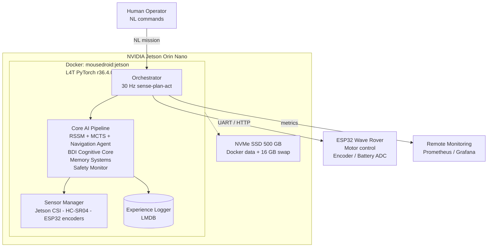

# MouseDroidAGI

**A Star Wars MSE-6 "Mouse Droid" autonomous navigation system powered by an Agentic World Model on NVIDIA Jetson Orin Nano.**

[](tests/)
[](pyproject.toml)
[](pyproject.toml)
[](pyproject.toml)
[](pyproject.toml)
[](Dockerfile.jetson)
[](docker-compose.jetson.yml)

---

## Overview

MouseDroidAGI implements the **10 Pillars of the Ideal Neural Network** as a cohesive agentic system that enables a physical MSE-6 droid replica to navigate autonomously, avoid obstacles, follow natural language commands, and continuously improve from experience.

The robot is built on a Wave Rover mecanum-wheel chassis, controlled by an ESP32 microcontroller, and powered by a Raspberry Pi AI Camera (IMX500) with onboard neural inference. All high-level reasoning runs on a Jetson Orin Nano.

### The 10 Pillars

| Pillar | Module | Description |
|--------|--------|-------------|
| 1. World Model | `world_model/` | RSSM latent dynamics + MCTS planning |
| 2. Cognitive Architecture | `cognitive/` | Dual-cadence BDI + metacognitive loop |
| 3. Memory Systems | `memory/` | Working, episodic, semantic, consolidation |
| 4. Continual Learning | `learning/` | EWC + progressive neural networks |
| 5. Meta-Learning | `meta/` | MAML + in-context adaptation |
| 6. Curiosity & Exploration | `curiosity/` | ICM intrinsic curiosity |
| 7. Growth & Distillation | `growth/` | Knowledge distillation to smaller models |
| 8. Reward Modelling | `reward/` | Constitutional multi-objective reward |
| 9. Scaling | `scaling/` | Mixture-of-Experts + adaptive compute |
| 10. Safety & Alignment | `safety/` | Constitutional RL + runtime safety monitor |

---

## Architecture



See [docs/architecture.md](docs/architecture.md) for full C4 diagrams (Context → Container → Component → Code + data flow sequence diagrams).

---

## Quick Start

### Prerequisites

- Python 3.10+
- NVIDIA Jetson Orin Nano (or any Linux/Windows machine for mock mode)
- Wave Rover chassis with ESP32 controller
- Raspberry Pi AI Camera IMX500 (optional — mock available)

### Installation

```bash
# Base install
pip install -e .

# With hardware drivers (Jetson only)
pip install -e ".[hardware]"

# With TensorRT acceleration (Jetson only)
pip install -e ".[hardware,jetson]"

# With local LLM
pip install -e ".[llm]"

# Development (includes pytest, coverage, ruff, mypy)
pip install -e ".[dev]"
```

### Docker Deployment (GPU — Jetson Only)

The L4T PyTorch container provides GPU-accelerated CUDA 12.6 on Jetson Orin Nano:

```bash
# Build the container image (first run pulls ~10 GB base)
docker compose -f docker-compose.jetson.yml build

# Start with GPU + mock hardware
MOUSEDROID_MOCK_HARDWARE=true docker compose -f docker-compose.jetson.yml up -d

# Verify GPU
docker exec mousedroid python3 -c "import torch; print(torch.cuda.is_available())"
# True

# Shell into container
docker exec -it mousedroid bash

# Or use the deploy script
sudo bash scripts/docker_deploy.sh
```

### NVMe SSD Setup (Recommended)

The Orin Nano has 8 GB shared RAM. For memory-intensive builds (e.g. llama-cpp-python CUDA compilation), the 500 GB NVMe SSD provides fast swap and Docker storage:

```bash
# Partition, format, mount SSD
sudo sfdisk /dev/nvme0n1 <<< ",,L"
sudo mkfs.ext4 -L ssd /dev/nvme0n1p1
sudo mkdir -p /mnt/ssd && sudo mount /dev/nvme0n1p1 /mnt/ssd

# Add to fstab for persistence
echo "/dev/nvme0n1p1 /mnt/ssd ext4 defaults,noatime 0 2" | sudo tee -a /etc/fstab

# Create 16 GB swap on SSD
sudo fallocate -l 16G /mnt/ssd/swapfile
sudo chmod 600 /mnt/ssd/swapfile && sudo mkswap /mnt/ssd/swapfile
sudo swapon /mnt/ssd/swapfile
echo "/mnt/ssd/swapfile none swap sw 0 0" | sudo tee -a /etc/fstab

# Move Docker data to SSD
sudo systemctl stop docker
sudo rsync -aP /var/lib/docker/ /mnt/ssd/docker/
# Set data-root in /etc/docker/daemon.json → "/mnt/ssd/docker"
sudo systemctl start docker
```

> See [ADR-l4t-container](docs/architecture/ADR-l4t-container.md) for architecture details.

### Run in Mock Mode (no hardware required)

```bash
MOUSEDROID_MOCK_HARDWARE=true mousedroid
# or
mousedroid --mock-hardware
```

### Health Check

```bash
mousedroid --health-check --config config/default.yaml
```

### Run with Custom Config

```bash
mousedroid --config config/default.yaml config/jetson_production.yaml
```

---

## Configuration

All settings are defined in `config/default.yaml` and validated by Pydantic v2. Override with additional YAML files:

| File | Purpose |
|------|---------|
| `config/default.yaml` | All defaults (mock hardware, safe thresholds) |
| `config/jetson_production.yaml` | Jetson Orin Nano production overrides |
| `config/mock_hardware.yaml` | Mock hardware for CI/development |

No values are hardcoded — every threshold, dimension, pin, and rate is configurable.

---

## Project Structure

```
src/mousedroid/
├── agents/           # Navigation agents (protocol + navigation impl)
├── cognitive/        # BDI model, metacognition, constitutional RL
├── comms/            # ESP32 drivers: serial, WiFi, mock
├── config/           # Pydantic settings schema + YAML loader
├── curiosity/        # Intrinsic Curiosity Module (ICM)
├── efficiency/       # TensorRT compilation, runtime profiler
├── experience/       # LMDB experience logger + record format
├── factory.py        # Dependency injection factory functions
├── growth/           # Knowledge distillation
├── hardware/         # Camera, ultrasonic, motor drivers + protocols
├── health/           # Jetson health monitor (GPU temp/load)
├── learning/         # EWC + progressive neural networks
├── llm_gateway/      # Natural language → velocity via local LLM
├── logging/          # structlog setup
├── main.py           # CLI entry point
├── memory/           # Working, episodic, semantic memory + consolidation
├── meta/             # MAML + in-context meta-learning
├── orchestrator/     # Main sense-plan-act loop
├── reward/           # Multi-objective reward model
├── safety/           # Safety context + constitutional monitor + Three Laws
├── scaling/          # MoE routing + adaptive compute
├── sensing/          # Sensor manager + observation bundle
├── tools/            # Tool registry for agentic tool dispatch
└── world_model/      # RSSM encoder, MCTS planner

training/             # Offline training pipelines
├── train_rssm.py             # Phase 2.1: RSSM pretraining on synthetic data
├── train_constitutional_rl.py # Phase 2.4: PPO + Constitutional constraints
├── train_bdi.py              # Phase 2.3b: BDI sub-network training
├── warmstart_policy.py        # Phase 2.2: MCTS policy warm-start + UCB tuning
├── collect_annotations.py    # Phase 2.3a: Intention annotation collection
├── data_generator.py         # Synthetic observation sequence generator
└── rssm_dataset.py           # PyTorch Dataset for RSSM sequences

scripts/
├── ci.sh             # CI pipeline: lint → type check → test → coverage gate
├── deploy_jetson.sh  # Idempotent Jetson deployment (venv + systemd)
├── docker_deploy.sh  # Docker container build + deploy on Jetson
├── jetson_test_runner.sh # Container test runner (unit/integration/e2e)
├── flash_esp32.sh    # ESP32 firmware flashing via esptool
├── mousedroid.service# systemd unit file for native deployment
└── mousedroid-docker.service # systemd unit for Docker auto-start
```

---

## Design Principles

### Protocol-Based Dependency Injection

All components are defined as `@runtime_checkable Protocol` interfaces. Factory functions in `factory.py` are the only place that imports concrete types:

```python
# Protocols define the contract
class ESP32CommProtocol(Protocol):
    async def send_velocity(self, vx: float, vy: float, omega: float) -> None: ...

# Factory selects the implementation
def build_esp32_driver(cfg: Settings) -> ESP32CommProtocol:
    if cfg.mock_hardware:
        return MockESP32Driver(cfg.esp32)
    if cfg.esp32.protocol == "serial":
        return SerialESP32Driver(cfg.esp32)
    return WiFiESP32Driver(cfg.esp32)
```

### Asyncio Throughout

All I/O is async. Blocking calls (serial, file, HTTP) run via `asyncio.to_thread()`. No threading primitives are used.

### Structured Logging

All logging uses `structlog` with machine-readable JSON output in production and coloured console output in development.

```python
_log = get_logger(__name__)
_log.info("orchestrator_started", platform=cfg.platform)
```

### Zero Hardcoded Values

Every number — GPIO pins, network ports, model dimensions, safety thresholds — comes from the Pydantic config schema. Module-level constants document internal algorithm parameters.

### Three Laws Safety

The `safety/three_laws.py` module implements Asimov's Three Laws of Robotics as hard constraints:

- **Law 1** — Human harm avoidance (highest priority, triggers emergency stop)
- **Law 2** — Obey commands unless they conflict with Law 1
- **Law 3** — Self-preservation unless conflicting with Laws 1 or 2

Constitutional RL integrates these constraints directly into the PPO training loop via `ConstitutionalChecker`.

---

## Testing

```bash
# Run all tests
pytest tests/

# With coverage report
pytest tests/ --cov=src/mousedroid --cov-report=term-missing

# Fast parallel run
pytest tests/ -n auto

# By category
pytest tests/unit/
pytest tests/integration/
pytest tests/e2e/
pytest tests/performance/
pytest tests/property/
pytest tests/regression/
```

### Test Statistics

| Category | Count |
|----------|-------|
| Unit tests | 668 |
| Scripts & training tests | 84 |
| **Total** | **752** |
| **Coverage** | **98.01%** (gate: 85%) |

> Hardware tests requiring real GPIO/camera are marked `@pytest.mark.hardware` and skipped in CI.

---

## Linting & Type Checking

```bash
# Lint
ruff check src/ tests/

# Format check
ruff format --check src/ tests/

# Type check
mypy src/ --strict --ignore-missing-imports
```

---

## Deployment

### Flash ESP32

```bash
sudo bash scripts/flash_esp32.sh /dev/ttyUSB0 firmware/waverover_mousedroid.bin
```

### Deploy to Jetson

```bash
sudo bash scripts/deploy_jetson.sh
```

### Systemd Service

```bash
cp scripts/mousedroid.service /etc/systemd/system/
systemctl enable mousedroid
systemctl start mousedroid
```

---

## Training Pipelines

Offline training follows a 4-phase pipeline:

| Phase | Script | Description |
|-------|--------|-------------|
| 2.1 | `train_rssm.py` | Pretrain RSSM world model on synthetic sequences |
| 2.2 | `warmstart_policy.py` | Warm-start MCTS policy from latent stats + UCB tuning |
| 2.3a | `collect_annotations.py` | Collect labelled intention annotations (500 episodes) |
| 2.3b | `train_bdi.py` | Train BDI sub-networks: Belief → Desire → Intention → Affect |
| 2.4 | `train_constitutional_rl.py` | PPO fine-tuning with Constitutional + Three Laws constraints |

---

## Developed By

Ian Cruickshank

---

## Contributing

1. Fork the repository
2. Create a feature branch: `git checkout -b feature/my-feature`
3. Follow the coding standards (ruff, mypy strict, Google docstrings)
4. Write tests — coverage must remain ≥85%
5. Open a pull request

---

## License

MIT License — see [LICENSE](LICENSE) for details.

---

## Hardware BOM

| Component | Part | Notes |
|-----------|------|-------|
| SBC | NVIDIA Jetson Orin Nano 8GB | Primary compute |
| Storage | Samsung NVMe 500 GB SSD | Docker data + swap |
| Chassis | Waveshare Wave Rover | Mecanum wheel, ESP32 onboard |
| Camera | Jetson CSI / Raspberry Pi AI Camera (IMX500) | Onboard ML inference |
| Distance | HC-SR04 Ultrasonic | GPIO pins 23/24 |
| Battery | 3S LiPo 11.1V | Min cutoff 9.5V |

---

## Next Steps

- [ ] Complete `llama-cpp-python` CUDA compilation on Jetson (requires SSD swap)
- [ ] Enable real hardware devices in `docker-compose.jetson.yml` (camera, GPIO, serial)
- [ ] Enable `mousedroid-docker.service` for auto-start on boot
- [ ] Run RSSM pretraining pipeline on Jetson GPU
- [ ] Integrate Hugging Face model download into container startup
- [ ] Add Prometheus metrics endpoint for remote monitoring
