# MouseDroidAGI — C4 Architecture

This document uses the [C4 model](https://c4model.com/) (Context → Container → Component → Code) to describe the system architecture at four levels of abstraction.

---

## Level 1 — System Context

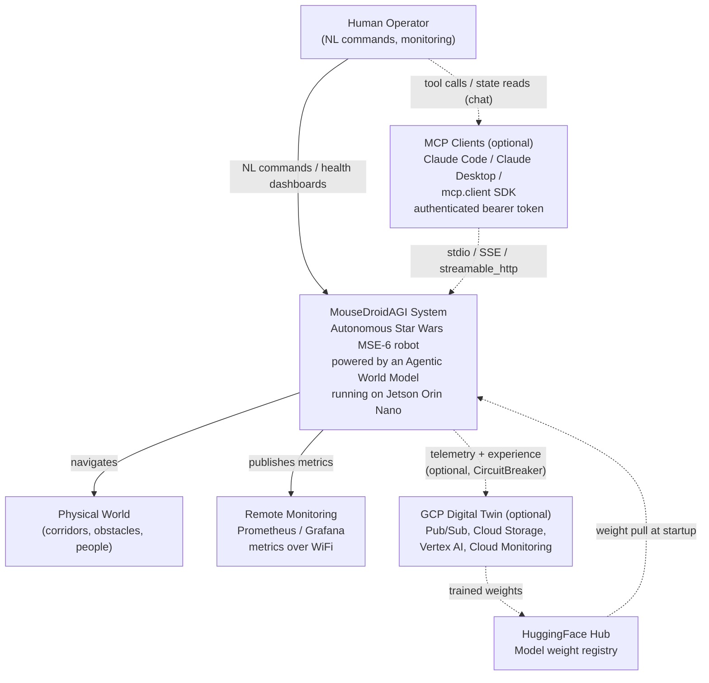

**Actors:**

- **Human Operator** — Sends natural language mission commands via LLM gateway; monitors telemetry
- **Physical World** — The environment the robot navigates through
- **Remote Monitoring** — Optional Prometheus/Grafana dashboard for production deployments

---

## Level 2 — Container Diagram

```mermaid
graph TD
    subgraph Jetson["NVIDIA Jetson Orin Nano"]
        subgraph DockerContainer["Docker: mousedroid:jetson\nL4T PyTorch r36.4.0\nCUDA 12.6 / TensorRT 10.4"]
            subgraph AppProcess["mousedroid Python process (asyncio event loop)"]
                Orchestrator["Orchestrator\nconfig-driven loop cadence"]
                LLMGateway["LLM Gateway\nLlama GGUF"]
                HealthMonitor["Health Monitor\nsysfs polling"]
                CoreAI["Core AI Pipeline\nRSSM + MCTS + Navigation Agent\nCognitive Core BDI + Metacognitive\nMemory: Working / Episodic / Semantic\nSafety Monitor + Constitutional Checker"]
                SensorMgr["Sensor Manager\nconcurrent I/O"]
                TelemetryPub["Telemetry Publisher\nasync queue\n≤60 Hz non-blocking"]
                MetricsRegistry["Metrics Registry\nPrometheus text format\nconfig-driven namespace"]
                TelemetryServer["Telemetry Server\naiohttp REST + WebSocket\nconfig-driven port"]
                MCPServer["MCP Server (optional)\nstdio / SSE / streamable_http\nbridges ToolRegistry + telemetry +\nlogs + redacted config + memory"]
                ExperienceDB[("Experience Logger\nLMDB\n/home/jetson/experience_db")]
            end
        end
        subgraph OpsLayer["Validation / Operations Layer"]
            RuntimeValidation["Runtime Validation\nvalidation/runtime.py\nshared overlay resolution + factory-backed checks"]
            SmokeHarness["Smoke Harness\njetson_validate.sh + jetson_smoke_test.sh + verify_sensors.py"]
        end
        subgraph HWLayer["Hardware Interface Layer"]
            Camera["Camera\nIMX500 ribbon camera\nJetson / GStreamer / V4L2 fallback"]
            Microphone["USB Microphone\nWonrabai USB Sound Card\nAudioProtocol"]
            Speaker["USB Speaker\nWonrabai USB Sound Card\nSpeakerProtocol"]
            LiDAR["LiDAR\nFHL-LD19\nLidarProtocol"]
            GPIO["GPIO\nJetson.GPIO"]
        end
        subgraph Storage["NVMe SSD (500 GB)"]
            DockerData["Docker Data Root\n/mnt/ssd/docker"]
            SwapFile["Swap File\n16 GB"]
            Containerd["containerd\nsnapshotter"]
        end
    end
    ESP32["ESP32 Wave Rover\nMotor control\nEncoder feedback\nBattery ADC"]

    Orchestrator --> CoreAI
    Orchestrator --> LLMGateway
    Orchestrator --> HealthMonitor
    Orchestrator --> TelemetryPub
    TelemetryPub --> MetricsRegistry
    HealthMonitor --> MetricsRegistry
    TelemetryPub --> TelemetryServer
    MetricsRegistry --> TelemetryServer
    HealthMonitor --> TelemetryPub
    Orchestrator -.-> MCPServer
    MCPServer -.-> MetricsRegistry
    MCPServer -.-> TelemetryPub
    CoreAI --> SensorMgr
    CoreAI --> ExperienceDB
    SensorMgr --> Camera
    SensorMgr --> Microphone
    SensorMgr --> Speaker
    SensorMgr --> LiDAR
    SensorMgr --> GPIO
    SmokeHarness --> RuntimeValidation
    RuntimeValidation --> Camera
    RuntimeValidation --> Microphone
    RuntimeValidation --> Speaker
    RuntimeValidation --> LiDAR
    TenPillars["Ten Pillars Campaign\nvalidate_pillar.sh\npytest + factory probe × 10"] --> SmokeHarness
    Orchestrator -- "UART 1 Mbps / HTTP" --> ESP32
    DockerContainer -.-> DockerData
    DockerContainer -.-> Containerd
```

**Containers:**

| Container | Technology | Responsibility |
| --------- | ---------- | -------------- |
| Docker `mousedroid:jetson` | L4T PyTorch r36.4.0 | GPU-accelerated container (CUDA 12.6 + TensorRT 10.4) |
| `mousedroid` process | Python 3.10 asyncio | All AI reasoning + I/O orchestration |
| Runtime validation layer | Python utilities + shell harnesses | Shared config-backed smoke, verification, and host-driven Jetson validation |
| Ten Pillars campaign | `validate_pillar.sh` | Headless dispatcher — runs pytest + factory probe for each of the 10 AGI pillars |
| LMDB experience store | LMDB on-disk | Persistent experience replay buffer |
| Llama GGUF model | llama-cpp-python | Local LLM for NL to velocity |
| ESP32 firmware | C++ (Wave Rover SDK) | Motor PWM control, encoder polling |
| IMX500 ribbon camera | jetson_utils / GStreamer / V4L2 | Vision capture with config-driven fallback and pluggable feature extraction |
| Wonrabai USB Sound Card | PyAudio | Combo mic + speaker: audio capture for world model + TTS output |
| FHL-LD19 LiDAR | pyserial UART | 360° 2D distance scanning for obstacle detection + clearance |
| NVMe SSD 500 GB | ext4 `/mnt/ssd` | Docker data-root, containerd, 16 GB swap |
| Telemetry Publisher | Python asyncio queue | Non-blocking sensor-frame fan-out at ≤60 Hz |
| Metrics Registry | Python stdlib exporter | Prometheus metric families and text rendering |
| Telemetry Server | aiohttp 3.x REST + WebSocket | Remote WiFi/Ethernet monitoring (configurable port, default 8080) |

---

## Level 3 — Component Diagram (mousedroid process)

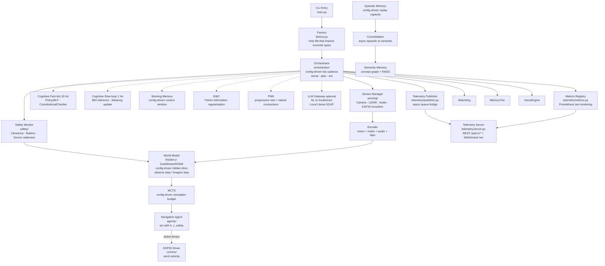

---

## Level 3b — Component Diagram: Production Hardening (v0.3.0)

New production components added in the v0.3.0 release:

```mermaid
graph TD
    Orchestrator["Orchestrator\nasyncio.wait_for(tick, timeout=tick_timeout_s)"]

    subgraph Watchdog["Watchdog Layer\nhealth/watchdog.py"]
        WatchdogProt["WatchdogProtocol\n@runtime_checkable"]
        SystemdNotif["SystemdNotifier\nWATCHDOG=1 via sdnotify or subprocess"]
        FileHB["FileHeartbeatNotifier\ntimestamp to /tmp/mousedroid_heartbeat"]
        NullNotif["NullNotifier\nmock/dev mode"]
        WatchdogProt <|.. SystemdNotif
        WatchdogProt <|.. FileHB
        WatchdogProt <|.. NullNotif
    end

    subgraph MemoryTierGroup["Memory Tier\nmemory/tier.py"]
        MemTier["MemoryTier\nepisodic + semantic + working + consolidation"]
        EpiRep["EpisodicReplay\nFAISS 50k"]
        SemIdx["SemanticIndex\nconcept graph"]
        WorkMem["WorkingMemory\n8192 token window"]
        Consol["MemoryConsolidation\nasync background task"]
        MemTier --> EpiRep
        MemTier --> SemIdx
        MemTier --> WorkMem
        MemTier --> Consol
    end

    subgraph VoiceLayer["Voice Engine\nvoice/engine.py"]
        Rocky["Rocky Personality\nphrase_bank.py"]
        PiperTTS["Piper TTS\nlocal inference"]
        Speaker["USB Speaker\nSpeakerProtocol"]
        Rocky --> PiperTTS --> Speaker
    end

    subgraph PreFlight["Pre-flight Check\nscripts/preflight_check.sh"]
        PF_ESP32["ESP32 device check"]
        PF_Camera["Camera device check"]
        PF_GPIO["GPIO device check"]
        PF_Disk["Disk space check"]
        PF_Config["Config YAML check"]
        PF_Weights["Model weights check"]
    end

    Orchestrator -- "notify() after successful tick" --> Watchdog
    Orchestrator -- "push ExperienceRecord each tick" --> MemoryTierGroup
    Orchestrator -- "startup/shutdown/error/obstacle events" --> VoiceLayer
    Orchestrator -- "asyncio.TimeoutError → emergency_stop()" --> ESP32Driver["ESP32 emergency_stop()"]
    PreFlight -- "ExecStartPre (systemd)" --> Orchestrator
```

**Tick Safety Loop (v0.3.0):**

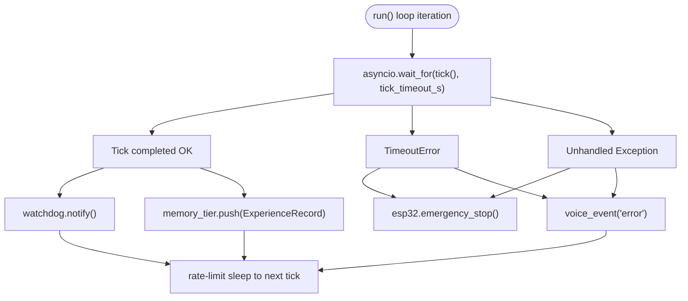

---

## Level 3c — Runtime Validation and Smoke Alignment

The Jetson validation surface is deliberately wired through the same config and factory layer as
the application so host-side smoke checks do not drift from the deployed runtime.

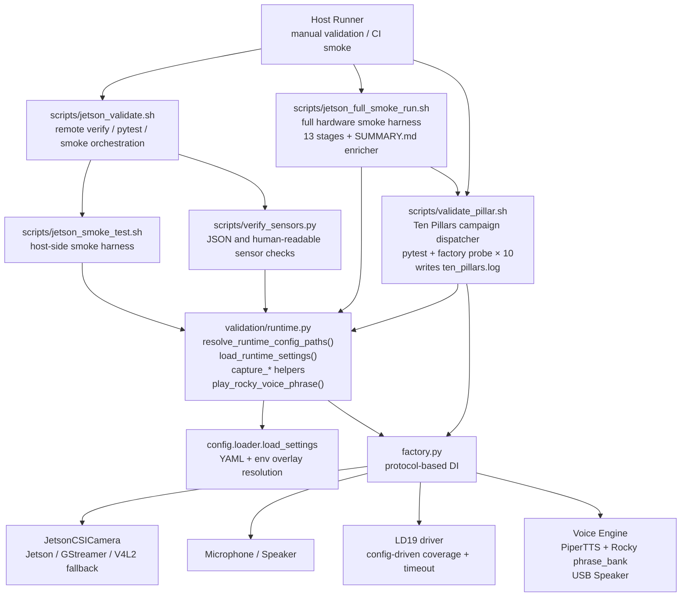

All runtime validation paths load overlays through `resolve_runtime_config_paths()` and
`load_runtime_settings()`, so values such as `camera.device_path`,
`lidar.scan_acquisition_timeout_s`, `lidar.min_scan_coverage_deg`, and
`voice.tts_model_path`, `voice.personality_to_model_map`, `voice.event_intensity_thresholds`, and
`voice.output_volume` remain config-driven.

`play_rocky_voice_phrase()` provides a factory-backed end-to-end TTS + speaker smoke check
used by `jetson_full_smoke_run.sh`. Voice smoke status: **PASS** (39,424 samples,
`en_US-lessac-medium`, `20260425T192408Z`).

**Ten Pillars campaign** (`scripts/validate_pillar.sh all`): runs 20 checks (10 pytest stages +
10 factory probes) across all AGI pillars. Last result: **Overall: PASS — 20/20**
(`2026-04-26T23:55:42Z`, Jetson Orin Nano, CUDA 12.6, TensorRT 10.4.0).

| Pillar | pytest marker | Factory probe class |
| ------ | ------------- | ------------------- |
| world_model | `unit/world_model/` | `build_world_model(cfg)` |
| cognitive | `unit/cognitive/` | `build_cognitive_core(cfg)` |
| memory | `unit/memory/` | `build_memory_tier(cfg)` |
| continual | `unit/learning/` | `EWCAgent(cfg.learning, nn.Linear(...))` |
| meta | `unit/meta/` | `MAMLAdapter(nn.Linear(...), ...)` |
| curiosity | `unit/curiosity/` | `build_curiosity_module(cfg)` |
| growth | `unit/growth/` | `KnowledgeDistiller(teacher, student, ...)` |
| reward | `unit/reward/` | `MultiObjectiveRewardModel(cfg.model, cfg.reward)` |
| scaling | `unit/scaling/` | `AdaptiveCompute(input_dim=..., max_steps=8)` |
| safety | `unit/safety/` | `build_safety_monitor(cfg)` |

> **Overlay sync note**: when managed by `scripts/mousedroid-docker.service`, the production
> overlay is synced automatically via `scripts/sync_jetson_overlay.sh` before
> `preflight_check.sh` executes.

---

## Level 3d — Component Diagram: GCP Digital Twin (Optional)

Cloud features are **fully optional** — the droid operates identically with `gcp: null` in config.
All cloud calls are protected by `CircuitBreaker` + `retry_async` patterns so cloud failures
never block the 30 Hz control loop.

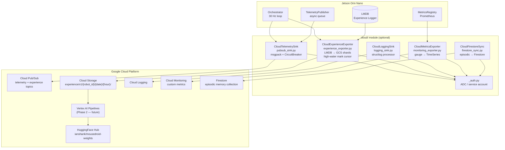

**GCP config hierarchy:** `Settings.gcp: GCPConfig | None = None`. When `None`, all
`build_cloud_*()` factory functions return `None` and the orchestrator skips cloud calls.

| Component | File | GCP Service | Resilience |
| --------- | ---- | ----------- | ---------- |
| Telemetry sink | `cloud/pubsub_sink.py` | Pub/Sub | CircuitBreaker (60s recovery) |
| Experience exporter | `cloud/experience_exporter.py` | Cloud Storage | CircuitBreaker + HWM cursor |
| Logging sink | `cloud/logging_sink.py` | Cloud Logging | Fire-and-forget (silent drop) |
| Metrics exporter | `cloud/monitoring_exporter.py` | Cloud Monitoring | Async executor |
| Firestore sync | `cloud/firestore_sync.py` | Firestore | Per-entry exception handling |
| Auth | `cloud/_auth.py` | ADC / SA key | Fail-fast at startup |

---

## Level 3e — Configuration Compatibility and CI Quality Gates

Configuration and CI are intentionally layered so legacy YAML schemas remain loadable while
quality gates fail early and deterministically.

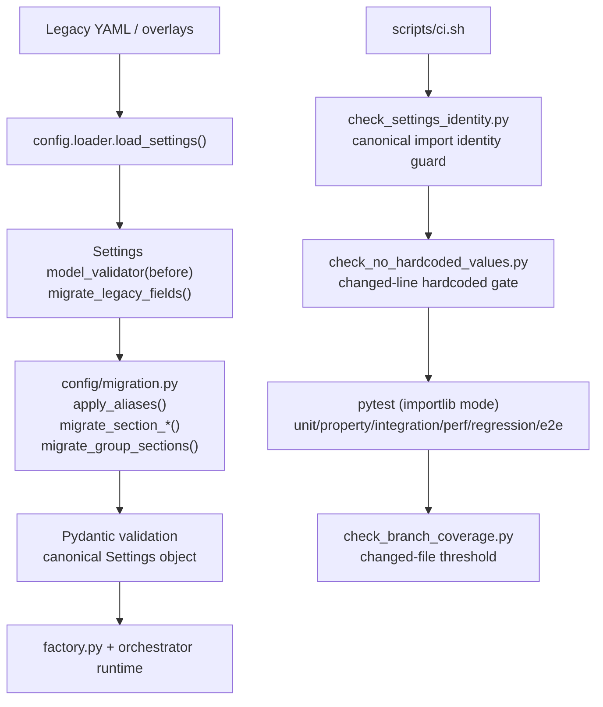

This model prevents class-identity drift under coverage/import instrumentation and keeps config
migration logic regression-tested as schema aliases evolve.

---

## Level 3f — Component Diagram: MCP Server (Optional)

The MCP (Model Context Protocol) server is an opt-in module that exposes the existing
`ToolRegistry`, telemetry pipeline, log buffer, redacted `Settings`, and (optionally)
episodic memory snapshots to any MCP-compliant client (Claude Code, Claude Desktop, the
`mcp.client` SDK, or future tooling). It is fully config-driven via `MCPConfig`, lazy-imports
the optional `mcp` SDK, and reuses every existing safety / resilience primitive — no
parallel infrastructure is introduced.

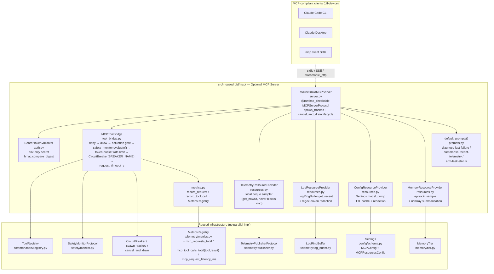

**Lifecycle:**

- Built by `factory.build_mcp_server(...)` only when `cfg.mcp.enabled`. Returns `None`
  otherwise; orchestrator boots normally without it.
- `factory.build_mcp_server` raises `ValueError` if `cfg.mcp.port == cfg.telemetry.port`
  for a non-stdio transport (configurable, no hardcoded port).
- Started after `TelemetryServer` and stopped just before it inside
  `MouseDroidOrchestrator.start()` / `stop()`. Background tasks (sampler + serve loop)
  are tracked in a private `set[asyncio.Task]` and drained via
  `cancel_and_drain` — same pattern as the telemetry server.
- The 30 Hz control loop is **never** gated on MCP I/O: the bridge polls
  `publisher.get_queue()` with `get_nowait()` from a low-cadence sampler and writes into
  a `deque(maxlen=resources.recent_frames_max)`.

**Security gates (all config-driven):**

| Gate | Source of truth | Behaviour |
|------|-----------------|-----------|
| Deny-list | `MCPConfig.tools_denylist` | Highest precedence; `health_check` cannot be denied |
| Allow-list | `MCPConfig.tools_allowlist` | When set, only listed tools are exposed |
| Actuation toggle | `MCPConfig.expose_actuation_tools` + `actuation_tools` list | Side-effecting tools hidden / refused unless explicitly enabled |
| Safety monitor | `SafetyMonitorProtocol.evaluate(...)` | Emergency state refuses every actuation tool |
| Rate limit | `MCPConfig.rate_limit_rps` | Per-session token bucket |
| Circuit breaker | `MCPConfig.circuit_breaker` ∨ root `cfg.circuit_breaker` | Opens on repeated failure |
| Per-call timeout | `MCPConfig.request_timeout_s` | `asyncio.wait_for` around handler |
| Auth | `MCPConfig.auth_token_env_var` | Required for non-loopback transports (rejected at config load) |
| Redaction | `MCPConfig.redact_key_pattern` (regex) | Applied to logs, memory, and config snapshots |

**Coverage:** 99.40% across the module; auth / metrics / prompts / protocol / resources /
tool_bridge at 100%; `server.py` at 97% (the 3 uncovered lines are behind the optional
`mcp` SDK import).

---

## Level 4 — Code: Dependency Injection Pattern

Every interface is a `@runtime_checkable Protocol`. Factory functions are the only place that branch on platform:

```python
# src/mousedroid/comms/protocol.py
@runtime_checkable
class ESP32CommProtocol(Protocol):
    async def connect(self) -> None: ...
    async def send_velocity(self, vx: float, vy: float, omega: float) -> None: ...
    async def read_encoders(self) -> EncoderReading: ...
    async def get_battery_voltage(self) -> float: ...
    async def emergency_stop(self) -> None: ...
    async def disconnect(self) -> None: ...

# src/mousedroid/factory.py
def build_esp32_driver(cfg: Settings) -> ESP32CommProtocol:
    inner: ESP32CommProtocol
    if cfg.mock_hardware:
        from mousedroid.comms.mock_driver import MockESP32Driver
        inner = MockESP32Driver(cfg.esp32)
    elif cfg.esp32.protocol == "serial":
        from mousedroid.comms.serial_driver import SerialESP32Driver
        inner = SerialESP32Driver(cfg.esp32)
    else:
        from mousedroid.comms.wifi_driver import WiFiESP32Driver
        inner = WiFiESP32Driver(cfg.esp32)

    from mousedroid.resilience.resilient_driver import ResilientESP32Driver
    return ResilientESP32Driver(inner, cfg.retry, cfg.circuit_breaker)
```

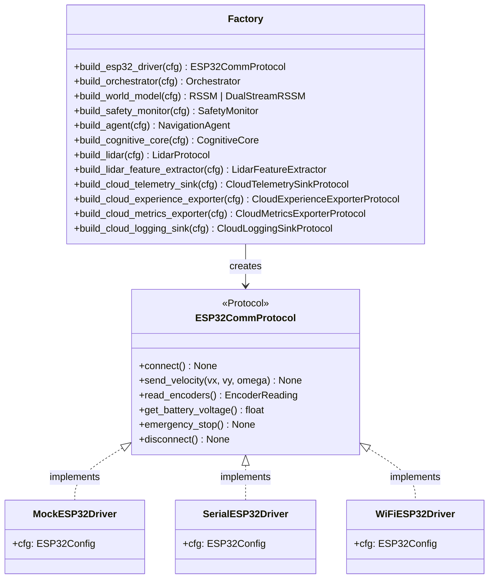

This means:

- **Tests** inject `MockESP32Driver` via `Settings(mock_hardware=True)` — no GPIO needed
- **CI** runs the full test suite with zero hardware
- **Production** seamlessly switches to `SerialESP32Driver` via config

---

## Data Flows

### Sense-Plan-Act (30 Hz)

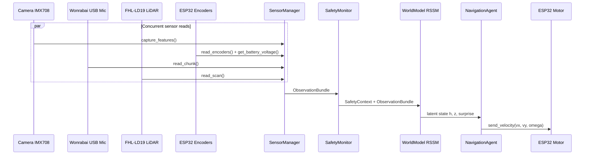

### Experience Pipeline (async)

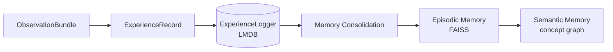

### Telemetry Broadcast (WiFi / Ethernet)

```mermaid
sequenceDiagram
    participant Orch as Orchestrator (30 Hz)
    participant TelePub as TelemetryPublisher
    participant TeleServ as TelemetryServer (aiohttp)
    participant WSClient as WebSocket Client
    participant RESTClient as REST Client
    participant PromClient as Prometheus Scraper

    Note over Orch,TelePub: Each control tick
    Orch->>TelePub: publish(TelemetryFrame)
    TelePub->>TelePub: put_nowait — drops if queue full
    TelePub->>TeleServ: _latest_frame updated

    Note over TeleServ,WSClient: Background broadcast loop
    TeleServ->>WSClient: JSON frame over WebSocket

    Note over RESTClient,TeleServ: On-demand REST endpoints
    RESTClient->>TeleServ: GET /api/v1/sensors
    TeleServ-->>RESTClient: latest TelemetryFrame JSON
    RESTClient->>TeleServ: GET /api/v1/health
    TeleServ-->>RESTClient: GPU temp, load, battery
    RESTClient->>TeleServ: GET /api/v1/logs
    TeleServ-->>RESTClient: last-N structured log entries
    RESTClient->>TeleServ: GET /api/v1/network
    TeleServ-->>RESTClient: interfaces + server URL
    Note over PromClient,TeleServ: Prometheus scrape path
    PromClient->>TeleServ: GET /metrics
    TeleServ-->>PromClient: text/plain; version=0.0.4
```

---

### Learning Pipeline (offline / async)

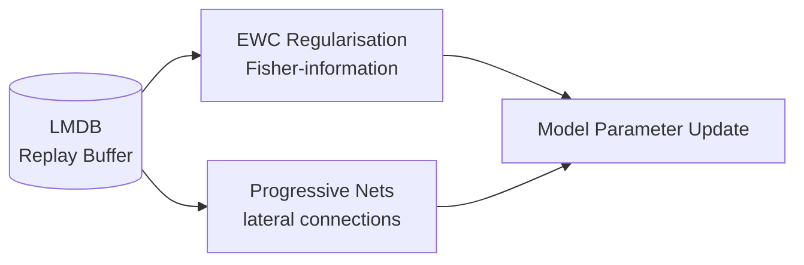

---

### Cognitive Core Data Flow (dual-cadence)

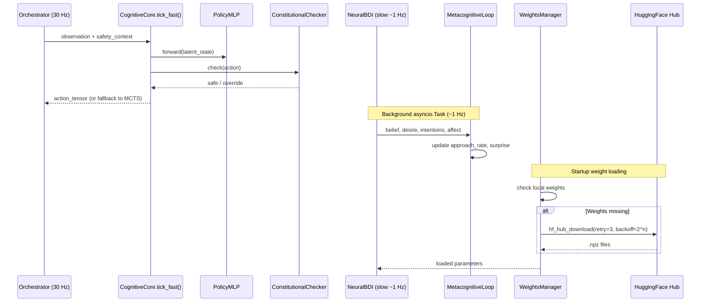

---

## Training Pipeline (Offline GPU)

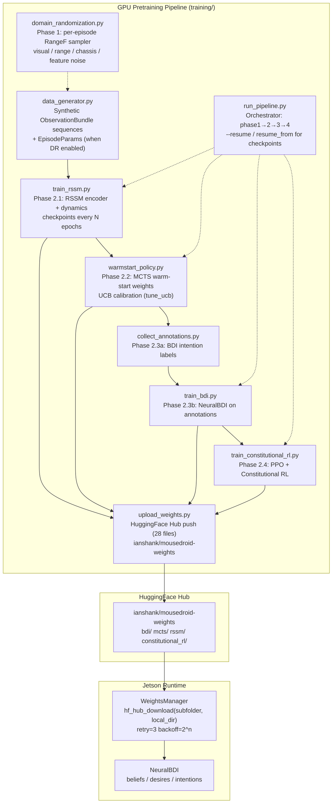

**Key training facts:**

| Property | Value |
| -------- | ----- |
| Pipeline entry | `python training/run_pipeline.py [--resume path/to/checkpoint.pt]` |
| Resume support | `--resume` / `resume_from` in config; forwards checkpoint to RSSM training only |
| Weight storage | `ianshank/mousedroid-weights` HuggingFace repo; `bdi/`, `mcts/`, `rssm/`, `constitutional_rl/` subfolders |
| Runtime download | `WeightsManager.download_weights_from_huggingface(subfolder='bdi', local_dir=weights_dir.parent)` |
| Type safety | All `training/` modules pass `mypy --strict` (NDArray[Any] annotations) |

---

## Physical AI Roadmap (Phase 1 — Domain Randomization)

Following the four-gap analysis from Martin Keen's "What is Physical AI?" (IBM
Technology, 2026-04-13), the offline pretraining pipeline is being extended to
shrink the sim-to-real gap. **Phase 1 is in this branch; Phases 2 → 6 are
roadmap items tracked in [`NEXT_STEPS.md`](../NEXT_STEPS.md).**

### Phase 1 — Domain Randomization (this branch)

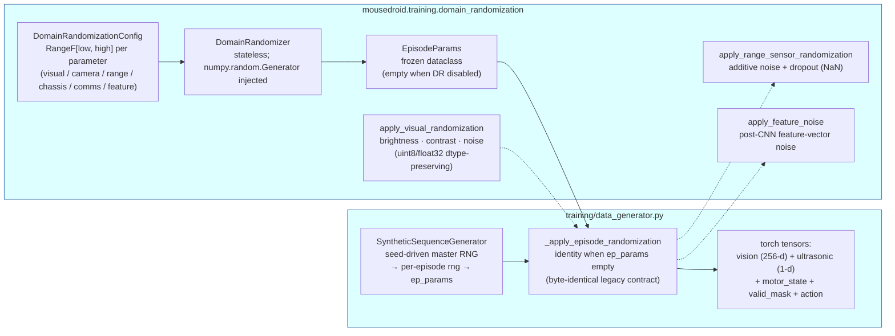

**Contract guarantees (regression-tested in
`tests/regression/test_domain_randomization_backcompat.py`):**

- `DomainRandomizationConfig.enabled=False` returns empty `EpisodeParams`;
  `_apply_episode_randomization` returns the input dict by **identity**, not
  just by equality. Existing artifacts and golden hashes remain byte-identical.
- All randomization ranges are `RangeF` Pydantic models — zero hardcoded values
  in module bodies; YAMLs override per-environment (production tightens; mock
  widens for stress testing).
- Reproducibility: every public function takes an explicit
  `numpy.random.Generator`, so identical seeds produce identical outputs. The
  generator's master RNG is re-seeded per episode via
  `np.iinfo(np.int64).max` (no magic literals).
- 100% line + branch coverage on the new module; 100% changed-line coverage
  across all touched source files; global coverage holds at 91.68% (gate 85%).

### Roadmap (Phases 2 → 6, tracked in `NEXT_STEPS.md`)

| Phase | Goal | Module(s) |
| ----- | ---- | --------- |
| 2 | Real-episode replay loop — LMDB reader + sim:real mixer feeds back into RSSM and Constitutional-RL training | `training/replay/`, schema-versioned `experience/` records |
| 3a | VLA Protocol + `MockVLA` + factory + orchestrator branch | `mousedroid.vla` |
| 3b | `DistilledVLAOnnx` adapter — TensorRT/ONNX with HF Hub weights pull | `mousedroid.vla.policy`, `[vla]` extra in `pyproject.toml` |
| 4 | VLM-derived dense rewards (VLAC pattern) — pluggable into `MultiObjectiveRewardModel` | `mousedroid.reward.vlm_progress` |
| 5 (stretch) | Real physics simulator (MuJoCo MJX / Isaac Sim Lite) — replace synthetic-sequence generator with ground-truth dynamics | `training/sim/` (new) |
| 6 (stretch) | On-device LoRA-adapter fine-tuning for the VLA from continuously-logged real episodes | `mousedroid.vla.adapters` (new) |

Each phase ships in an isolated PR off the default branch; dependency direction
is strictly Phase 1 → 2 → 3 → 4. Phases 5 and 6 are deferred until Phase 3b has
been in production for ≥30 days.

---

## Dual-Stream CfC/GRU World Model

The world model supports two modes selected via `model.cfc_hidden_dim`:

- **Classic RSSM** (`cfc_hidden_dim=0`): Single GRU stream, 256-dim hidden state
- **Dual-Stream RSSM** (`cfc_hidden_dim>0`): GRU + CfC parallel streams with concat fusion

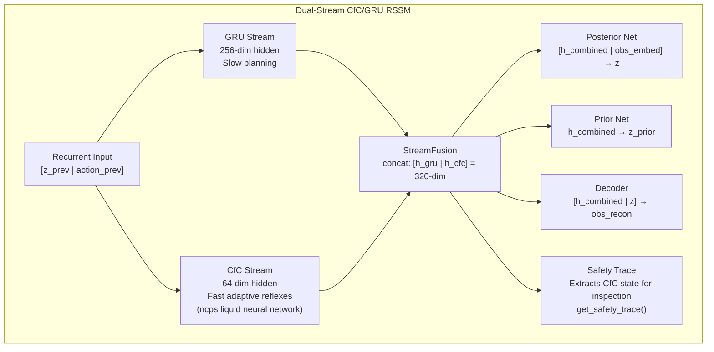

**Training:** Dual optimizers with separate learning rates and gradient clipping per stream.
CfC loss weight ramps linearly from 0.1→1.0 over 10k steps.

**Human activation gate:** CfC disabled by default in production (`cfc_hidden_dim=0`).
Activate via: `MOUSEDROID_MODEL__CFC_HIDDEN_DIM=64 docker compose up -d`

**HuggingFace:** Trained weights at `ianshank/mousedroid-dual-stream-rssm` (experimental).

---

## Key Design Decisions

| Decision | Rationale |
| -------- | --------- |
| Protocol-based DI everywhere | Testable without hardware; clean separation of concerns |
| `asyncio` throughout, `to_thread` for I/O | No GIL contention; predictable latency |
| Pydantic v2 for all config | Validation at startup; no silent misconfiguration |
| `structlog` JSON logging | Machine-readable in production; grep-friendly in dev |
| `deque(maxlen=N)` ring buffers | Fixed memory footprint for sensor history |
| LMDB for experience storage | Zero-copy reads; crash-safe; high write throughput |
| FAISS for memory retrieval | Sub-millisecond similarity search at 50k scale |
| numpy-only cognitive inference | No CUDA dependency for BDI/metacog; runs on CPU |
| Dual-cadence cognitive loop | Fast 30 Hz reaction + slow 1 Hz deliberation minimises compute |
| HuggingFace Hub weight loading | `hf_hub_download(subfolder, local_dir)` routes files to exact path; retry=3, backoff=2^n |
| `torch.no_grad()` for all RSSM/MCTS inference | Prevents accidental gradient accumulation |
| Optional audio projection in encoder | `audio_dim=0` disables audio entirely; existing 3-modality checkpoints load unchanged |
| `FeatureExtractorProtocol` for camera | Pluggable backends (MeanPool, TensorRT, ONNX); eliminates duplicate code across camera drivers |
| Module-level constants for all magic numbers | Grep-able; documented; not scattered in logic |
| Dual-stream CfC/GRU RSSM | CfC provides sub-100ms adaptive time constants for reflexes; GRU handles slow planning; concat fusion preserves both information streams; safety trace exposes CfC state for independent monitoring |
| Human activation gate for CfC | `cfc_hidden_dim=0` default ensures classic RSSM in production; explicit env var override required — prevents accidental deployment of experimental architecture |
| Separate dual optimizers | GRU (lr=3e-4, clip=10.0) and CfC (lr=1e-4, clip=1.0) trained independently; CfC loss warmup prevents destabilising GRU early in training |
| L4T Docker container | GPU-accelerated deployment with consistent environment |
| Multi-stage Docker builds | Extract pre-compiled binaries from upstream images to bypass OOM |
| NVMe SSD for Docker + swap | 500 GB fast storage avoids SD card wear and OOM during builds |
| `systemd-run` for long builds | Persistent processes survive SSH drops |
| aiohttp over FastAPI for telemetry | Lightweight asyncio-native HTTP; no ASGI wrapper; fits inside the existing event loop |
| Non-blocking drop-on-full queue | Telemetry must never stall the 30 Hz control loop; frame drops are preferable to back-pressure |
| Stdlib-only network discovery | `socket` + `netifaces` avoids extra system calls; works inside Docker without root |
| Immutable `TelemetryFrame` dataclass | Thread-safe snapshot; safe to pass across asyncio tasks without copying |
| GCP Digital Twin as optional sidecar | `gcp: null` = fully offline; CircuitBreaker on all cloud calls; droid never depends on cloud for safety |
| msgpack for Pub/Sub payloads | Reuses existing serialisation (ExperienceRecord + TelemetryFrame); 30-60% smaller than JSON for numpy arrays |
| LMDB-to-GCS high-water mark cursor | Exactly-once export without needing Pub/Sub ordering; survives power cycles |
| Cloud config as `GCPConfig \| None` | Single Optional field on Settings; all existing YAML loads unchanged; no migration needed |
