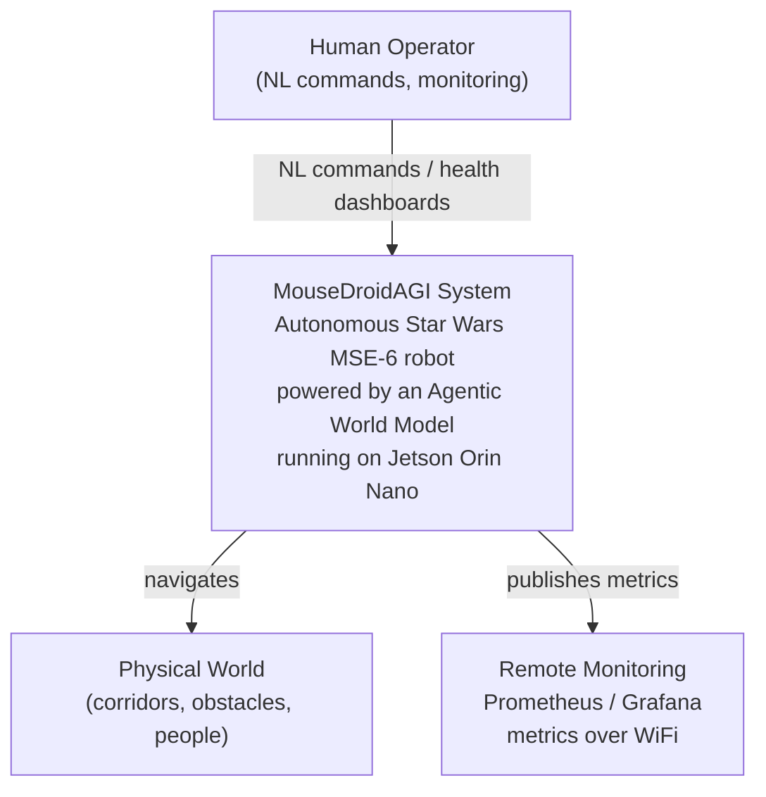
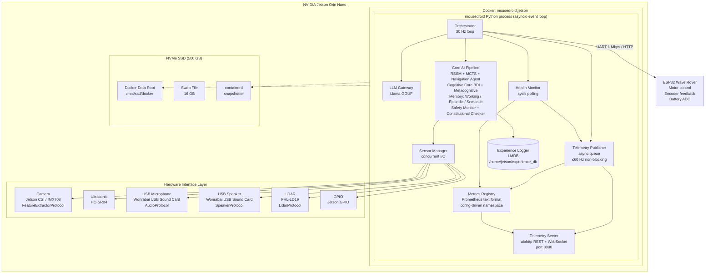
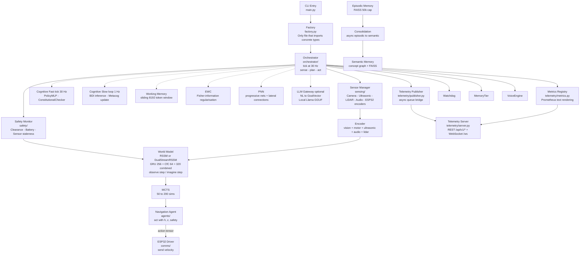
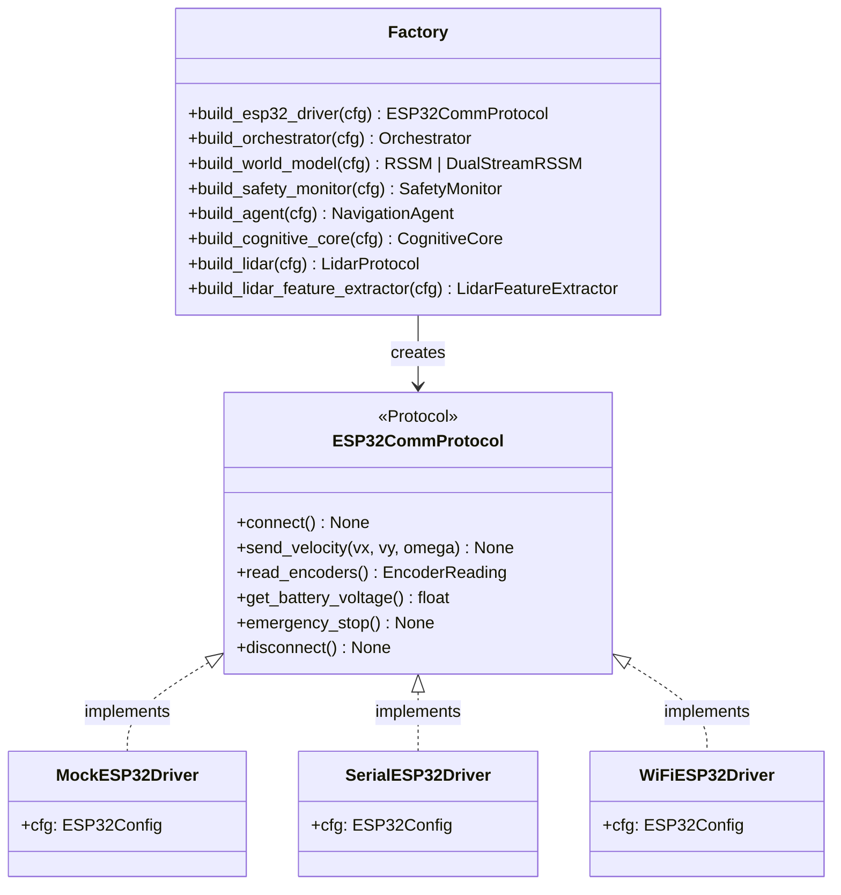
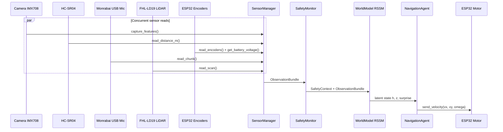
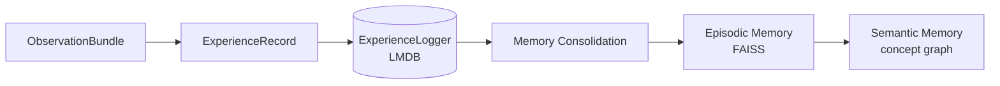
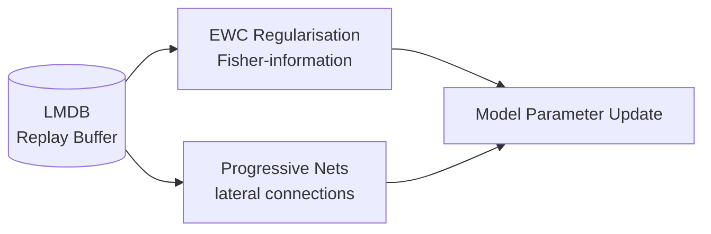
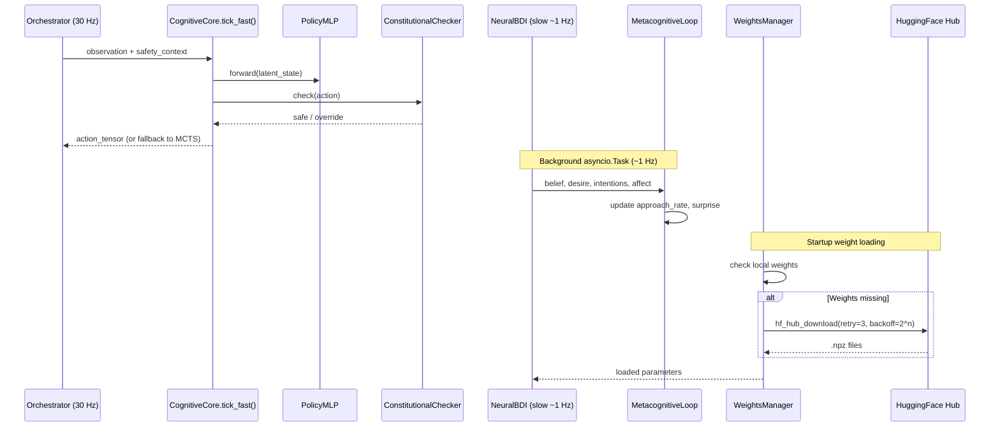
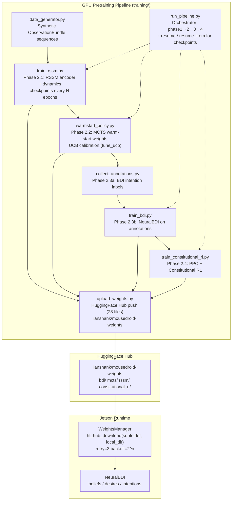
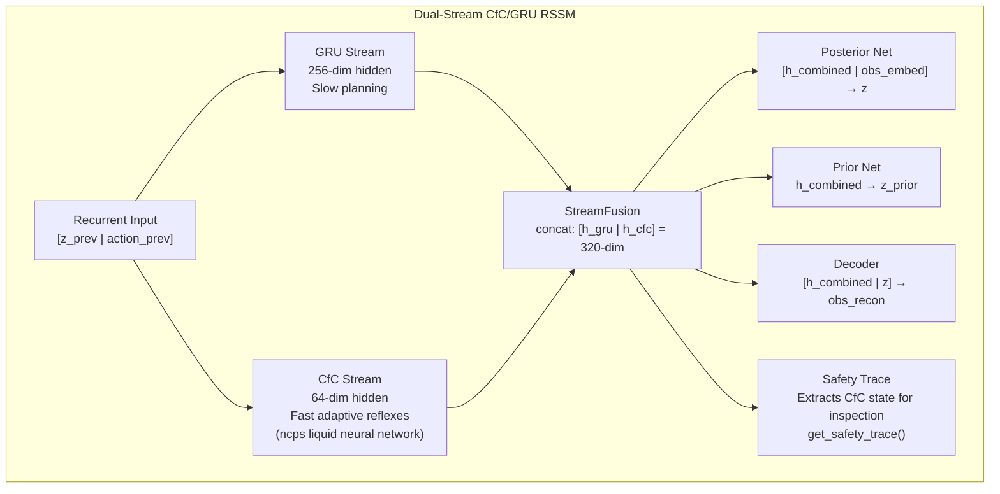

# MouseDroidAGI — C4 Architecture

This document uses the [C4 model](https://c4model.com/) (Context → Container → Component → Code) to describe the system architecture at four levels of abstraction.

---

## Level 1 — System Context



**Actors:**

- **Human Operator** — Sends natural language mission commands via LLM gateway; monitors telemetry
- **Physical World** — The environment the robot navigates through
- **Remote Monitoring** — Optional Prometheus/Grafana dashboard for production deployments

---

## Level 2 — Container Diagram



**Containers:**

| Container | Technology | Responsibility |
|-----------|-----------|----------------|
| Docker `mousedroid:jetson` | L4T PyTorch r36.4.0 | GPU-accelerated container (CUDA 12.6 + TensorRT 10.4) |
| `mousedroid` process | Python 3.10 asyncio | All AI reasoning + I/O orchestration |
| LMDB experience store | LMDB on-disk | Persistent experience replay buffer |
| Llama GGUF model | llama-cpp-python | Local LLM for NL to velocity |
| ESP32 firmware | C++ (Wave Rover SDK) | Motor PWM control, encoder polling |
| Jetson CSI / IMX708 camera | jetson_utils / picamera2 | Vision capture + pluggable feature extraction (MeanPool / TensorRT) |
| Wonrabai USB Sound Card | PyAudio | Combo mic + speaker: audio capture for world model + TTS output |
| FHL-LD19 LiDAR | pyserial UART | 360° 2D distance scanning for obstacle detection + clearance |
| NVMe SSD 500 GB | ext4 `/mnt/ssd` | Docker data-root, containerd, 16 GB swap |
| Telemetry Publisher | Python asyncio queue | Non-blocking sensor-frame fan-out at ≤60 Hz |
| Metrics Registry | Python stdlib exporter | Prometheus metric families and text rendering |
| Telemetry Server | aiohttp 3.x REST + WebSocket | Remote WiFi/Ethernet monitoring (configurable port, default 8080) |
---

## Level 3 — Component Diagram (mousedroid process)



---

## Level 3b — Component Diagram: Production Hardening (v0.3.0)

New production components added in the v0.3.0 release:

```mermaid
graph TD
    Orchestrator["Orchestrator\nasyncio.wait_for(tick, timeout=tick_timeout_s)"]

    subgraph Watchdog["Watchdog Layer\nhealth/watchdog.py"]
        WatchdogProt["WatchdogProtocol\n@runtime_checkable"]
        SystemdNotif["SystemdNotifier\nWATCHDOG=1 via sdnotify or subprocess"]
        FileHB["FileHeartbeatNotifier\ntimestamp to /tmp/mousedroid_heartbeat"]
        NullNotif["NullNotifier\nmock/dev mode"]
        WatchdogProt <|.. SystemdNotif
        WatchdogProt <|.. FileHB
        WatchdogProt <|.. NullNotif
    end

    subgraph MemoryTierGroup["Memory Tier\nmemory/tier.py"]
        MemTier["MemoryTier\nepisodic + semantic + working + consolidation"]
        EpiRep["EpisodicReplay\nFAISS 50k"]
        SemIdx["SemanticIndex\nconcept graph"]
        WorkMem["WorkingMemory\n8192 token window"]
        Consol["MemoryConsolidation\nasync background task"]
        MemTier --> EpiRep
        MemTier --> SemIdx
        MemTier --> WorkMem
        MemTier --> Consol
    end

    subgraph VoiceLayer["Voice Engine\nvoice/engine.py"]
        Rocky["Rocky Personality\nphrase_bank.py"]
        PiperTTS["Piper TTS\nlocal inference"]
        Speaker["USB Speaker\nSpeakerProtocol"]
        Rocky --> PiperTTS --> Speaker
    end

    subgraph PreFlight["Pre-flight Check\nscripts/preflight_check.sh"]
        PF_ESP32["ESP32 device check"]
        PF_Camera["Camera device check"]
        PF_GPIO["GPIO device check"]
        PF_Disk["Disk space check"]
        PF_Config["Config YAML check"]
        PF_Weights["Model weights check"]
    end

    Orchestrator -- "notify() after successful tick" --> Watchdog
    Orchestrator -- "push ExperienceRecord each tick" --> MemoryTierGroup
    Orchestrator -- "startup/shutdown/error/obstacle events" --> VoiceLayer
    Orchestrator -- "asyncio.TimeoutError → emergency_stop()" --> ESP32Driver["ESP32 emergency_stop()"]
    PreFlight -- "ExecStartPre (systemd)" --> Orchestrator
```

**Tick Safety Loop (v0.3.0):**


---

## Level 4 — Code: Dependency Injection Pattern

Every interface is a `@runtime_checkable Protocol`. Factory functions are the only place that branch on platform:

```python
# src/mousedroid/comms/protocol.py
@runtime_checkable
class ESP32CommProtocol(Protocol):
    async def connect(self) -> None: ...
    async def send_velocity(self, vx: float, vy: float, omega: float) -> None: ...
    async def read_encoders(self) -> EncoderReading: ...
    async def get_battery_voltage(self) -> float: ...
    async def emergency_stop(self) -> None: ...
    async def disconnect(self) -> None: ...

# src/mousedroid/factory.py
def build_esp32_driver(cfg: Settings) -> ESP32CommProtocol:
    if cfg.mock_hardware:
        from mousedroid.comms.mock_driver import MockESP32Driver
        return MockESP32Driver(cfg.esp32)
    if cfg.esp32.protocol == "serial":
        from mousedroid.comms.serial_driver import SerialESP32Driver
        return SerialESP32Driver(cfg.esp32)
    from mousedroid.comms.wifi_driver import WiFiESP32Driver
    return WiFiESP32Driver(cfg.esp32)
```



This means:

- **Tests** inject `MockESP32Driver` via `Settings(mock_hardware=True)` — no GPIO needed
- **CI** runs the full test suite with zero hardware
- **Production** seamlessly switches to `SerialESP32Driver` via config

---

## Data Flows

### Sense-Plan-Act (30 Hz)



### Experience Pipeline (async)



### Telemetry Broadcast (WiFi / Ethernet)

```mermaid
sequenceDiagram
    participant Orch as Orchestrator (30 Hz)
    participant TelePub as TelemetryPublisher
    participant TeleServ as TelemetryServer (aiohttp)
    participant WSClient as WebSocket Client
    participant RESTClient as REST Client
    participant PromClient as Prometheus Scraper

    Note over Orch,TelePub: Each control tick
    Orch->>TelePub: publish(TelemetryFrame)
    TelePub->>TelePub: put_nowait — drops if queue full
    TelePub->>TeleServ: _latest_frame updated

    Note over TeleServ,WSClient: Background broadcast loop
    TeleServ->>WSClient: JSON frame over WebSocket

    Note over RESTClient,TeleServ: On-demand REST endpoints
    RESTClient->>TeleServ: GET /api/v1/sensors
    TeleServ-->>RESTClient: latest TelemetryFrame JSON
    RESTClient->>TeleServ: GET /api/v1/health
    TeleServ-->>RESTClient: GPU temp, load, battery
    RESTClient->>TeleServ: GET /api/v1/logs
    TeleServ-->>RESTClient: last-N structured log entries
    RESTClient->>TeleServ: GET /api/v1/network
    TeleServ-->>RESTClient: interfaces + server URL
    Note over PromClient,TeleServ: Prometheus scrape path
    PromClient->>TeleServ: GET /metrics
    TeleServ-->>PromClient: text/plain; version=0.0.4
```

---

### Learning Pipeline (offline / async)



---

### Cognitive Core Data Flow (dual-cadence)



---

## Training Pipeline (Offline GPU)



**Key training facts:**

| Property | Value |
|----------|-------|
| Pipeline entry | `python training/run_pipeline.py [--resume path/to/checkpoint.pt]` |
| Resume support | `--resume` / `resume_from` in config; forwards checkpoint to RSSM training only |
| Weight storage | `ianshank/mousedroid-weights` HuggingFace repo; `bdi/`, `mcts/`, `rssm/`, `constitutional_rl/` subfolders |
| Runtime download | `WeightsManager.download_weights_from_huggingface(subfolder='bdi', local_dir=weights_dir.parent)` |
| Type safety | All `training/` modules pass `mypy --strict` (NDArray[Any] annotations) |

---

## Dual-Stream CfC/GRU World Model

The world model supports two modes selected via `model.cfc_hidden_dim`:

- **Classic RSSM** (`cfc_hidden_dim=0`): Single GRU stream, 256-dim hidden state
- **Dual-Stream RSSM** (`cfc_hidden_dim>0`): GRU + CfC parallel streams with concat fusion



**Training:** Dual optimizers with separate learning rates and gradient clipping per stream.
CfC loss weight ramps linearly from 0.1→1.0 over 10k steps.

**Human activation gate:** CfC disabled by default in production (`cfc_hidden_dim=0`).
Activate via: `MOUSEDROID_MODEL__CFC_HIDDEN_DIM=64 docker compose up -d`

**HuggingFace:** Trained weights at `ianshank/mousedroid-dual-stream-rssm` (experimental).

---

## Key Design Decisions

| Decision | Rationale |
|----------|-----------|
| Protocol-based DI everywhere | Testable without hardware; clean separation of concerns |
| `asyncio` throughout, `to_thread` for I/O | No GIL contention; predictable latency |
| Pydantic v2 for all config | Validation at startup; no silent misconfiguration |
| `structlog` JSON logging | Machine-readable in production; grep-friendly in dev |
| `deque(maxlen=N)` ring buffers | Fixed memory footprint for sensor history |
| LMDB for experience storage | Zero-copy reads; crash-safe; high write throughput |
| FAISS for memory retrieval | Sub-millisecond similarity search at 50k scale |
| numpy-only cognitive inference | No CUDA dependency for BDI/metacog; runs on CPU |
| Dual-cadence cognitive loop | Fast 30 Hz reaction + slow 1 Hz deliberation minimises compute |
| HuggingFace Hub weight loading | `hf_hub_download(subfolder, local_dir)` routes files to exact path; retry=3, backoff=2^n |
| `torch.no_grad()` for all RSSM/MCTS inference | Prevents accidental gradient accumulation |
| Optional audio projection in encoder | `audio_dim=0` disables audio entirely; existing 3-modality checkpoints load unchanged |
| `FeatureExtractorProtocol` for camera | Pluggable backends (MeanPool, TensorRT, ONNX); eliminates duplicate code across camera drivers |
| Module-level constants for all magic numbers | Grep-able; documented; not scattered in logic |
| Dual-stream CfC/GRU RSSM | CfC provides sub-100ms adaptive time constants for reflexes; GRU handles slow planning; concat fusion preserves both information streams; safety trace exposes CfC state for independent monitoring |
| Human activation gate for CfC | `cfc_hidden_dim=0` default ensures classic RSSM in production; explicit env var override required — prevents accidental deployment of experimental architecture |
| Separate dual optimizers | GRU (lr=3e-4, clip=10.0) and CfC (lr=1e-4, clip=1.0) trained independently; CfC loss warmup prevents destabilising GRU early in training |
| L4T Docker container | GPU-accelerated deployment with consistent environment |
| Multi-stage Docker builds | Extract pre-compiled binaries from upstream images to bypass OOM |
| NVMe SSD for Docker + swap | 500 GB fast storage avoids SD card wear and OOM during builds |
| `systemd-run` for long builds | Persistent processes survive SSH drops |
| aiohttp over FastAPI for telemetry | Lightweight asyncio-native HTTP; no ASGI wrapper; fits inside the existing event loop |
| Non-blocking drop-on-full queue | Telemetry must never stall the 30 Hz control loop; frame drops are preferable to back-pressure |
| Stdlib-only network discovery | `socket` + `netifaces` avoids extra system calls; works inside Docker without root |
| Immutable `TelemetryFrame` dataclass | Thread-safe snapshot; safe to pass across asyncio tasks without copying |
