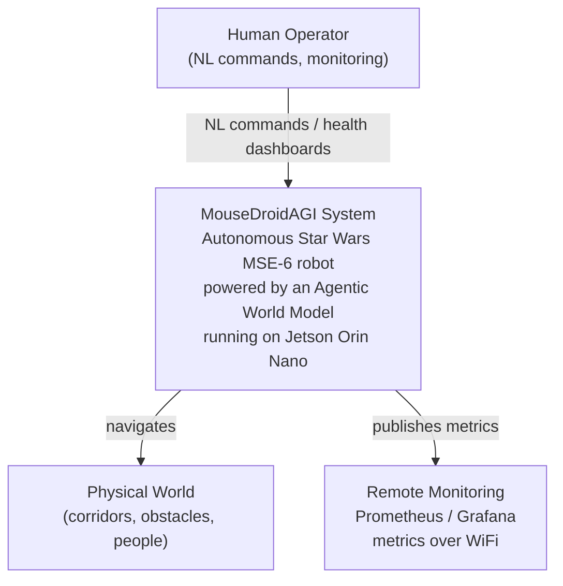
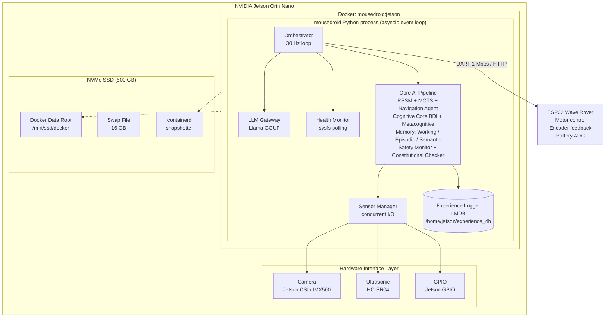
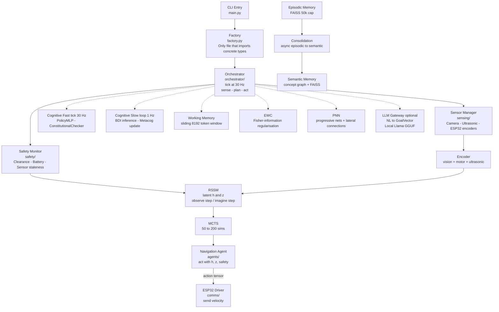
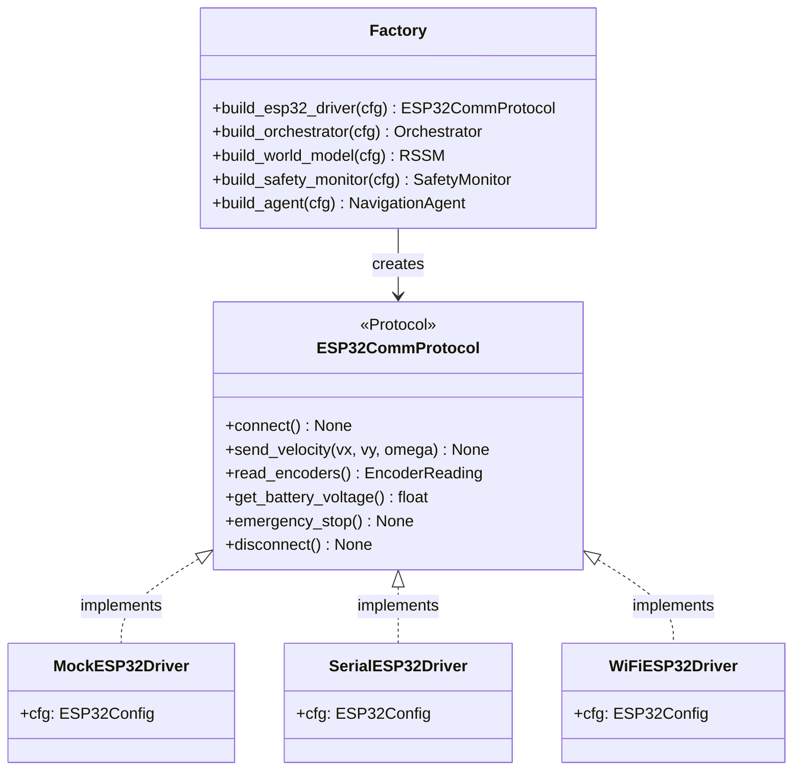
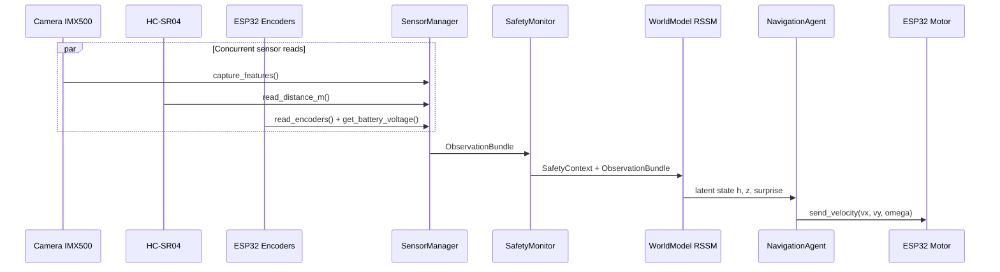
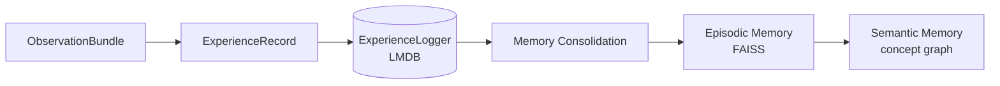
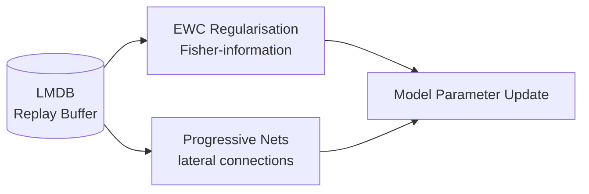

# MouseDroidAGI — C4 Architecture

This document uses the [C4 model](https://c4model.com/) (Context → Container → Component → Code) to describe the system architecture at four levels of abstraction.

---

## Level 1 — System Context



**Actors:**

- **Human Operator** — Sends natural language mission commands via LLM gateway; monitors telemetry
- **Physical World** — The environment the robot navigates through
- **Remote Monitoring** — Optional Prometheus/Grafana dashboard for production deployments

---

## Level 2 — Container Diagram



**Containers:**

| Container | Technology | Responsibility |
|-----------|-----------|----------------|
| Docker `mousedroid:jetson` | L4T PyTorch r36.4.0 | GPU-accelerated container (CUDA 12.6 + TensorRT 10.4) |
| `mousedroid` process | Python 3.10 asyncio | All AI reasoning + I/O orchestration |
| LMDB experience store | LMDB on-disk | Persistent experience replay buffer |
| Llama GGUF model | llama-cpp-python | Local LLM for NL to velocity |
| ESP32 firmware | C++ (Wave Rover SDK) | Motor PWM control, encoder polling |
| Jetson CSI / IMX500 camera | jetson_utils / picamera2 | Vision capture + onboard neural inference |
| NVMe SSD 500 GB | ext4 `/mnt/ssd` | Docker data-root, containerd, 16 GB swap |

---

## Level 3 — Component Diagram (mousedroid process)



---

## Level 4 — Code: Dependency Injection Pattern

Every interface is a `@runtime_checkable Protocol`. Factory functions are the only place that branch on platform:

```python
# src/mousedroid/comms/protocol.py
@runtime_checkable
class ESP32CommProtocol(Protocol):
    async def connect(self) -> None: ...
    async def send_velocity(self, vx: float, vy: float, omega: float) -> None: ...
    async def read_encoders(self) -> EncoderReading: ...
    async def get_battery_voltage(self) -> float: ...
    async def emergency_stop(self) -> None: ...
    async def disconnect(self) -> None: ...

# src/mousedroid/factory.py
def build_esp32_driver(cfg: Settings) -> ESP32CommProtocol:
    if cfg.mock_hardware:
        from mousedroid.comms.mock_driver import MockESP32Driver
        return MockESP32Driver(cfg.esp32)
    if cfg.esp32.protocol == "serial":
        from mousedroid.comms.serial_driver import SerialESP32Driver
        return SerialESP32Driver(cfg.esp32)
    from mousedroid.comms.wifi_driver import WiFiESP32Driver
    return WiFiESP32Driver(cfg.esp32)
```



This means:

- **Tests** inject `MockESP32Driver` via `Settings(mock_hardware=True)` — no GPIO needed
- **CI** runs the full test suite with zero hardware
- **Production** seamlessly switches to `SerialESP32Driver` via config

---

## Data Flows

### Sense-Plan-Act (30 Hz)



### Experience Pipeline (async)



### Learning Pipeline (offline / async)



---

## Key Design Decisions

| Decision | Rationale |
|----------|-----------|
| Protocol-based DI everywhere | Testable without hardware; clean separation of concerns |
| `asyncio` throughout, `to_thread` for I/O | No GIL contention; predictable latency |
| Pydantic v2 for all config | Validation at startup; no silent misconfiguration |
| `structlog` JSON logging | Machine-readable in production; grep-friendly in dev |
| `deque(maxlen=N)` ring buffers | Fixed memory footprint for sensor history |
| LMDB for experience storage | Zero-copy reads; crash-safe; high write throughput |
| FAISS for memory retrieval | Sub-millisecond similarity search at 50k scale |
| numpy-only cognitive inference | No CUDA dependency for BDI/metacog; runs on CPU |
| `torch.no_grad()` for all RSSM/MCTS inference | Prevents accidental gradient accumulation |
| Module-level constants for all magic numbers | Grep-able; documented; not scattered in logic |
| L4T Docker container | GPU-accelerated deployment with consistent environment |
| NVMe SSD for Docker + swap | 500 GB fast storage avoids SD card wear and OOM during builds |
| `systemd-run` for long builds | Persistent processes survive SSH drops |
