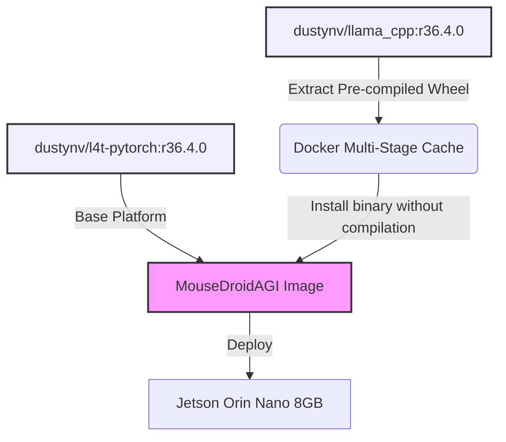

# Architecture Decision Record: ADR-004 Pre-built AI Containers

## Title

Multi-Stage Pre-built Container Substrates for LLM Dependencies

## Context

Deploying MouseDroidAGI on the Jetson Orin Nano (8GB) encounters insurmountable memory failures (Linux OOM killer) when compiling `llama-cpp-python` from source. Limiting compilation threads/jobs and configuring 16GB NVMe swap did not resolve the peak memory usage during NVIDIA CUDA kernel (`cicc` / `ptxas`) linking. The Jetpack 6 / CUDA 12.6 stack requires contiguous compilation memory that surpasses device limits. Furthermore, network constraints (DNS dropping) make retrieving pure wheels from Jetson AI lab unreliable during container builds.

## Decision

We bypass source compilation entirely by adopting **Docker Multi-Stage Builds**, extracting pre-compiled Python binaries directly from specialized L4T images.

Instead of building `llama-cpp-python`, we define a `builder` stage using `dustynv/llama_cpp:r36.4.0`. We extract the compiled wheel/site-packages and inject them directly into our core foundation `dustynv/l4t-pytorch:r36.4.0`.

## Architecture Diagram

## Consequences

**Positive:**

- Build time drops from 40+ minutes (failing) to ~5 minutes.
- Peak memory usage during the Docker build remains under 2GB (safely avoiding OOM events).
- Zero dependency on live external network connections for complex compilations.
- Deterministic and identical CUDA/C++ ABI linking, as `dustynv` images share identically versioned foundational layers.

**Negative:**

- The Dockerfile becomes slightly more complex with multi-stage `COPY` strategies.
- Upgrading to a new L4T version requires bumping both `dustynv/l4t-pytorch` and `dustynv/llama_cpp` tags synchronously.

## Alternatives Considered

- **Direct `.whl` Download**: Fails frequently over SSH/DNS proxies on the Jetson due to timeout constraints and host resolution errors (`[Errno 11001] getaddrinfo failed`).
- **x86_64 Cross Compilation**: Avoided to keep the repository CI/CD and developer onboarding standalone and self-sufficient on ARM64 environments.
