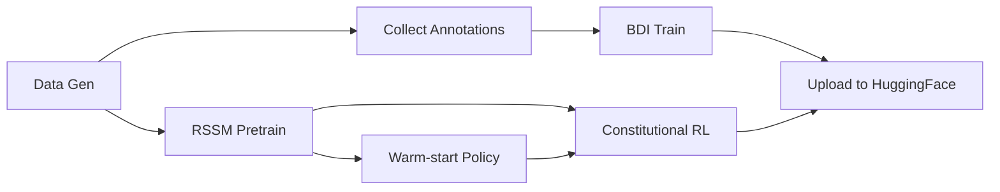
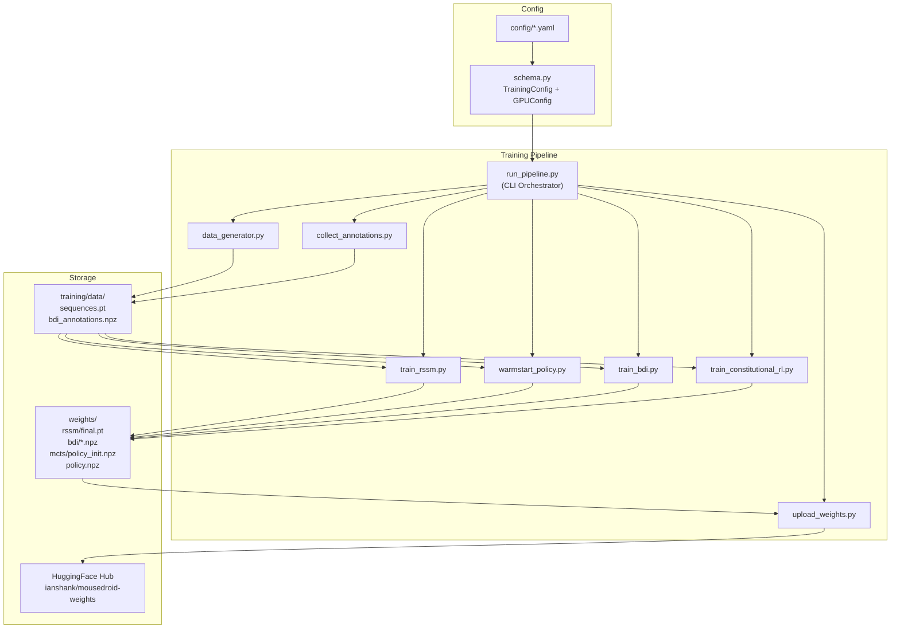

# ADR-005: GPU Pre-Training Pipeline on Jetson Orin Nano

> **Date**: 2026-03-13
> **Status**: Proposed
> **Deciders**: @ianshank

---

## Context

MouseDroid has a 4-phase training pipeline (RSSM → Warm-start → BDI → Constitutional RL) that currently defaults to CPU execution. The Jetson Orin Nano has a 1024-core NVIDIA Ampere GPU with 8 GB unified memory. We need to GPU-accelerate the PyTorch-based phases while keeping the numpy-based BDI training on CPU.

## Decision

### 1. GPU Auto-Detection with Graceful Fallback

```python
def resolve_device(device: str | None = None) -> torch.device:
    if device:
        return torch.device(device)
    if torch.cuda.is_available():
        return torch.device("cuda:0")
    return torch.device("cpu")
```

**Rationale**: All training scripts should auto-detect GPU without requiring explicit `--device cuda` flags, but allow override.

### 2. Unified Pipeline Orchestrator

Create `training/run_pipeline.py` that executes all phases sequentially:



**Rationale**: Currently each phase must be run manually with correct paths. A single orchestrator reduces human error and enables CI/CD automation.

### 3. Memory-Constrained Batch Sizing

| Phase | Default Batch Size | Est. GPU Memory |
|-------|--------------------|-----------------|
| RSSM | 16 (Jetson) / 32 (desktop) | ~2.5 GB |
| Warm-start (UCB tuning) | N/A (online) | ~1.5 GB |
| Constitutional RL | 64 rollout steps | ~2 GB |
| BDI | 32 (CPU) | N/A |

**Rationale**: Jetson has 8 GB unified (shared CPU+GPU). Conservative defaults prevent OOM.

### 4. Checkpoint Resume with Epoch Tracking

```python
@dataclass
class CheckpointState:
    epoch: int
    model_state_dict: dict
    optimizer_state_dict: dict
    best_loss: float
    rng_state: dict
```

**Rationale**: Jetson may lose power or overheat during long training runs. Resume support prevents wasted compute.

### 5. AMP (Automatic Mixed Precision) for RSSM

Use `torch.amp.autocast("cuda")` + `GradScaler` for RSSM training to halve memory and improve throughput on Ampere GPU.

**Rationale**: Jetson Ampere cores natively support FP16/BF16 tensor operations. AMP typically gives 1.5-2x speedup with minimal accuracy loss.

---

## Component Diagram



---

## Risks

| Risk | Impact | Mitigation |
|------|--------|------------|
| OOM on Jetson during RSSM training | High | Auto-reduce batch size on OOM + memory monitoring |
| Thermal throttling during long runs | Medium | Add temperature checks + pause logic |
| `llama-cpp-python` CUDA compile fails | Low | Not needed for training pipeline |
| Weight divergence CPU vs GPU | Low | Seed determinism + parity tests |

---

## Alternatives Considered

1. **Cloud training on GCP Vertex AI**: Rejected — adds complexity, cost, and latency for small models
2. **CuPy for BDI numpy acceleration**: Deferred — BDI training is fast enough on CPU (~minutes)
3. **ONNX Runtime for training**: Rejected — PyTorch native is better supported

---

## Requires Sign-Off

> [!IMPORTANT]
>
> - Default batch sizes for 8 GB Jetson memory
> - Whether to enable AMP by default or make it opt-in
> - HuggingFace repo structure for versioned weights
