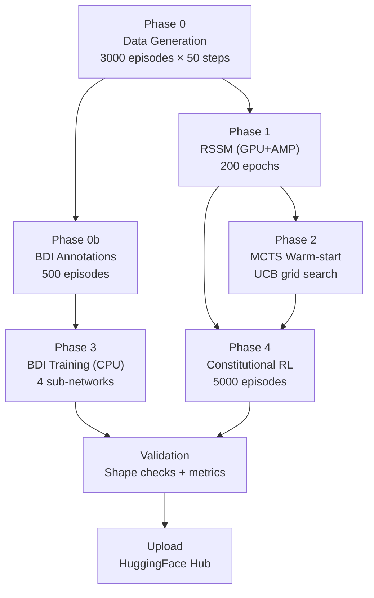

# ADR-006: Sequential Training Execution Strategy

> **Date**: 2026-03-13
> **Status**: Proposed
> **Deciders**: @ianshank

---

## Context

MouseDroid has a fully implemented GPU pre-training pipeline (PR #11) with 6 sequential phases. The pipeline orchestrator (`run_pipeline.py`) can run all phases, but we need:

1. **Tuned hyperparameters** — current defaults are conservative placeholders
2. **Convergence validation** — no automated checks that training actually converged
3. **A training-specific configuration** — `mock_hardware.yaml` is too minimal
4. **Results reporting** — no aggregated training metrics output
5. **Robustness** — graceful handling of thermal throttling and power interruption

---

## Decision

### 1. Dedicated Training Configuration

Create `config/training.yaml` with phase-specific tuned parameters:

```yaml
training:
  # Phase 0: Data Generation
  n_episodes: 3000        # Up from 1000 for better coverage
  sequence_length: 50

  # Phase 1: RSSM
  epochs: 200             # Up from 100 for convergence
  batch_size: 16          # Conservative for Jetson 8 GB unified memory
  learning_rate: 3e-4
  kl_beta: 0.5            # Lower weight to prioritize reconstruction

  # Phase 3: BDI (uses same epochs/lr)
  # Phase 4: Constitutional RL (uses PPO config)

  gpu:
    device: null           # auto-detect
    enable_amp: true
    memory_limit_gb: 6.0

ppo:
  n_training_episodes: 5000
  n_rollout_steps: 128
  clip_epsilon: 0.2
  ppo_epochs: 4
```

**Rationale**: A dedicated config separates training concerns from runtime config and documents the tuned values.

### 2. Phase Dependency Graph



**Rationale**: Phases 0/0b are data preparation. Phase 1 (RSSM) is the critical path — all downstream phases depend on its weights. Phases 2 and 3 can run in parallel (but current pipeline runs them sequentially for simplicity). Phase 4 consumes both RSSM and warm-started policy.

### 3. Convergence Validation Module

Add `training/validate_weights.py` that runs after all phases:

| Check | Criteria | Action on Fail |
|-------|----------|----------------|
| Weight file existence | All expected `.pt`/`.npz` files present | ERROR + abort |
| Shape validation | Model state_dict shapes match ModelConfig | ERROR + abort |
| RSSM loss check | Final recon loss < 0.05 | WARNING + log |
| BDI accuracy | Intention accuracy > 60% on held-out set | WARNING + log |
| Constitutional RL | Violation rate < 5%, mean reward > 0 | WARNING + log |
| Memory check | Peak GPU < 6 GB during training | INFO + log |

**Rationale**: Prevents uploading or deploying un-converged weights.

### 4. Training Results Report

Generate `training/results/training_report.json` after pipeline completion:

```json
{
  "timestamp": "2026-03-13T21:00:00Z",
  "device": "Jetson Orin Nano (cuda:0)",
  "phases": {
    "data_gen": {"n_episodes": 3000, "wall_time_s": 900},
    "rssm": {"final_loss": 0.032, "epochs": 200, "wall_time_s": 2400},
    "warmstart": {"best_ucb_c": 1.41, "wall_time_s": 600},
    "bdi": {"intention_accuracy": 0.72, "wall_time_s": 300},
    "constitutional_rl": {"violation_rate": 0.03, "mean_reward": 1.2, "wall_time_s": 1500}
  },
  "total_wall_time_s": 5700,
  "all_checks_passed": true
}
```

**Rationale**: JSON format enables CI/CD integration and trend tracking across training runs.

### 5. Thermal and Power Safety

Add training-aware thermal monitoring:

- Check `/sys/devices/virtual/thermal/` every 10 epochs
- Pause training if temperature > 85°C (Jetson Orin Nano throttle point)
- Auto-resume when temperature drops below 75°C
- Save emergency checkpoint before pause

**Rationale**: Jetson can overheat during sustained GPU workloads without active cooling management.

---

## Risks

| Risk | Impact | Mitigation |
|------|--------|------------|
| RSSM doesn't converge with synthetic data | High | Lower kl_beta, increase epochs, add learning rate scheduling |
| Jetson thermal throttling during RSSM phase | Medium | Thermal monitoring + auto-pause |
| Constitutional RL needs real sensor data to converge | Medium | Use mock data with diverse scenarios |
| OOM during Phase 4 (RSSM loaded + policy training) | Medium | Offload RSSM to CPU for inference in Phase 4 |

---

## Alternatives Considered

1. **Parallel Phase 2 + Phase 3**: Architecturally possible but adds complexity for minimal time savings (~5 min BDI)
2. **Multi-GPU training**: Not applicable to single-GPU Jetson
3. **Progressive training (train RSSM, freeze, train policy)**: Already the current design
4. **Curriculum learning**: Deferred to future iteration

---

## Requires Sign-Off

> [!IMPORTANT]
>
> - Number of synthetic episodes (1000 vs 3000 vs 5000)
> - RSSM kl_beta value (0.5 vs 1.0)
> - Whether to add thermal monitoring in this iteration
> - Whether to run BDI training with train/val split
