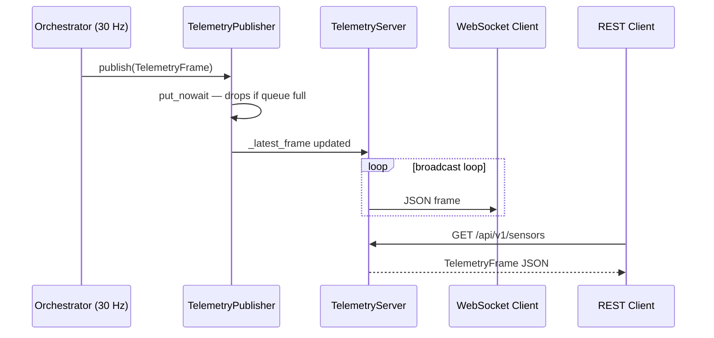

# Architecture Decision Record: ADR-006 Telemetry Server

## Title

WiFi/Ethernet Telemetry Server Using aiohttp REST + WebSocket

## Context

MouseDroidAGI runs as a headless system on a Jetson Orin Nano without a connected display. Developers and operators need a way to:

1. Inspect the real-time sensor frame (camera features, sonar, encoder, battery) from a laptop on the same network.
2. Monitor hardware health (GPU temperature, CPU load, battery voltage) without SSH.
3. Stream structured logs from the running droid process to a browser or CLI tool.
4. Retrieve the droid's IP address dynamically for service discovery (mDNS is not always available).

The existing `structlog` JSON pipeline writes to stdout. There was no way to pull metrics or logs remotely without an SSH session.

## Decision

We introduce a **`src/mousedroid/telemetry/`** package that provides:

| Component | File | Responsibility |
|-----------|------|---------------|
| `TelemetryFrame` | `protocol.py` | Immutable dataclass snapshot of one control tick |
| `LogRingBuffer` | `log_buffer.py` | structlog processor; retains the last N log entries in RAM |
| `TelemetryPublisher` | `publisher.py` | Async queue bridge; puts frames non-blocking at ≤60 Hz |
| `TelemetryServer` | `server.py` | aiohttp REST API + WebSocket broadcast |
| `NetworkInterface` | `network.py` | Stdlib-only network interface discovery |
| `MockTelemetryServer` | `mock_server.py` | Protocol stub for unit tests |

### REST API surface

| Endpoint | Method | Response |
|----------|--------|----------|
| `/api/v1/status` | GET | Server status, uptime |
| `/api/v1/sensors` | GET | Latest `TelemetryFrame` as JSON |
| `/api/v1/health` | GET | GPU temp, CPU load, battery voltage |
| `/api/v1/logs` | GET | Last N structured log entries |
| `/api/v1/network` | GET | Network interfaces + server URL |
| `/ws` | WebSocket | Streaming `TelemetryFrame` JSON at ≤60 Hz |

## Architecture Diagram

## Rationale — Why aiohttp?

We evaluated three options:

| Option | Pros | Cons | Decision |
|--------|------|------|----------|
| **aiohttp** | Asyncio-native; zero ASGI wrapper; WebSocket built-in; minimal RAM overhead | Manual routing (no dependency injection) | **Selected** |
| FastAPI + uvicorn | Auto-generated docs; Pydantic integration; DI framework | Requires ASGI wrapper process; heavier dependencies; adds `uvicorn` to Jetson runtime | Rejected |
| Flask + flask-sock | Familiar API | WSGI-based; blocks the asyncio event loop without `run_in_executor` | Rejected |

aiohttp runs inside the same asyncio event loop as the orchestrator. No extra threads or processes are required.

## Rationale — Non-blocking Publisher

The 30 Hz control loop must never be stalled by a slow network consumer. `TelemetryPublisher` uses `asyncio.Queue(maxsize=N)` and calls `put_nowait`, **dropping the frame** if the queue is full. Back-pressure from a slow WebSocket client is silently discarded.

This is acceptable because telemetry is **observational only** — a dropped frame does not affect robot control.

## Rationale — Stdlib-only Network Discovery

`NetworkInterface` uses only `socket.getaddrinfo`, `socket.inet_aton`, and parses `/proc/net/if_inet6` (Linux) or `ipconfig` output (Windows) with no third-party dependencies. On Jetson, `netifaces` is available as a fallback but is not required.

This avoids adding a C-extension to the dependency graph and ensures the discovery code works inside Docker without elevated privileges.

## Consequences

**Positive:**

- Zero-SSH inspection of live sensor data and structured logs from any device on the WiFi network.
- Lightweight: aiohttp adds ~2 MB to the Docker image; no extra process.
- Non-blocking design: the 30 Hz control loop is completely unaffected even with many connected clients.
- Testable in isolation: `MockTelemetryServer` (Protocol stub) allows unit tests without a real network stack.

**Negative:**

- No authentication by default — the server binds to `0.0.0.0` on a configurable port (default `8080`). In a production environment, access should be restricted via firewall rules or mutual TLS.
- Manual routing in aiohttp means no auto-generated OpenAPI documentation.

## Alternatives Considered

- **Prometheus `/metrics` endpoint**: Good for scraping but requires a separate Prometheus server; does not support raw sensor frame streaming or log retrieval.
- **MQTT**: Event-driven and lightweight, but adds a broker dependency and is harder to query ad-hoc from a laptop.
- **gRPC streaming**: Strong typing and efficient serialisation, but requires code generation and adds significant complexity for a monitoring-only use case.

## Status

Accepted — implemented in PR #14.
