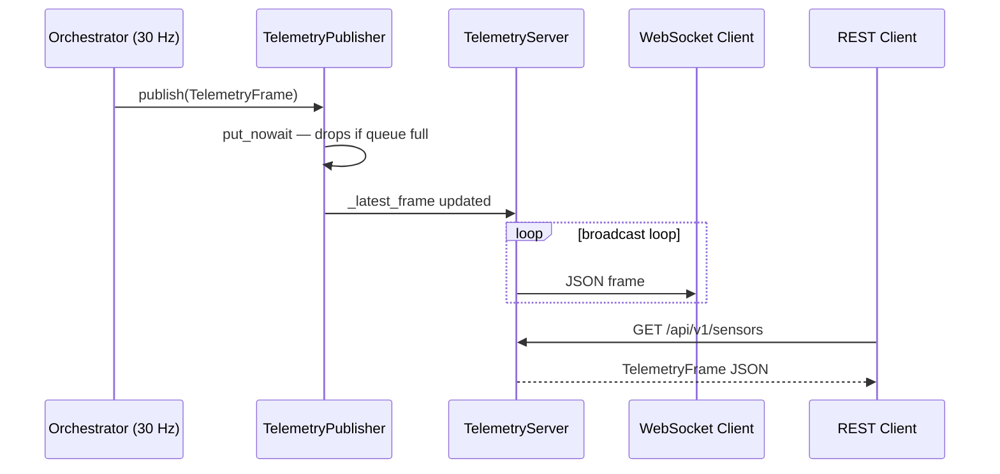

# Architecture Decision Record: ADR-006 Telemetry Server

## Title

WiFi/Ethernet Telemetry Server Using aiohttp REST + WebSocket

## Context

MouseDroidAGI runs as a headless system on a Jetson Orin Nano without a connected display. Developers and operators need a way to:

1. Inspect the real-time sensor frame (camera features, sonar, encoder, battery) from a laptop on the same network.
2. Monitor hardware health (GPU temperature, CPU load, battery voltage) without SSH.
3. Stream structured logs from the running droid process to a browser or CLI tool.
4. Retrieve the droid's IP address dynamically for service discovery (mDNS is not always available).

The existing `structlog` JSON pipeline writes to stdout. There was no way to pull metrics or logs remotely without an SSH session.

## Decision

We introduce a **`src/mousedroid/telemetry/`** package that provides:

| Component | File | Responsibility |
|-----------|------|---------------|
| `TelemetryFrame` | `protocol.py` | Immutable dataclass snapshot of one control tick |
| `LogRingBuffer` | `log_buffer.py` | structlog processor; retains the last N log entries in RAM |
| `TelemetryPublisher` | `publisher.py` | Async queue bridge; puts frames non-blocking at ≤60 Hz |
| `TelemetryServer` | `server.py` | aiohttp REST API + WebSocket broadcast |
| `NetworkInterface` | `network.py` | Stdlib-only network interface discovery |
| `MockTelemetryServer` | `mock_server.py` | Protocol stub for unit tests |

### REST API surface

| Endpoint | Method | Response |
|----------|--------|----------|
| `/api/v1/status` | GET | Server status, uptime |
| `/api/v1/sensors` | GET | Latest `TelemetryFrame` as JSON |
| `/api/v1/health` | GET | GPU temp, CPU load, battery voltage |
| `/api/v1/logs` | GET | Last N structured log entries |
| `/api/v1/network` | GET | Network interfaces + server URL |
| `/metrics` | GET | Prometheus metrics in exposition format (requires `api_key` if configured, same as other REST endpoints) |
| `/ws` | WebSocket | Streaming `TelemetryFrame` JSON at ≤60 Hz |

## Architecture Diagram

## Rationale — Why aiohttp?

We evaluated three options:

| Option | Pros | Cons | Decision |
|--------|------|------|----------|
| **aiohttp** | Asyncio-native; zero ASGI wrapper; WebSocket built-in; minimal RAM overhead | Manual routing (no dependency injection) | **Selected** |
| FastAPI + uvicorn | Auto-generated docs; Pydantic integration; DI framework | Requires ASGI wrapper process; heavier dependencies; adds `uvicorn` to Jetson runtime | Rejected |
| Flask + flask-sock | Familiar API | WSGI-based; blocks the asyncio event loop without `run_in_executor` | Rejected |

aiohttp runs inside the same asyncio event loop as the orchestrator. No extra threads or processes are required.

## Rationale — Non-blocking Publisher

The 30 Hz control loop must never be stalled by a slow network consumer. `TelemetryPublisher` uses `asyncio.Queue(maxsize=N)` and calls `put_nowait`, **dropping the frame** if the queue is full. Back-pressure from a slow WebSocket client is silently discarded.

This is acceptable because telemetry is **observational only** — a dropped frame does not affect robot control.

## Rationale — Stdlib-only Network Discovery

`NetworkInterface` uses only `socket.getaddrinfo`, `socket.inet_aton`, and parses `/proc/net/if_inet6` (Linux) or `ipconfig` output (Windows) with no third-party dependencies. On Jetson, `netifaces` is available as a fallback but is not required.

This avoids adding a C-extension to the dependency graph and ensures the discovery code works inside Docker without elevated privileges.

## Consequences

**Positive:**

- Zero-SSH inspection of live sensor data and structured logs from any device on the WiFi network.
- Lightweight: aiohttp adds ~2 MB to the Docker image; no extra process.
- Non-blocking design: the 30 Hz control loop is completely unaffected even with many connected clients.
- Testable in isolation: `MockTelemetryServer` (Protocol stub) allows unit tests without a real network stack.

**Negative:**

- No authentication by default — the server binds to `0.0.0.0` on a configurable port (default `8080`). In a production environment, access should be restricted via firewall rules or mutual TLS.
- Manual routing in aiohttp means no auto-generated OpenAPI documentation.

## Alternatives Considered

- **Prometheus `/metrics` endpoint**: Good for scraping but requires a separate Prometheus server; does not support raw sensor frame streaming or log retrieval.
- **MQTT**: Event-driven and lightweight, but adds a broker dependency and is harder to query ad-hoc from a laptop.
- **gRPC streaming**: Strong typing and efficient serialisation, but requires code generation and adds significant complexity for a monitoring-only use case.

## Status

Accepted — implemented in PR #14.

## Addendum: PR-A2 — replay / VLA / VLM observability metrics

The Phase 2 (real-episode replay) + Phase 3 (VLA inference) + Phase 4 (VLM dense
rewards) subsystems shipped without first-class operational visibility. PR-A2
closes that gap with four pure-add Prometheus metrics on the existing
`/metrics` endpoint:

| Metric | Type | Label(s) | Source |
|---|---|---|---|
| `mousedroid_replay_records_total` | Counter | `outcome=ok\|schema_mismatch` | `LMDBReplayReader` per-record deserialization outcome |
| `mousedroid_vla_inference_seconds` | Histogram | _none_ | Wall-clock seconds spent inside `VLAPolicy.predict()` |
| `mousedroid_vla_timeouts_total` | Counter | `mode=mock\|distilled_onnx` | VLA fallback events by backend mode |
| `mousedroid_vlm_progress_cache_hits_total` + `..._misses_total` | Counter | _none_ | VLM progress-reward cache hit/miss accounting |

### Design invariants

- **Config-driven, not hardcoded.** Histogram bucket boundaries come from
  `MetricsConfig.vla_inference_seconds_buckets`. All four bucket fields share
  a single `_validate_histogram_buckets` Pydantic validator (ascending,
  positive, unique, non-empty) — invalid configurations are rejected at
  schema-load time.
- **Type-safe label values.** `ReplayOutcomeLiteral` and `VLABackendLiteral`
  in `mousedroid.config.schema` are the canonical sources of label values.
  Helper signatures (`inc_replay_record(outcome: ReplayOutcomeLiteral)`,
  `inc_vla_timeout(mode: VLABackendLiteral)`) use these aliases so a backend
  rename in `VLAConfig.backend` propagates to every caller via mypy.
- **Naming convention preserved.** Helpers follow the existing project
  convention: `inc_*` for counters, `observe_*` for histograms, `set_*` for
  gauges. Mirrors `inc_safety_violation`, `observe_llm_translation_latency_ms`,
  `set_loop_time_ms`.
- **Pure-add render.** Metric families are conditionally emitted only when
  observations exist. Legacy deployments produce byte-identical `/metrics`
  output. Promtool tolerates absent families.
- **Defensive observation.** `observe_vla_inference_seconds` drops samples
  below `_MIN_OBSERVABLE_SECONDS` (0.0) so clock-skewed negative latencies
  cannot corrupt the histogram sum.

### Advisory `[vla]` CI matrix

A new `vla-extras` job in `.github/workflows/ci.yml` installs `[dev,vla]`
extras (onnxruntime + transformers + huggingface-hub) and runs
`tests/unit/vla/` on Python 3.11. The job is **advisory**
(`continue-on-error: true`) for the first 7 green-run window so ONNX Runtime
API drift and HF-Hub pull regressions surface without blocking unrelated
merges. Promotion gate: remove `continue-on-error` after 7 consecutive green
runs (operator action, tracked in
[docs/planning/PHASE_2_1_AND_BEYOND_PLAN.md](../planning/PHASE_2_1_AND_BEYOND_PLAN.md)
Story 2.5).

### What was deferred (now landed in PR-A2.1)

- ✅ **Writer-side call-site instrumentation** in `LMDBReplayReader`,
  `MockVLA.predict()`, `DistilledVLAOnnx.predict()`,
  `MouseDroidOrchestrator._try_vla_action()` (timeout branch), and
  `VLMProgressHead._score_single()` — **landed in PR-A2.1**.
  Factory-level threading of the `MetricsRegistry` parameter completed in
  `build_replay_reader`, `build_vla_policy`, `_build_distilled_onnx_vla`,
  and `build_reward_model`. The four PR-A2 metric families now populate at
  runtime; the Grafana panels and alert rules from PR-B2 produce real data
  the first time their code paths fire.
- ✅ **Grafana dashboard panels** over the new metrics — shipped in PR-B2.
- ✅ **Prometheus alert rules** in `config/prometheus/alerts.yml` for VLA
  latency / timeout / replay schema-mismatch spike — shipped in PR-B2.

The operator note about dashboards-have-no-data is **no longer current**.
After PR-A2.1 merges, the Grafana queries surface live observations as
soon as the corresponding subsystem (replay reader / VLA inference / VLM
cache lookup) fires. The end-to-end test in
`tests/integration/test_writer_side_instrumentation_http.py` proves the
full pipeline (subsystem → `MetricsRegistry` → `/metrics` HTTP scrape) is
wired correctly.
