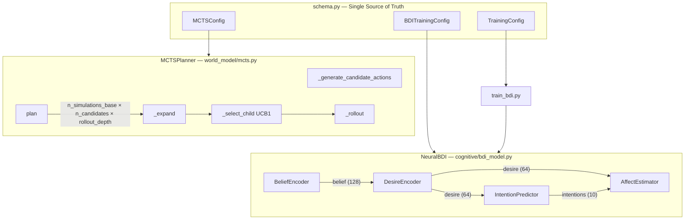

# ADR-007: MCTS Latency Optimisation & BDI Accuracy Remediation

**Status:** Proposed  
**Date:** 2026-03-14  
**Deciders:** Engineering, SQE  
**PRDs:** [prd-mcts-latency.md](prd-mcts-latency.md), [prd-bdi-accuracy.md](prd-bdi-accuracy.md)

---

## Context

Training validation (2026-03-14) revealed:
1. MCTS p50 latency = **219 ms** (target ≤ 50 ms for 10 Hz planning)
2. BDI intention accuracy = **55%** (threshold: 60%)

Both issues stem from under-parameterised configs and a deterministic-but-shallow action sampling strategy. No architectural rewrites are required — targeted config additions and algorithm improvements suffice.

---

## System Components



---

## Decision 1: MCTS — Early Exit via Convergence Threshold

**Options considered:**

| Option | Pros | Cons |
|---|---|---|
| A: Fixed simulation count reduction (n_simulations_base=10) | Simple | May degrade reward quality; not adaptive |
| **B: Early exit when value converges (chosen)** | Adaptive; maintains quality | Slightly more complex |
| C: Parallel/batched MCTS | Maximum speedup | Requires significant refactor; GPU dependency |

**Decision: Option B.** Add `early_exit_value_threshold` and `early_exit_patience` to `MCTSConfig`. Defaults of `0.0` and `3` preserve all existing behaviour.

---

## Decision 2: MCTS — Multi-Dimensional Action Sampling

**Problem:** Current `_generate_candidate_actions` uses `torch.linspace(-1,1,n)` broadcast — every action is `[x, x, x]`, producing `n_action_candidates` correlated near-identical trajectories.

**Decision:** Replace with stratified Halton-sequence or uniformly random anti-correlated sampling. Controlled by `action_sampling: Literal["linspace", "uniform", "halton"] = "uniform"` in `MCTSConfig`. Default `"uniform"` for diversity; `"linspace"` for backward compatibility.

---

## Decision 3: MCTS — Time-Budget Simulation

**Decision:** Add `simulation_budget_ms: float = 0.0` to `MCTSConfig`. When > 0, `plan()` checks elapsed time after each simulation and exits early. Clock source injectable for testing. Default 0 = disabled (backward-compat).

---

## Decision 4: BDI — Separate Training Config

**Problem:** `TrainingConfig.epochs = 100` is shared across RSSM, BDI, and constitutional RL. BDI requires ~300 epochs.

**Decision:** Add `BDITrainingConfig` to `Settings` with:
- `epochs: int = 300`  
- `balance_classes: bool = False`  
- `normalise_observations: bool = False`  
- `accuracy_threshold: float = 0.60`

`train_bdi.py` reads from `cfg.bdi_training` if present, falls back to `cfg.training`.

---

## Decision 5: BDI — Observation Normalisation is Opt-In

**Decision:** Z-score normalisation is added to `BeliefEncoder` but **defaults to off**. Statistics (mean, std) are saved alongside weights as `belief_norm_stats.npz`. If a model is loaded with norm stats but config has `normalise_observations=False`, a `DeprecationWarning` is emitted.

---

## Decision 6: CI/CD — Performance & Accuracy Gates

**Decision:** Two new CI stages are added after the existing test stage:

```yaml
# .github/workflows/ci.yml additions
- name: MCTS benchmark gate
  run: pytest tests/benchmarks/ --benchmark-json=benchmark.json
  env:
    MOUSEDROID_MCTS__N_SIMULATIONS_BASE: "50"

- name: BDI accuracy gate
  run: |
    python -m training.validate_weights \
      --weights-dir weights/ \
      --annotations training/data/bdi_annotations.npz
```

Both use environment variables (no hardcoded values). Thresholds flow through `MOUSEDROID_MCTS__*` and `MOUSEDROID_BDI_TRAINING__*` env var prefixes.

---

## Non-Functional Requirements

| NFR | Requirement |
|---|---|
| Latency | MCTS p50 ≤ 50 ms at 10 Hz planning cadence |
| Accuracy | BDI intention accuracy ≥ configurable threshold (default 60%) |
| Backwards Compat | All new config fields have sane defaults; no existing defaults change |
| Test Coverage | `mcts.py` and `bdi_model.py` ≥ 80% branch coverage |
| CI | Both gates run on every PR; block merge on failure |
| Explainability | All decisions config-logged at INFO on startup |

---

## Risks & Mitigations

| Risk | Severity | Mitigation |
|---|---|---|
| Early exit degrades reward quality | High | A/B test with `--no-early-exit` in benchmark harness; revert if > 5% reward drop |
| Uniform action sampling produces invalid trajectories | Medium | Clamp to `[-1, 1]` via `torch.clamp`; add property test |
| Tree reuse with drifted latent states | High | Detect divergence (`l2(h_new, h_cached) > threshold`); fall back to fresh root |
| BDI normalisation breaks existing weight files | Medium | `normalise_observations = false` default; norm stats file presence check |

---

## Requires Human Sign-Off

> [!IMPORTANT]
> **Tree warm-start (E1-S3)** changes the MCTS root state across planning timesteps. This must be tested on-hardware before enabling by default. Sign-off required from robotics lead before enabling `reuse_tree = true` in production config.

> [!IMPORTANT]
> **Intention class count** (currently 10): reducing to 5 may make the 60% threshold achievable faster but requires regenerating `bdi_annotations.npz`. Decision requires PM + ML sign-off.
