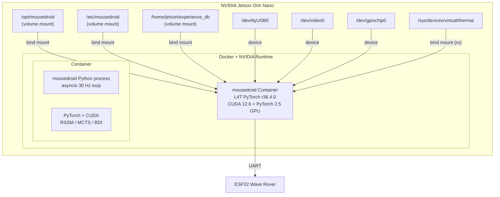
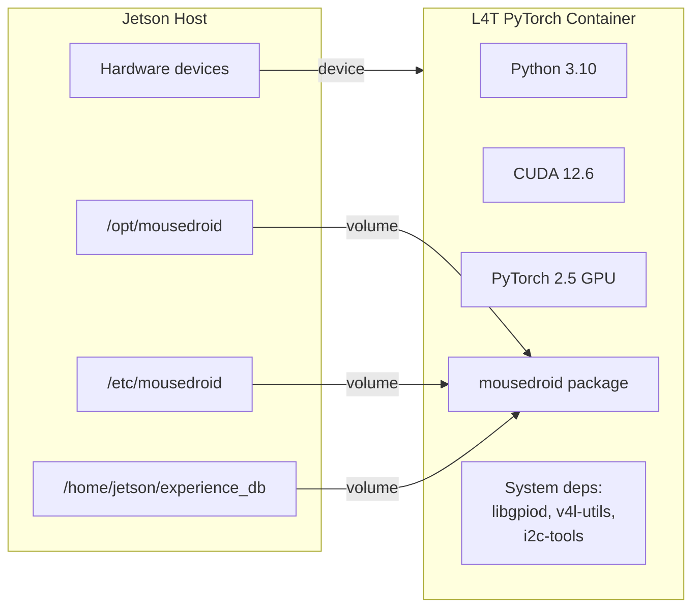

# ADR: L4T Container Deployment for MouseDroid

> **ADR ID**: ADR-l4t-container
> **Date**: 2026-03-11
> **Status**: Proposed
> **Deciders**: Ian Cruickshank

---

## Context

MouseDroid requires GPU-accelerated PyTorch (CUDA) on the Jetson Orin Nano for real-time RSSM inference and MCTS planning at 30 Hz. The current venv-based deployment can only run PyTorch in CPU mode because:

1. PyPI and all NVIDIA pip indexes serve CPU-only `aarch64` wheels
2. Building PyTorch from source takes 4-6 hours and is fragile
3. NVIDIA provides pre-built L4T containers with CUDA PyTorch via NGC

---

## Decision

Adopt **NVIDIA L4T PyTorch container** (`nvcr.io/nvidia/l4t-pytorch:r36.4.0-pth2.5-py3`) as the runtime for MouseDroid on the Jetson. The project code is volume-mounted into the container (not baked in), enabling rapid iteration.

---

## System Components

## Data Flow (Unchanged)

The internal data flow (Sense → Plan → Act) is identical to the bare-metal deployment. The container only affects the **runtime environment**, not the application architecture.

## Technology Choices

| Choice | Rationale |
|--------|-----------|
| `nvcr.io/nvidia/l4t-pytorch:r36.4.0-pth2.5-py3` | Official NVIDIA image matching JetPack 6.x, pre-built CUDA PyTorch |
| Volume mounts (not COPY) | Faster iteration; no rebuild needed for code changes |
| `docker compose` | Declarative device/volume/env config; easier than raw `docker run` |
| `--runtime=nvidia` | Required for GPU access inside container |
| systemd `ExecStart=docker compose up` | Integrates with existing service management |

## API Contracts

No API changes. All internal interfaces remain the same. The only change is the execution environment.

## Non-Functional Requirements

| Requirement | Target | Verification |
|-------------|--------|-------------|
| Latency | 30 Hz loop ≤33 ms/tick | Benchmark inside container |
| Startup | Container start ≤10s | Timed start-stop test |
| Disk | Image ≤15 GB | `docker images` check |
| Security | No `--privileged` if possible | Use specific `--device` flags |
| Reliability | Auto-restart on crash | `restart: unless-stopped` in compose |

## Architectural Risks

| Risk | Impact | Mitigation |
|------|--------|------------|
| L4T image tag doesn't exist for R36.4.7 | High | Use closest matching tag; R36.4.0 should work |
| GPIO requires `--privileged` | Medium | Try `--device /dev/gpiochip*` first; fallback to privileged |
| Container overhead at 30 Hz | Low | Docker adds <1% overhead for compute; no network namespace needed |
| Image size exhausts SD card | Low | 32 GB free; image ~10 GB; prune unused images |

## Anti-Patterns Identified

1. **Current**: venv pip install of PyTorch has no GPU support — silent degradation
2. **Current**: `mousedroid.service` hardcodes venv path — not container-aware
3. **Remediation**: Dockerfile pins exact versions; compose validates GPU at startup

---

## Decisions Requiring Human Sign-Off

> [!IMPORTANT]
>
> 1. **L4T image tag**: `r36.4.0-pth2.5-py3` is the recommended tag. Confirm this matches your JetPack version.
> 2. **`--privileged` mode**: If GPIO access requires it, this grants full host access. Acceptable for a single-purpose embedded device?
> 3. **Volume mount vs. COPY**: Volume mounts mean the container depends on the host filesystem. OK for dev workflow?

---

## Component Diagram (L4T Container)

