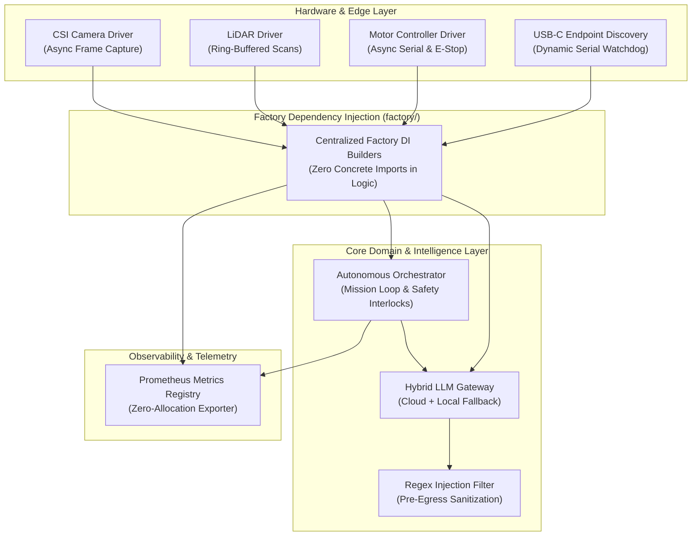

# MouseDroid Hardened Autonomous Architecture Reference (2026)

## 📌 Architecture Overview

---

## 🏛️ Invariants & Design Principles

1. **Protocol-First Dependency Injection**:
   - Interfaces declared as `@runtime_checkable Protocol` in `src/mousedroid/interfaces/protocols.py`.
   - Concrete implementations imported solely within `src/mousedroid/factory/`.
   - Zero concrete driver imports in application business logic.

2. **Schema-Driven Configuration**:
   - Master configuration managed via Pydantic v2 in `src/mousedroid/config/schema/`.
   - Dynamic environment overrides (`MOUSEDROID_*__*`).
   - Backward compatibility guaranteed with default field pinning.

3. **Hot-Loop Purity (30 Hz Deterministic Loop)**:
   - Synchronous LLM calls and training routines prohibited on the 30 Hz loop.
   - Background tasks and I/O offloaded via `asyncio.to_thread`.
   - Fixed-size ring buffers (`deque(maxlen=N)`) for all sensor data.

4. **Multi-Tier LLM Gateway with Pre-Egress Sanitization**:
   - Cloud primary (Anthropic Claude Haiku) + Local edge failover (Phi-3 / vLLM / Mock).
   - Regex-based pre-egress prompt injection sanitization.
   - Non-fatal degraded mode fallback with auto-recovery.

5. **7-Tier Test Pyramid Matrix ($\ge 80\%$ Coverage)**:
   - Tier 1: Unit Tests (`tests/unit/`)
   - Tier 2: Property Tests (`tests/property/`)
   - Tier 3: Integration Tests (`tests/integration/`)
   - Tier 4: Functional Tests (`tests/functional/`)
   - Tier 5: E2E Tests (`tests/e2e/`)
   - Tier 6: User Journey Tests (`tests/user_journey/`)
   - Tier 7: Security & Sanity Tests (`tests/security/`, `tests/smoke/`, `tests/hardware/`)

---

## 🤖 Claude Code Workforce Subagents (`.claude/agents/`)

| Agent | Responsibility | Key Tools |
|---|---|---|
| `peer-reviewer` | Code review against 11 invariants, typing, and complexity | `view_file`, `grep_search`, `list_dir`, `run_command` |
| `security-scanner` | Credential detection, secret masking, injection audits | `view_file`, `grep_search`, `run_command` |
| `config-guardian` | Pydantic schema validation, default-pinning regression | `view_file`, `grep_search`, `run_command` |
| `openspec-author` | OpenSpec proposal, design, and task specification | `view_file`, `list_dir`, `write_to_file`, `replace_file_content` |
| `test-engineer` | 7-tier test authoring and coverage ratchet enforcement | `view_file`, `grep_search`, `run_command` |
| `doc-reconciler` | Truth reconciliation between docs and active code | `view_file`, `grep_search`, `replace_file_content` |
| `hw-evidence-auditor` | Hardware test evidence auditing on Jetson Orin Nano | `view_file`, `list_dir`, `grep_search` |
