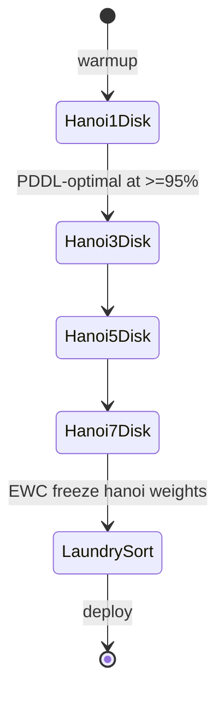

# C4 Component — Robot Arm Platform

> The hierarchical four-layer reasoning architecture for the SO-ARM100
> robot arm. Trained sim-first in MuJoCo (Tower of Hanoi → laundry
> sorting curriculum), transferred to real hardware via domain
> randomization.

## Component Diagram

```mermaid
C4Component
title Robot Arm Platform — Component Diagram

Container_Boundary(arm, "Arm platform (when cfg.platform = robot_arm)") {

    Component_Boundary(perception, "Layer 0 — Perception") {
        Component(d435, "DepthCameraProtocol", "RealSense D435i / Mock", "RGB + depth stream")
        Component(yolo, "ObjectDetector", "YOLO ONNX", "2D bounding boxes")
        Component(pose, "PoseEstimator", "Six-DoF", "Depth + bbox → object pose")
        Component(sym, "SymbolicStateExtractor", "PDDL fluents", "Pose → on(X,Y), at(X,P)")
    }

    Component_Boundary(planning, "Layer 1 — Symbolic Planning") {
        Component(pddl, "PDDLPlanner", "Pyperplan", "Solver — Tower of Hanoi optimal\n(2^n - 1 moves)")
        Component(mcts, "MCTSReplanner", "PUCT", "Coverage of failure recovery")
        Component(llm, "LLMReplanner", "rules + LLM", "Laundry-style replanning")
    }

    Component_Boundary(world, "Layer 2 — World Modeling (reused)") {
        Component(rssm_arm, "RSSM WorldModel", "torch.nn.Module", "Same RSSM as MSE-6; imagination")
    }

    Component_Boundary(control, "Layer 3 — Motor Control") {
        Component(sac, "SAC+HER", "torch", "Goal-conditioned policy")
        Component(grasp, "GraspPrimitive", "control", "Approach + close + lift")
        Component(place, "PlacePrimitive", "control", "Hover + open + retreat")
        Component(traj, "TrajectoryRunner", "linear blend", "Joint-space interpolation")
    }

    Component(drv, "SOArm100Protocol", "Real / Mock", "Joint position + velocity I/O")
}

Container_Ext(arm_hw, "SO-ARM100", "USB-C")
Container_Ext(camera_hw, "RealSense D435i", "USB 3.0")
Container_Ext(mujoco, "MuJoCo Gymnasium env", "Training only")

Rel(d435, yolo, "frames")
Rel(yolo, pose, "boxes")
Rel(pose, sym, "object poses")
Rel(sym, pddl, "initial state")
Rel(sym, mcts, "snapshot")
Rel(pddl, sac, "next action goal")
Rel(mcts, sac, "alt action goal")
Rel(llm, sac, "replanned goal")
Rel(sac, grasp, "policy → primitive")
Rel(sac, place, "policy → primitive")
Rel(grasp, traj, "joint setpoints")
Rel(place, traj, "joint setpoints")
Rel(traj, drv, "send_joint_positions(...)")
Rel(drv, arm_hw, "USB-C", "if cfg.arm.enabled")
Rel(d435, camera_hw, "USB 3.0", "if not mock")
Rel(sac, mujoco, "training rollouts", "training-only")
Rel(rssm_arm, mujoco, "imagination", "training-only")
```

## Curriculum flow



EWC (Elastic Weight Consolidation) gates each transition: Hanoi-acquired
priors stay locked while the next stage trains, so the laundry-sorting
task doesn't catastrophically forget Hanoi disk-stacking.

## Reused modules

These existing modules work for both mouse_droid and robot_arm platforms:

| Module | Source | Reused for |
|--------|--------|------------|
| RSSM world model | `src/mousedroid/world_model/` | Latent dynamics, imagination |
| Safety monitor | `src/mousedroid/safety/` | Joint limits, E-stop |
| Multi-objective reward | `src/mousedroid/reward/` | Grasp / place / collision / completion |
| Episodic replay | `src/mousedroid/memory/` | HER buffer |
| Curiosity (ICM) | `src/mousedroid/curiosity/` | Exploration bonus |
| EWC continual learning | `src/mousedroid/learning/` | Hanoi → laundry transfer |
| Circuit breaker / retry | `src/mousedroid/resilience/` | Real-hardware fault tolerance |
| Tool registry | `src/mousedroid/common/tools/` | Calibration, diagnostics |

Adding a new platform = (a) add a new config preset under `config/`, (b)
implement the platform-specific drivers under `src/mousedroid/<area>/`,
(c) hook the factory branches. The reused modules above don't change.
