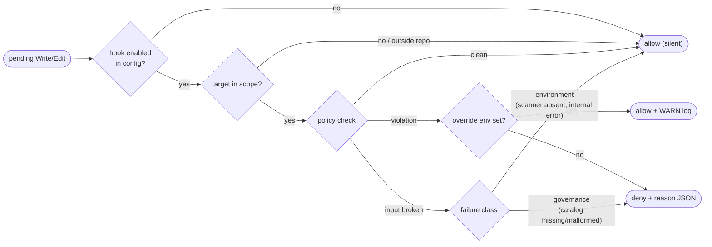

# C4 Component — Claude Code Workforce Governance (F-024)

> The edit-time governance chain that runs *before* a Write/Edit reaches disk in
> a Claude Code session, plus the CI gates that keep the chain itself honest.
> Added under F-024 to close two gaps the repository had carried as prose: the
> secret-scan gate existed only in CI (advisory, post-commit), and the "hardware
> readiness preempts all in-flight software streams" freeze rule was enforced by
> plan text plus one substring test — nothing stopped a capability edit at the
> moment it was made.
>
> Companion to `docs/architecture/c4-overview.md` (Levels 1–2),
> `docs/runbooks/claude-workforce-hooks.md` (operator workflow), and
> `docs/runbooks/secret-scanning.md` (the CI-side secret gate this reuses).
>
> **Scope:** developer tooling only. Nothing here runs on the rover, and
> `tools/claude_hooks/` never imports the `mousedroid` runtime package — an
> edit must not pay a torch/faiss/lmdb import cost.

## Component Diagram

```mermaid
flowchart TB
    subgraph Session["Claude Code session"]
        Agent(["Agent / operator"])
        Tool["Write / Edit / MultiEdit / NotebookEdit"]
    end

    subgraph Settings["Hook wiring (.claude/settings.json)"]
        Pre["PreToolUse matcher\nWrite|Edit|MultiEdit|NotebookEdit\n(blocking)"]
        Post["PostToolUse matcher\nWrite|Edit|MultiEdit\n(report-only)"]
    end

    subgraph Hooks["Hooks (tools/claude_hooks/)"]
        Secret["secret_scan.py\nscan pending buffer"]
        Freeze["freeze_gate.py\ncapability freeze"]
        PostEdit["post_edit_check.py\nruff + mypy on touched file"]
    end

    subgraph Primitives["Reusable primitives (policy-free)"]
        Config["config.py\nWorkforceConfig (pydantic, extra=forbid)"]
        Paths["paths.py\nrepo root + glob (no separator crossing)"]
        HookIO["hookio.py\nstdin payload / stdout decision"]
        Logging["logging_setup.py\nstructured logs -> STDERR"]
        Portability["portability.py\nabsolute-path rule"]
    end

    subgraph Inputs["Governance inputs (repo-native)"]
        WorkforceYaml[("`.claude/workforce.yaml`\nthresholds, globs, gate keys")]
        Features[("`features.yaml`\nF-008 gate feature")]
        Gitleaks[("`.gitleaks.toml`\nregex-only allowlist")]
    end

    subgraph Gates["CI gates (scripts/ci.sh + ci.yml)"]
        AQA["tests/regression/\ntest_claude_workforce_aqa.py\n(PR gate)"]
        Units["tests/unit/tools/claude_hooks/\n--cov + --cov-branch"]
        TypeCheck["mypy --strict\ntools/claude_hooks/"]
        Lint["ruff check/format\nsrc/ tests/ tools/"]
    end

    Agent --> Tool
    Tool --> Pre
    Tool --> Post
    Pre --> Secret
    Pre --> Freeze
    Post --> PostEdit

    Secret --> HookIO
    Freeze --> HookIO
    PostEdit --> HookIO
    Secret --> Config
    Freeze --> Config
    PostEdit --> Config
    Freeze --> Paths
    Secret --> Logging
    Freeze --> Logging
    PostEdit --> Logging

    Config -.reads.-> WorkforceYaml
    Freeze -.reads.-> Features
    Secret -.delegates to gitleaks with.-> Gitleaks

    Secret -->|deny / allow| Tool
    Freeze -->|deny / allow| Tool
    PostEdit -->|findings to stderr| Agent

    AQA -.validates.-> WorkforceYaml
    AQA -.validates.-> Settings
    AQA --> Portability
    Units --> Hooks
    TypeCheck --> Hooks
    Lint --> Hooks
```

## Decision flow

Both PreToolUse hooks run on every matching tool call and are independent — a
deny from either blocks the write.



**The split failure posture is deliberate.** A *governance* failure — an
unreadable or malformed `features.yaml`, or an absent gate feature — denies,
because the gate cannot prove the freeze has lifted and a broken governance
input is itself worth stopping on. An *environment* failure — a missing scanner
binary, an unexpected internal error — allows with a warning, because bricking
every edit in a session is worse than a missed gate. `secret_scan.strict: true`
moves the scanner-absent case into the deny column for operators who want it.

## Contracts

| Contract | Where | Why it is load-bearing |
|---|---|---|
| **stdout is the decision channel** | `hookio.py`, `logging_setup.py` | Claude Code parses hook stdout as JSON. All logging goes to **stderr**; a stray log line would corrupt the decision payload. |
| **Allow is silent** | `hookio.emit_allow` | Emitting an explicit `allow` *bypasses* the user's normal permission prompt. A hook with no objection writes nothing and exits 0. |
| **`cd $CLAUDE_PROJECT_DIR && python3 -m tools.claude_hooks.<mod>`** | `.claude/settings.json` | Running the module file by path leaves the repo root off `sys.path`; the package import then fails on *every* edit. Pinned by the AQA test. |
| **No runtime import** | `tools/claude_hooks/**` | Importing `mousedroid` would drag torch/faiss/lmdb into the edit path. Pinned by `test_hook_package_has_no_runtime_package_import`. |
| **Single config source** | `.claude/workforce.yaml` + `WorkforceConfig` | `extra="forbid"` turns a typo (`frozen_path`) into a load error instead of a silently disabled gate. Every field defaults, so a missing file still loads. |
| **Shared `.claude/` assets must be git-tracked** | `.gitignore` negations + AQA | `.gitignore` excludes `.claude/*`, so a new shared asset is untracked by default — present locally, absent in CI. This is how `workforce.yaml` first failed to ship. |
| **Local structlog binding** | `logging_setup.py` | Uses `wrap_logger`, not `structlog.configure()`, so importing a hook never mutates the process-global config the test suite pins. |
| **Gate self-disables** | `freeze_gate.py` | When F-008 reaches `done` the freeze lifts with no code change and no redeploy. |

## Why this shape

**Hooks carry policy only.** The five primitives (`config`, `paths`, `hookio`,
`logging_setup`, `portability`) are separately unit-tested and reused by the AQA
gate, so each hook module reads as a policy statement rather than a pile of
path-wrangling and subprocess plumbing.

**Glob matching is not `fnmatch`.** `fnmatch`'s `*` crosses directory
separators, which would make `src/mousedroid/*` silently freeze the whole tree.
`paths.glob_to_regex` gives `**` separator-crossing semantics and `*`/`?`
single-segment semantics, with a wildcard-free pattern matching exactly or as a
directory prefix.

**The AQA gate is a regression test, not a workflow.** The regression tier
already runs across the 3.10/3.11/3.12 matrix in the existing `test` job, so a
new workflow would add a startup surface to keep green and buy nothing. This
follows the precedent set by `tests/regression/test_skill_commands_aqa.py`.

**Coverage needed its own invocation.** The repository gate measures
`src/mousedroid` only (`[tool.coverage.run] source`), so `tools/` code would
have shipped with zero measured coverage in either direction. `scripts/ci.sh`
runs a dedicated `--cov=tools/claude_hooks --cov-branch` stage whose line
threshold is read from `coverage.tools_line_min` — branch coverage is reported
but advisory, because no baseline exists and the repository does not claim
metrics it does not enforce.

## Related

- `docs/runbooks/claude-workforce-hooks.md` — operator guide, debugging, overrides
- `docs/runbooks/secret-scanning.md` — the CI-side gitleaks gate (F-015)
- `docs/architecture/ADR-013-f-number-namespaces.md` — F-number allocation
- `openspec/changes/mouse-droid-claude-workforce/` — the change bundle and its peer review
