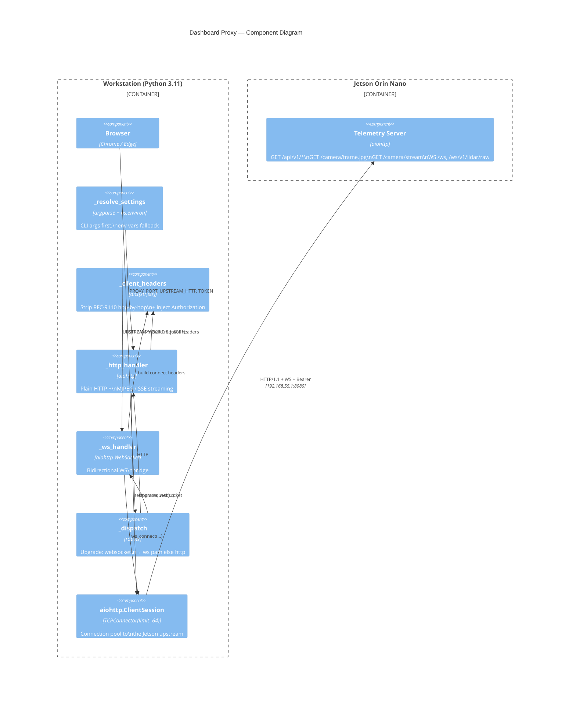
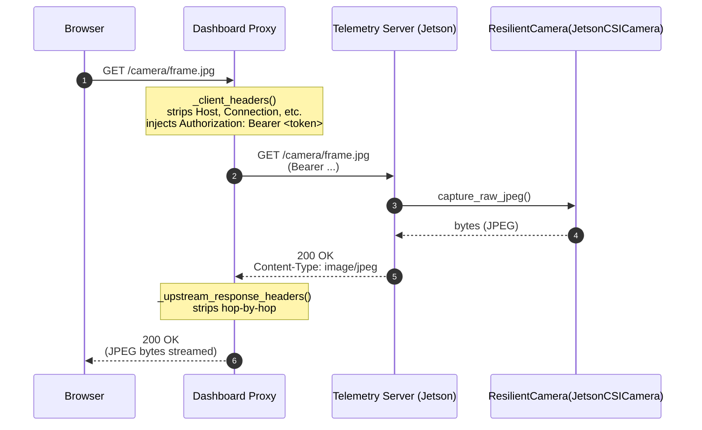
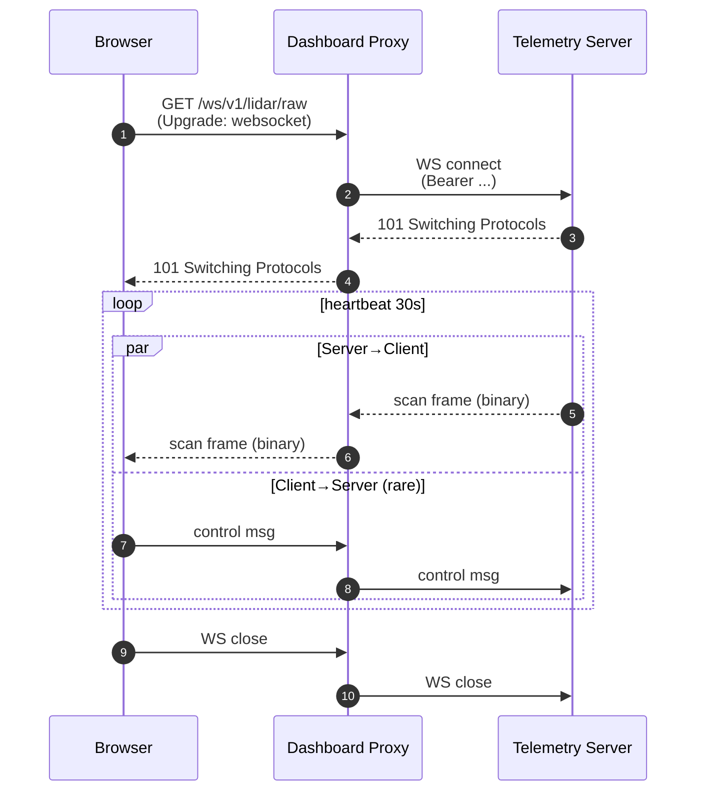

# C4 Component — Dashboard Proxy (PR #104)

> The bridge between a Windows / macOS browser and the auth-gated Jetson
> telemetry server. Added in PR #104 to enable live verification of the
> mousedroid dashboard without exposing the bearer token to the browser.

## Component Diagram

## Sequence — HTTP request (camera snapshot)

## Sequence — WebSocket (LiDAR raw scan)

## Configuration surface

| Source | Wins over | Field |
|--------|-----------|-------|
| CLI arg 1 | env | proxy port |
| CLI arg 2 | env | upstream HTTP URL |
| CLI arg 3 | env | bearer token (optional) |
| `PROXY_PORT` env | (default 8081) | proxy port |
| `JETSON_HTTP` env | (default `http://192.168.55.1:8080`) | upstream |
| `JETSON_TOKEN` env | (documented dev default) | bearer token |
| `PROXY_HOST` env | (default `127.0.0.1`) | bind host |

CLI args ALWAYS win over env vars. The token is also looked up in the
`scripts/launch_dashboard.ps1` wrapper from the operator's `~/.config/mousedroid/`
overlay if present.

## Security boundaries

- The proxy binds to `127.0.0.1` by default — it's intentionally a
  loopback-only dev tool. Setting `PROXY_HOST=0.0.0.0` is a deliberate
  operator decision (see `tools/dashboard_proxy.py` docstring).
- Hop-by-hop headers (RFC-9110 §7.6.1) are stripped both ways. Plus
  `content-length` and `content-encoding` (which aiohttp recomputes).
  Pinned by `tests/regression/test_pr104_aqa.py`.
- The bearer token is injected at the upstream edge — the browser sees
  no Authorization header. This is the whole point of the proxy.

## Failure modes

| Symptom | Cause | Fix |
|---------|-------|-----|
| 502 from upstream | Proxy passes through any status — see `_http_handler`. Real cause is on the Jetson side. | Check `journalctl -u mousedroid-docker` on Jetson |
| WS handshake fails | Upstream cert / proto mismatch (https vs http) | Confirm `UPSTREAM_WS = UPSTREAM_HTTP.replace(...)` resolved correctly |
| Stream drops mid-MJPEG | Client disconnected; `_http_handler` suppresses `write_eof` errors | Expected; reload the browser tab |
| Grafana → "Unauthorized" through proxy | Configured token but Grafana has its own auth | Run proxy with empty token: `python dashboard_proxy.py 8082 http://192.168.55.1:3000 ""` |

## Related: the on-rover unified dashboard (`/dashboard`)

The proxy is the *workstation* bridge to the auth-gated server. The server itself
now serves a **unified overview page** at `/` (→ `/dashboard`) — a single page
(camera MJPEG + lidar polar + sensor-fusion panel + status) fed by one `/ws`
connection, served by `TelemetryServer._handle_dashboard_page` from
`telemetry/static/dashboard.html`. Any device on the WiFi reaches it directly at
`http://<rover-ip>:8080/?token=…` (or `mousedroid-telemetry.local` via mDNS); the
proxy is only needed for the Claude-Preview workstation path. The fusion panel
renders `TelemetryFrame.fused` (a pure per-modality summary — see
`docs/runbooks/jetson-full-bringup.md` and `CLAUDE.md`).
