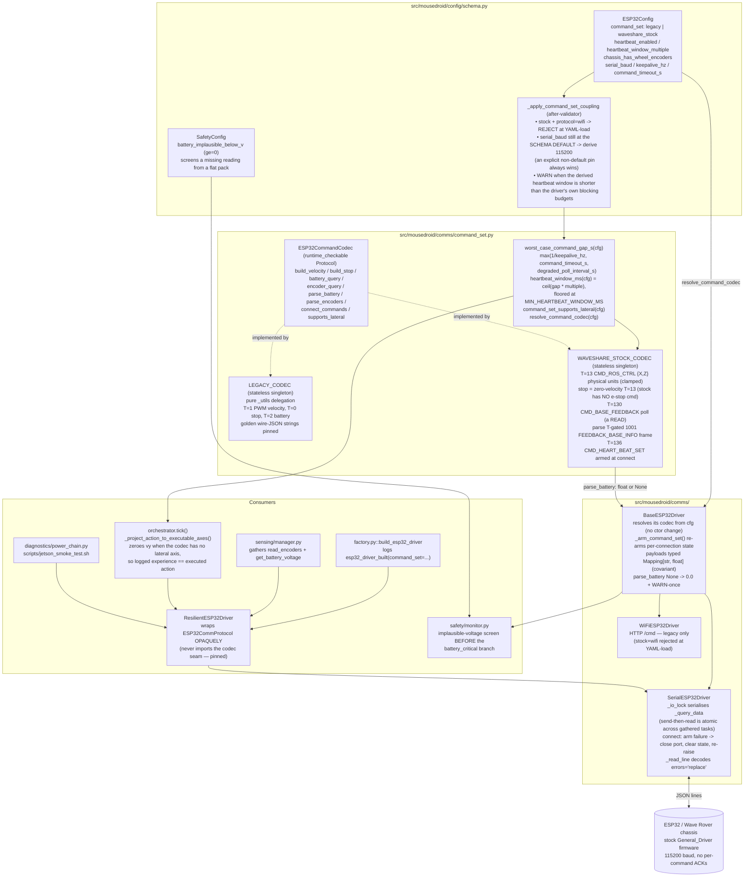

# C4 Component — ESP32 command-set codec seam (F-025)

> Every ESP32 command-build and response-parse dispatches through a **stateless
> codec singleton** selected by one config field, `ESP32Config.command_set`.
> `legacy` (the default) reproduces the pre-F-025 wire bytes exactly;
> `waveshare_stock` speaks the stock `General_Driver` firmware that any board
> attached post-repair actually runs. The private `{"T":1,"vx","vy","omega"}`
> protocol never had firmware behind it — `firmware/` was never committed — so
> on a stock board the legacy motion command parses as zeros and the legacy
> battery poll `{"T":2}` is `CMD_SET_MOTOR_PID`, a motor-controller **write**
> fired by `assert_power_chain` immediately before commanding motion.
>
> Companion diagram: `docs/architecture/c4-usbc-smoke.md` (the smoke gate that
> consumes this seam). Operator triage: `docs/runbooks/jetson-rover-smoke.md`.

## Component Diagram

## Load-bearing decisions

**One field, not a widened `protocol`.** `command_set` is a separate selector
because the factory's serial/else ladder would silently route a third
`protocol` value to the WiFi driver. The two axes are orthogonal: transport
(`serial` / `wifi`) and dialect (`legacy` / `waveshare_stock`).

**Codecs are stateless singletons.** Anything per-connection — the lateral-warn
latch, the battery-unavailable latch — lives on the driver and is re-armed by
`_arm_command_set()` on every connect. A codec that carried state would leak it
across reconnects and across the two drivers that share the singleton.

**The stock battery step is a READ.** Legacy `{"T":2}` maps to stock
`CMD_SET_MOTOR_PID`. Stock polls `CMD_BASE_FEEDBACK` (T=130) and parses the
T-gated `FEEDBACK_BASE_INFO` (T=1001) frame. Stock frames stream freely with no
per-command ACK, so a non-1001 frame is a normal occurrence, not an error — it
parses to `None` with a DEBUG breadcrumb. Stock encoder reads **must poll**:
serial `_query_data` only writes when given a command, so an un-polled stock
read would return zeros forever.

**`parse_battery` returns `float | None`.** A fabricated `0.0` is
indistinguishable from a flat pack, and `0.0 < battery_critical_v` made
`safety/monitor.py` latch a permanent emergency stop on what was really a comms
fault — with a runbook row that said "charge the pack". The three-layer fix:
codec returns `None`, the driver warns once and reports `0.0`, and the monitor
screens anything below `SafetyConfig.battery_implausible_below_v` as *missing*
rather than *critical* before the critical branch runs.

**The heartbeat window is derived, not tuned.** `CMD_HEART_BEAT_SET` is the
only thing that stops the *wheels* after a wedged host — the software watchdog
only restarts the container, and stock defines no e-stop command. The window is
`ceil(worst_case_command_gap_s(cfg) * heartbeat_window_multiple)` where the gap
is the max of the driver's own blocking budgets, so tightening a timeout
automatically tightens the window instead of silently outrunning it. It is
floored at `MIN_HEARTBEAT_WINDOW_MS` because `keepalive_hz` has no upper bound
and a rounded-to-zero window is the firmware's "disable failsafe" value — which
would have disarmed the failsafe while still logging `esp32_heartbeat_armed`.

**Baud coupling defers to the operator.** Selecting stock derives 115 200 only
while `serial_baud` still holds the schema default. Both shipped overlays pin
the legacy 1 Mbaud explicitly, so keying on `model_fields_set` alone made the
derivation dead on every real deployment — the exact misdiagnosis (stock
firmware at 1 Mbaud reads as line noise, i.e. "the board is dead") that F-025
exists to prevent. An explicit non-default pin still wins.

## Test surface

| Tier | File |
|---|---|
| Unit | `tests/unit/test_comms_utils.py`, `tests/unit/test_base_driver.py` |
| Integration | `tests/integration/test_f025_integration.py` |
| Regression | `tests/regression/test_f025_backwards_compat.py` |
| AQA | `tests/regression/test_f025_aqa.py` |
| Property | `tests/property/test_config_property.py` |
| Sanity | `tests/smoke/test_f025_sanity.py` |
| Hardware | `tests/hardware/test_motor_smoke.py` |

The integration tier exists because `config/jetson_production.yaml` ships
`esp32.enabled: false`, so a factory build returns `MockESP32Driver` — which
implements the protocol directly and never touches a codec. Every "does stock
work end to end" question was otherwise answered only by tests that stubbed the
transport. That file builds the real `SerialESP32Driver` through the factory
over a fake serial port, so the codec, the driver, the resilience wrapper and
the config validator all participate.

## Grep events

| Event | Level | Meaning |
|---|---|---|
| `esp32_driver_built` | INFO | factory wiring, carries the `command_set` discriminator |
| `esp32_stock_baud_derived` | INFO | the coupling fired; `from_baud`/`to_baud` |
| `esp32_heartbeat_window_below_blocking_budget` | WARNING | the window is shorter than a blocking budget — motion can be halted mid-command |
| `esp32_heartbeat_armed` | INFO | failsafe armed at connect, `window_ms=` |
| `esp32_lateral_velocity_unsupported` | WARNING once, then DEBUG | a non-zero `vy` reached a codec with no lateral axis (30 Hz path) |
| `esp32_battery_reading_unavailable` | WARNING once, then DEBUG | no valid frame; reported as 0.0 and screened by the monitor |
| `battery_reading_implausible` | WARNING | the monitor screened a reading as missing rather than critical |
| `esp32_stock_frame_mismatch` | DEBUG | a non-1001 frame arrived (normal on a free-streaming link) |
| `serial_esp32_arm_failed_rolling_back` | WARNING | arming raised; the port was closed before re-raise |
