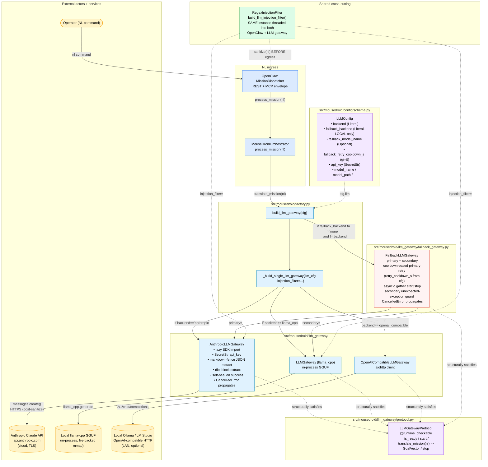

# C4 Component — LLM Gateway (PR #107)

> The deliberative mission-translation path. Operator natural-language
> commands enter via the OpenClaw mission dispatcher (HTTP / MCP),
> get sanitized by the shared prompt-injection filter, and are routed
> to a concrete LLM gateway selected by `cfg.llm.backend`. When
> `cfg.llm.fallback_backend` is non-`"none"`, the primary is wrapped
> with a local secondary in a `FallbackLLMGateway` composite for
> cloud→local failover. The 30 Hz reactive control loop (RSSM → MCTS →
> ESP32) is deliberately NOT shown — it does not touch the LLM and is
> intentionally LLM-free for determinism / safety reasons.

## Component Diagram



## Dispatch resolution chain — `build_llm_gateway`

| Condition | Outcome |
|---|---|
| `cfg.llm.fallback_backend == "none"` (default) | Return the bare primary built by `_build_single_llm_gateway`. No composite. |
| `cfg.llm.fallback_backend == cfg.llm.backend` | Log `llm_gateway_fallback_same_as_primary` WARN, return the bare primary (avoid double-instantiating the same backend). |
| `cfg.llm.fallback_backend != "none"` and `!= backend` | Build the secondary from `cfg.llm.model_copy(update={"backend": fallback_backend, ...})`, optionally overriding `model_name` with `fallback_model_name`. Wrap both in `FallbackLLMGateway(primary, secondary, retry_cooldown_s=cfg.llm.fallback_retry_cooldown_s)`. Log `llm_gateway_fallback_wired` INFO with primary/secondary names + cooldown. |

## Failover state machine — `FallbackLLMGateway.translate_mission`

| Inbound state | Action | Outcome |
|---|---|---|
| Primary `is_ready` AND not `is_degraded` | Call primary, stamp `_last_primary_attempt` after the await returns. | Primary serves; legitimate-neutral GoalVector is NOT a failover trigger. |
| Primary `is_ready` AND `is_degraded` AND cooldown elapsed | Re-probe primary (logged `fallback_primary_retry_attempt`). | If primary recovers (clears `_degraded` on success), serves and `_last_primary_attempt` updates. Otherwise fall through to secondary. |
| Primary `is_ready` AND `is_degraded` AND within cooldown | Skip primary; serve from secondary. | `_last_primary_attempt` unchanged. |
| Primary not `is_ready` | Skip primary; serve from secondary. | Cooldown timer untouched. |
| Primary raises `ValueError` (injection / empty) | Stamp `_last_primary_attempt`; propagate. NO failover. | Caller sees the rejection; secondary would reject identically. |
| Primary raises `asyncio.CancelledError` | Propagate WITHOUT stamping timestamp / setting degrade. | Cancelling task sees the cancellation; cooldown timer unchanged. |
| Primary raises any other Exception | Log + treat `goal = None`; fall through to secondary. | Stamp `_last_primary_attempt`; serve from secondary. |
| Secondary raises `ValueError` | Propagate. | Caller error; symmetric with primary's contract. |
| Secondary raises `asyncio.CancelledError` | Propagate. | Cooperative cancellation. |
| Secondary raises any other Exception | Log + return neutral `GoalVector()`. | Preserves the composite's "never raises on backend failure" contract. |

## Security boundary

- **Cloud egress only at `AnthropicLLMGateway.translate_mission` line `client.messages.create`.** Every command flowing through this line was sanitized by `RegexInjectionFilter.sanitize()` 8 lines earlier — confirmed by `tests/unit/llm_gateway/test_anthropic_gateway.py` and the round-3 security-auditor agent.
- **API key never logged.** `LLMConfig.api_key` is `SecretStr`; `.get_secret_value()` is called ONCE at `start()` (line ~188) and passed to the SDK constructor. Pydantic's `SecretStr.__repr__` masks to `SecretStr('**********')`. Confirmed by `test_llm_config_anthropic_fallback.py::test_env_overrides_for_anthropic_failover` (asserts `"sk-ant-xyz" not in repr(settings.llm)`).
- **Example YAML overlay has no credentials.** `config/jetson_claude_pilot.yaml` line 39-40 explicitly omits `api_key` with operator instructions to supply via `ANTHROPIC_API_KEY` env var or `MOUSEDROID_LLM__API_KEY` schema-mapped override.
- **Same-input failover invariant.** When primary fails, the SAME `nl_command` reaches the secondary — both apply the SAME shared filter instance. An injection-rejected command propagates `InjectionRejected` (`ValueError` subclass) without failover.

## Failure-mode matrix

| Symptom | Where it shows up | Resolver / fix |
|---|---|---|
| Every cloud call logs `anthropic_gateway_slow` | `latency_target_ms` overlay missing | Set `latency_target_ms: 5000.0` in YAML overlay |
| Rover pinned to secondary after one WAN dropout | Composite without cooldown retry / `_degraded` never reset | Already fixed — both gateways self-heal on success; composite re-probes after `fallback_retry_cooldown_s` |
| `_degraded` survives stop/start cycle | `AnthropicLLMGateway.stop` doesn't clear the flag | Already fixed — `stop()` resets `_ready` AND `_degraded` |
| Orchestrator crash when local secondary mallocs fail mid-failover | Bare `await secondary.translate_mission` with no guard | Already fixed — secondary call wrapped symmetrically |
| Boot blocks for `T_primary + T_secondary` | Sequential `await` in `start()` | Already fixed — `asyncio.gather(return_exceptions=True)` |
| Cancelled task leaks `_last_primary_attempt` poison | Stamp BEFORE await | Already fixed — stamp AFTER await returns; `CancelledError` re-raised explicitly |
| Claude wraps JSON in ` ```json ... ``` ` → neutral vector | `json.loads` chokes on the fence | Already fixed — `_JSON_OBJECT_RE` extracts first `{...}` span |
| Cloud cost/latency invisible — quota burned silently | No metrics behind `anthropic_gateway_slow` | Already fixed (PR #115) — four `/metrics` families; see Observability below |
| `/metrics` shows no LLM families on prod | No HTTP mission ingress (`openclaw` disabled) → gateway never driven over the wire | Expected — population is proven in-process by the Phase-2 hardware test; enable `openclaw` for HTTP-driven population |

## Observability (PR #115)

A shared `MetricsRegistry` is threaded `build_orchestrator → build_llm_gateway(metrics=…)` (keyword-only, defaults `None` → byte-identical when absent). The **same** registry instance is also handed to `build_telemetry_server`, so a translation through the running orchestrator surfaces on `/metrics`. Four config-gated families (namespaced via `cfg.metrics.namespace`; one flag `MetricsConfig.track_llm_gateway`):

| Family | Type | Labels | Recorded by | When |
|---|---|---|---|---|
| `{ns}_llm_tokens_total` | counter | `model`, `token_type` (input/output) | `AnthropicLLMGateway` | success path, from `response.usage` |
| `{ns}_llm_gateway_latency_ms` | histogram (label-free) | — | `AnthropicLLMGateway` | success path; buckets from `MetricsConfig.llm_gateway_latency_buckets_ms` |
| `{ns}_llm_gateway_served_total` | counter | `tier` (primary/secondary), `outcome` (ok/degraded) | `FallbackLLMGateway` | every served translation (the durable cloud-vs-local split) |
| `{ns}_llm_latency_budget_exceeded_total` | counter | `model` | `AnthropicLLMGateway` | same branch as the `anthropic_gateway_slow` log (event name KEPT) |

- **Pure-add:** families are omitted from `/metrics` until the first write — a registry with no LLM activity (or `metrics=None`) renders byte-identically to pre-feature.
- **Cardinality guard:** label values are validated against module-level frozensets (`_LLM_TOKEN_TYPES` / `_LLM_SERVED_TIERS` / `_LLM_SERVED_OUTCOMES`) and out-of-set values are dropped with a DEBUG log — a typo or forwarded SDK value can never open a new time series. Never label by mission text.
- **Records on success only;** `asyncio.CancelledError` propagates untouched. `generate_metrics_sample()` seeds all four (promtool contract).
- **Live validation:** `tests/hardware/test_llm_gateway_metrics_live_jetson.py` (Test A: live `/metrics` healthy; Test B: in-process `process_mission` populates the families on real Claude). Full pass via `scripts/jetson_full_validation.sh` — see `docs/runbooks/jetson-full-validation.md`.

## Related diagrams

- `docs/architecture/c4-overview.md` — Levels 1 (Context) and 2
  (Container) for the whole system.
- `docs/architecture/c4-orchestrator.md` — the 30 Hz sense-plan-act
  loop that calls `translate_mission` from `process_mission`.
- `docs/architecture/c4-dashboard-proxy.md` — workstation-side dashboard
  bridge (separate concern; does not touch the LLM gateway).
- `docs/architecture/c4-usbc-smoke.md` — PR #106 USB-C smoke gate
  (separate concern; rover hardware bring-up).
