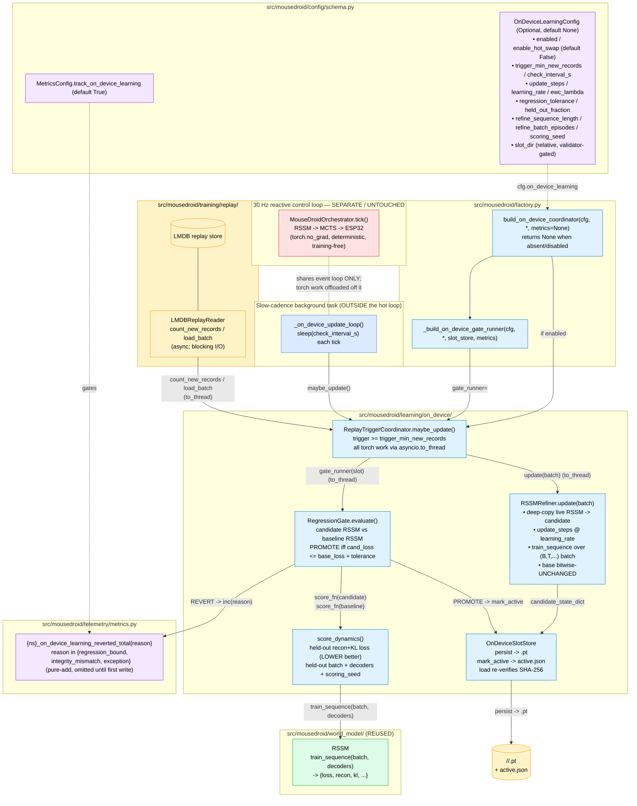

# C4 Component — On-Device Incremental Learning (Phase 6)

> The on-device incremental-learning path. Fresh rover experience in the LMDB
> replay store triggers a **bounded** RSSM refinement at the
> slow-cadence / POST_TICK seam, producing a SHA-256-stamped *candidate*
> weight slot that a world-model recon+KL-loss regression gate either
> promotes (marks active) or reverts (increments a Prometheus counter). The
> 30 Hz reactive control loop (RSSM → MCTS → ESP32) is shown SEPARATELY and is
> deliberately **untouched** — the only torch work runs on a worker thread via
> `asyncio.to_thread`, never inside `tick()`. Default-OFF: with
> `cfg.on_device_learning` absent/disabled, no coordinator is built and the
> orchestrator is byte-identical to pre-Phase-6.

## Component Diagram

## One slow-cadence cycle — `ReplayTriggerCoordinator.maybe_update`

| Step | Action | Hot-loop isolation |
|---|---|---|
| 1. Trigger probe | `count_new_records()` via `asyncio.to_thread`. Below `trigger_min_new_records` ⇒ log `on_device_trigger_below_threshold`, return `None`. | Blocking LMDB scan off the event loop. |
| 2. Batch load | `load_batch()` via `asyncio.to_thread`. Empty batch ⇒ log `on_device_trigger_empty_batch`, return `None`. | Off the event loop. |
| 3. Bounded update | `learner.update(batch)` via `asyncio.to_thread`. Deep-copies the live RSSM, runs `update_steps` of `train_sequence` refinement; base parameters bitwise-unchanged. | Gradient work on a worker thread. |
| 4. Persist | `slot_store.persist(candidate)` → write-temp-then-rename to `<digest>.pt`. | Cheap I/O on the slow cadence. |
| 5. Gate | `gate_runner(slot)` via `asyncio.to_thread` — score candidate RSSM vs baseline RSSM by held-out recon+KL loss, PROMOTE or REVERT. `None` gate ⇒ byte-identical to pre-WS-E3. | Torch recon-loss scoring on a worker thread. |

## Promote / revert decision — `RegressionGate.evaluate`

| Condition | Outcome |
|---|---|
| `candidate_loss` finite AND `candidate_loss <= baseline_loss + regression_tolerance` | **PROMOTE**: `slot_store.mark_active(slot)` (write `active.json`); log `on_device_candidate_promoted`. Live model NOT overwritten — only the pointer is recorded. |
| otherwise | **REVERT**: do NOT mark active; `metrics.inc_on_device_learning_reverted("regression_bound")`; log `on_device_candidate_reverted` (WARN). |
| slot SHA-256 verify fails on load | **REVERT** with reason `integrity_mismatch` (`SlotIntegrityError`). |
| update path raises | slow loop logs `on_device_update_cycle_failed` and keeps running; reason `exception` reserved for the counter. |

Determinism is load-bearing: both losses come from `score_dynamics` on the SAME
held-out batch + shared decoders + `scoring_seed`, so the decision is reproducible.

## Safety + de-hardcode contracts

- **Separate slot (ADR-010).** On-device candidates land at
  `<ExperienceConfig.path>/<slot_dir>/<digest>.pt` — NEVER overwriting the
  cloud-pulled slot. A revert simply leaves the live policy on the cloud
  baseline.
- **No absolute path hardcoded.** `slot_dir` is experience-root-relative and
  validated (`field_validator` rejects absolute / `..` / empty), so an
  operator override of the experience root is inherited for free.
- **SHA-256 integrity reused.** `OnDeviceSlotStore` digests with the C1 OTA
  helper (`utils.weights_manager.verify_sha256`); the digest stamps the
  filename and is re-verified on load.
- **Default-OFF + pure-add metric.** `cfg.on_device_learning` absent/disabled
  ⇒ no coordinator, no task, byte-identical orchestrator. The revert counter
  is gated by `MetricsConfig.track_on_device_learning` and omitted from
  `/metrics` until the first revert.
- **Hot loop untouched.** No edge crosses into the `tick()` subgraph; the two
  paths share only the event loop, and all torch work is offloaded off it.

## Enablement status (WS-E2/E3 closed; WS-E4 gated)

These are documented in full in the operator runbook
(`docs/runbooks/jetson-on-device-learning.md`):

1. **Refines the LIVE RSSM (CLOSED, #135).** `build_on_device_coordinator` wires
   `RSSMRefiner` over the live RSSM (deep-copied per update), refining via
   `train_sequence`; the gate scores candidate RSSM vs baseline RSSM. The
   pre-ENABLEMENT `nn.Linear` stand-in + policy adapter are gone.
2. **Scores real held-out experience (CLOSED, #135).** The gate scores against a
   FIXED held-out replay batch DISJOINT from the refine batch — not
   `manual_seed`-sampled latents.
3. **Live-model hot-swap (WS-E4, default-OFF).** Activating a promoted slot into
   the running RSSM is the `enable_hot_swap`-gated `build_on_device_hot_swap_source`
   seam — keep it off until a soak gate passes.

See the runbook's "DO NOT enable on the rover yet" section and the ≥30-day
soak-gate framing.

## Related diagrams

- `docs/architecture/c4-overview.md` — Levels 1 (Context) and 2 (Container).
- `docs/architecture/c4-orchestrator.md` — the 30 Hz sense-plan-act loop that
  the slow-cadence task runs alongside.
- `docs/architecture/c4-rssm-sim-pretraining.md` — the RSSM world model reused
  by the recon-loss scorer.
- `docs/architecture/ADR-010-cloud-weight-update-ota.md` — the SHA-256
  integrity + separate-slot contract this feature reuses.
- `docs/architecture/c4-llm-gateway.md` — the deliberative LLM tier (separate
  concern; also OUTSIDE the hot loop).
