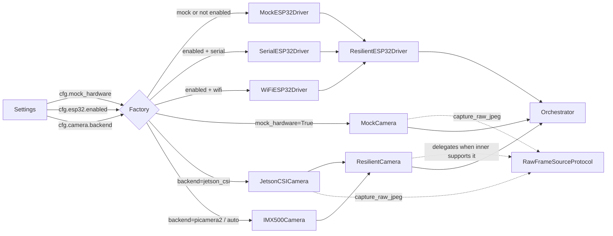
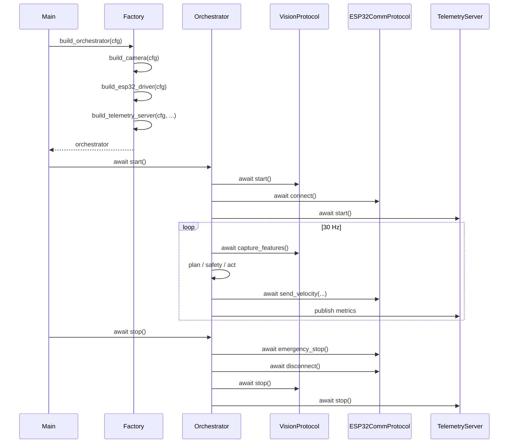

# C4 Component — Orchestrator (30 Hz sense-plan-act)

> The heart of MouseDroid: an asyncio 30 Hz loop that wires sensors →
> world-model → planner → motor commands. Every module is reached
> through a `@runtime_checkable Protocol`, instantiated by
> `src/mousedroid/factory.py`.

## Component Diagram

```mermaid
C4Component
title Orchestrator — Component Diagram

Container_Boundary(orch, "Orchestrator container (Python 3.11, asyncio)") {

    Component(loop, "tick_loop()", "30 Hz coroutine", "sense → plan → act\nstructlog metrics each tick")

    Component(safety, "RuntimeSafetyMonitor", "VisionProtocol consumer", "Joint / velocity limits,\nemergency stop")

    Component_Boundary(sense, "Sensing layer") {
        Component(cam, "VisionProtocol", "JetsonCSI / Mock / IMX500", "Async capture_features()\nasync capture_raw_jpeg() (PR #104)")
        Component(lidar, "LidarProtocol", "LD-19 / Mock", "Async read_scan()")
        Component(usonic, "DistanceSensorProtocol", "HC-SR04 / Mock", "Async read_distance_m()")
        Component(mic, "MicrophoneProtocol", "ALSA / Mock", "Async stream_chunks()")
    }

    Component_Boundary(plan, "World model + planning") {
        Component(rssm, "WorldModel (RSSM)", "torch.nn.Module", "Latent dynamics + imagination")
        Component(mcts, "MCTSPlanner", "policy_value_net", "PUCT search over actions")
        Component(bdi, "BDIAgent", "dual-cadence", "deliberative + reactive layers")
    }

    Component_Boundary(act, "Actuation") {
        Component(esp32, "ESP32CommProtocol", "Serial / WiFi / Mock", "send_velocity(vx, vy, omega)\nemergency_stop()")
        Component(resilient, "ResilientESP32Driver", "wraps inner", "Retry + circuit breaker")
    }

    Component(tel, "Telemetry Server", "aiohttp", "REST + WS endpoints,\nreads from sense + plan")
    Component(metrics, "Prometheus exporter", "/metrics", "Tick rate, latencies, breaker states")
}

Container_Ext(esp32_hw, "ESP32 hardware", "Wave Rover")

Rel(loop, cam, "capture_features()")
Rel(loop, lidar, "read_scan()")
Rel(loop, usonic, "read_distance_m()")
Rel(loop, rssm, "step(latent, obs)")
Rel(rssm, mcts, "rollout()")
Rel(mcts, bdi, "intention prior")
Rel(loop, safety, "validate(plan)")
Rel(safety, resilient, "emergency_stop()")
Rel(loop, resilient, "send_velocity(...)")
Rel(resilient, esp32, "wraps")
Rel(esp32, esp32_hw, "Serial / WiFi", "if .enabled")

Rel(tel, cam, "capture_raw_jpeg() if RawFrameSourceProtocol")
Rel(tel, lidar, "latest scan")
Rel(metrics, loop, "tick histogram")
```

## Factory wiring (PR #104 dashboard-mode emphasis)



Three branches matter for PR #104:

1. `mock_hardware=True` → MockESP32Driver (legacy).
2. `mock_hardware=False AND esp32.enabled=False` → MockESP32Driver (PR #104
   addition).
3. `mock_hardware=False AND esp32.enabled=True` → real Serial/WiFi driver
   (legacy + still default).

The `ResilientESP32Driver` wrap is preserved in all three branches. The same
retry + circuit-breaker pattern now covers real camera backends too: only
`mock_hardware=True` returns the bare `MockCamera`; `JetsonCSICamera` and
`IMX500Camera` are both wrapped in `ResilientCamera`
(`src/mousedroid/resilience/resilient_camera.py`), which transparently
delegates the optional `RawFrameSourceProtocol.capture_raw_jpeg` capability
only when the wrapped driver actually implements it.

## Lifecycle


