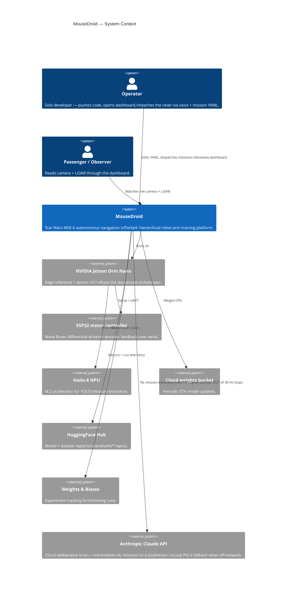
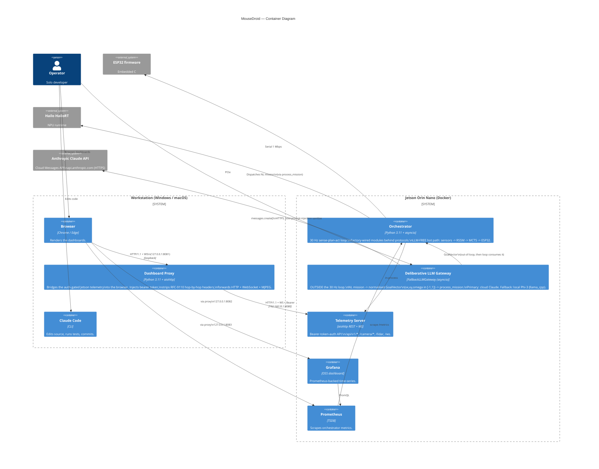

# C4 Architecture — MouseDroid

> **This is the canonical C4 diagram index.** For a single-page prose walkthrough of every level, see
> [`../architecture.md`](../architecture.md). Full documentation index: [`../README.md`](../README.md).
>
> Four-level C4 model for the MouseDroid codebase. Diagrams use Mermaid;
> render on GitHub or via VS Code's Markdown preview.
>
> - **Level 1 (Context):** systems, people, external dependencies.
> - **Level 2 (Container):** deployable units (Jetson container, workstation
>   proxy, ESP32 firmware, dashboards).
> - **Level 3 (Component):** internal modules + the protocol interfaces
>   between them (this file links to per-area diagrams).
> - **Level 4 (Code):** class-level — covered by Sphinx-style docstrings in
>   each module; not duplicated here.
>
> See also: `c4-dashboard-proxy.md`, `c4-orchestrator.md`, `c4-arm-platform.md`.

---

## Level 1 — System Context

> The **Anthropic Claude API** is the *deliberative* tier only: it
> turns a natural-language mission into a normalised `GoalVector`. It is
> deliberately outside the 30 Hz reactive control loop, which stays
> LLM-free and deterministic. When the rover is off-network, a local
> Phi-3-mini (llama_cpp) fallback serves the same translation. See
> Level 2 and [`c4-llm-gateway.md`](./c4-llm-gateway.md) for detail.

---

## Level 2 — Container

> **Loop boundary.** The Deliberative LLM Gateway runs *beside* the
> orchestrator, not inside its 30 Hz tick. NL → `GoalVector` translation
> happens once per mission (or on cloud→local failover) and hands the
> goal to `process_mission`; the deterministic hot path (sensors → RSSM
> world model → MCTS → ESP32 velocity command) never calls an LLM.
> Component-level wiring — the `build_llm_gateway` dispatch chain,
> `FallbackLLMGateway` failover state machine, and the cloud-egress
> security boundary — lives in [`c4-llm-gateway.md`](./c4-llm-gateway.md).

---

## Level 3 — Component (high level — see per-area files for detail)

Each subsystem owns a Component diagram in its own file:

| Subsystem | Component diagram | Owner test surface |
|-----------|-------------------|--------------------|
| Dashboard proxy + telemetry bridge | [`c4-dashboard-proxy.md`](./c4-dashboard-proxy.md) | `tests/unit/tools/test_dashboard_proxy.py`, `tests/e2e/test_pr104_dashboard_e2e.py` |
| 30 Hz orchestrator loop | [`c4-orchestrator.md`](./c4-orchestrator.md) | `tests/integration/test_sense_plan_act.py` |
| Robot-arm training platform | [`c4-arm-platform.md`](./c4-arm-platform.md) | `tests/unit/arm/*` |
| USB-C smoke validation gate (PR #106) | [`c4-usbc-smoke.md`](./c4-usbc-smoke.md) | `tests/unit/diagnostics/test_usbc.py`, `tests/unit/diagnostics/test_power_chain.py`, `tests/unit/test_factory_esp32_discovery.py`, `tests/hardware/test_usbc_enumeration.py`, `tests/hardware/test_power_chain_smoke.py` |
| LLM gateway + cloud/local failover (PR #107) | [`c4-llm-gateway.md`](./c4-llm-gateway.md) | `tests/unit/llm_gateway/test_anthropic_gateway.py`, `tests/unit/llm_gateway/test_fallback_gateway.py`, `tests/unit/config/test_llm_config_anthropic_fallback.py`, `tests/unit/factory/test_build_llm_gateway_dispatch.py`, `tests/integration/test_anthropic_gateway_wiring.py` |
| Validation efficiency: latency stats · trend store · summary renderer · trend timer · phase caching (PR #126 + F-018) | [`c4-validation-efficiency.md`](./c4-validation-efficiency.md) | `tests/unit/validation/test_latency_stats.py`, `tests/unit/validation/test_report_store.py`, `tests/unit/validation/test_summary.py`, `tests/unit/scripts/test_render_validation_summary.py`, `tests/regression/test_trend_timer_units.py`, `tests/unit/validation/test_init_lazy_exports.py`, `tests/unit/cli/test_preflight_cli.py`, `tests/integration/test_validation_report_store_integration.py`, `tests/regression/test_validation_import_decoupling.py`, `tests/smoke/test_jetson_full_validation_sanity.py` |
| Spec-driven harness: feature DAG + validate.py runner (ADR-012) | [`c4-spec-harness.md`](./c4-spec-harness.md) | `tests/unit/harness/test_spec.py`, `tests/regression/test_harness_spec_aqa.py`, `tests/regression/test_harness_cli_contract.py` |
| Claude Code workforce governance: edit-time secret scan · capability freeze gate · post-edit checks (F-024) | [`c4-claude-workforce.md`](./c4-claude-workforce.md) | `tests/unit/tools/claude_hooks/*`, `tests/regression/test_claude_workforce_aqa.py` |

The component-level diagrams are the right entry point when you need to
understand *which protocol object talks to which* — they map every
`build_*` factory in `src/mousedroid/factory.py` to its protocol +
implementations.

---

## Mapping the diagrams to source

| C4 element | Source path |
|------------|-------------|
| Orchestrator container | `src/mousedroid/orchestrator/` |
| Deliberative LLM Gateway | `src/mousedroid/llm_gateway/` (composite: `fallback_gateway.py`) |
| Telemetry Server | `src/mousedroid/telemetry/` |
| Dashboard Proxy | `tools/dashboard_proxy.py` |
| Claude workforce hooks + config | `tools/claude_hooks/`, `.claude/workforce.yaml`, `.claude/settings.json` |
| Factory wiring | `src/mousedroid/factory.py` |
| Configuration schema | `src/mousedroid/config/schema.py` |
| Hardware protocols | `src/mousedroid/hardware/protocols.py`, `src/mousedroid/comms/protocol.py` |
| ESP32 firmware | (out of repo — vendored Wave Rover bootloader) |
| Hailo NPU runtime | `src/mousedroid/hardware/accelerators/hailo_runtime.py` |

---

## Deployment + CI gates

The Jetson container is the only deployed runtime. Its provenance and the
guard rails that keep config + workflows from drifting away from it:

| Concern | Where | Notes |
|---------|-------|-------|
| Deployed image record | `deployments/jetson-image.json` | Source-of-truth SHA for what the rover runs. The PR #107 LLM tier (anthropic SDK + `LLMConfig`) is baked here; the rover bind-mounts editable source over it but the baked SDK survives `--force-recreate`. Bump this whenever the image is rebuilt or the tracked source SHA changes. |
| `config-compat` schema-drift gate | `.github/workflows/config-compat.yml`, `scripts/check_config_compat.py` | On any `config/*.yaml` (or `deployments/*.json`) change, worktrees out the deployed SHA and validates the changed YAML against *that* schema — catches the "yaml-only PR merges, rover crash-loops with `Extra inputs are not permitted`" class. |
| Edit-time workforce hooks (F-024) | `.claude/settings.json` hooks block, `tools/claude_hooks/` | PreToolUse secret scan + capability freeze gate (blocking), PostToolUse checks (advisory). Config: `.claude/workforce.yaml`. See [`c4-claude-workforce.md`](./c4-claude-workforce.md) |
| `actionlint` workflow lint | `.github/workflows/ci.yml` (Stage 0) | Lints every workflow file so an invalid workflow (e.g. an empty `${{ }}` expression) can't silently startup-fail and disable a gate — the exact failure that killed `config-compat` repo-wide before PR #113. |

The deliberative LLM tier is deployed via this image record; per-host
secrets (`ANTHROPIC_API_KEY`) and the CPU-fallback toggle
(`MOUSEDROID_LLM__N_GPU_LAYERS=0`) live in the rover's uncommitted
`docker.env`, never in the image or repo.

---

## Update discipline

When any of these change:

- Add or remove a top-level subsystem under `src/mousedroid/`.
- Add or remove a protocol interface.
- Add or remove an external dependency (HuggingFace, W&B, Hailo,
  Anthropic Claude API, etc.).
- Change the deployment topology (e.g. split telemetry out of the
  orchestrator container).
- Rebuild the Jetson image or repoint the tracked source SHA (keep
  `deployments/jetson-image.json` and the Deployment + CI gates table
  in sync).

…update the relevant C4 diagram in the same PR. Reviewers should bounce
PRs that introduce a new container without a matching diagram update.
