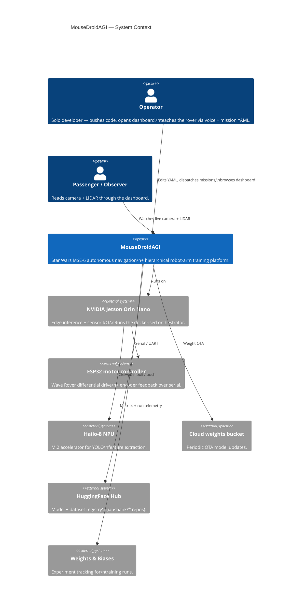
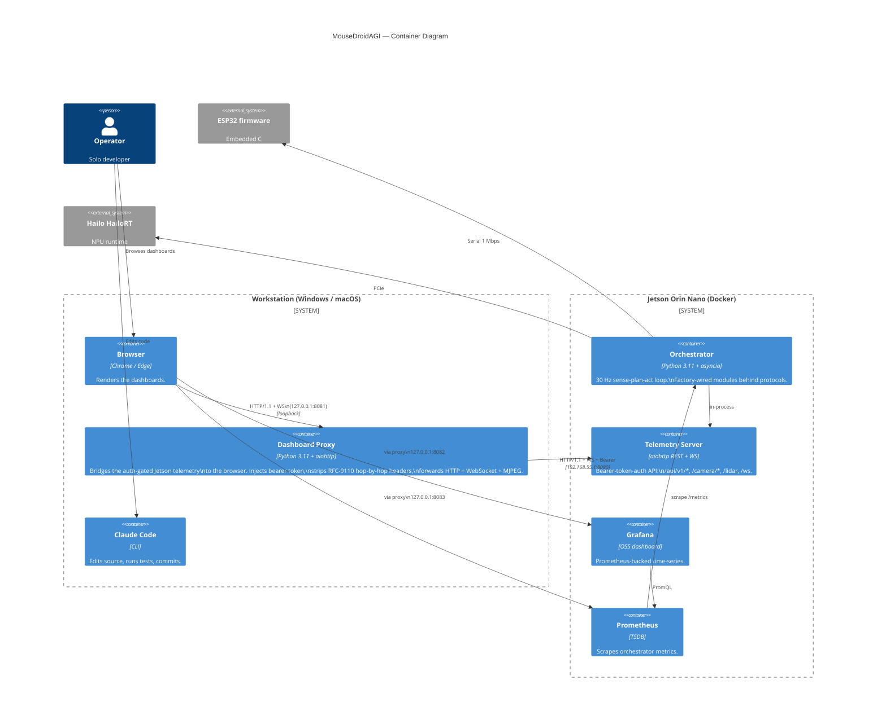

# C4 Architecture — MouseDroidAGI

> Four-level C4 model for the MouseDroidAGI codebase. Diagrams use Mermaid;
> render on GitHub or via VS Code's Markdown preview.
>
> - **Level 1 (Context):** systems, people, external dependencies.
> - **Level 2 (Container):** deployable units (Jetson container, workstation
>   proxy, ESP32 firmware, dashboards).
> - **Level 3 (Component):** internal modules + the protocol interfaces
>   between them (this file links to per-area diagrams).
> - **Level 4 (Code):** class-level — covered by Sphinx-style docstrings in
>   each module; not duplicated here.
>
> See also: `c4-dashboard-proxy.md`, `c4-orchestrator.md`, `c4-arm-platform.md`.

---

## Level 1 — System Context

---

## Level 2 — Container

---

## Level 3 — Component (high level — see per-area files for detail)

Each subsystem owns a Component diagram in its own file:

| Subsystem | Component diagram | Owner test surface |
|-----------|-------------------|--------------------|
| Dashboard proxy + telemetry bridge | [`c4-dashboard-proxy.md`](./c4-dashboard-proxy.md) | `tests/unit/tools/test_dashboard_proxy.py`, `tests/e2e/test_pr104_dashboard_e2e.py` |
| 30 Hz orchestrator loop | [`c4-orchestrator.md`](./c4-orchestrator.md) | `tests/integration/test_sense_plan_act.py` |
| Robot-arm training platform | [`c4-arm-platform.md`](./c4-arm-platform.md) | `tests/unit/arm/*` |
| USB-C smoke validation gate (PR #106) | [`c4-usbc-smoke.md`](./c4-usbc-smoke.md) | `tests/unit/diagnostics/test_usbc.py`, `tests/unit/diagnostics/test_power_chain.py`, `tests/unit/test_factory_esp32_discovery.py`, `tests/hardware/test_usbc_enumeration.py`, `tests/hardware/test_power_chain_smoke.py` |
| LLM gateway + cloud/local failover (PR #107) | [`c4-llm-gateway.md`](./c4-llm-gateway.md) | `tests/unit/llm_gateway/test_anthropic_gateway.py`, `tests/unit/llm_gateway/test_fallback_gateway.py`, `tests/unit/config/test_llm_config_anthropic_fallback.py`, `tests/unit/factory/test_build_llm_gateway_dispatch.py`, `tests/integration/test_anthropic_gateway_wiring.py` |

The component-level diagrams are the right entry point when you need to
understand *which protocol object talks to which* — they map every
`build_*` factory in `src/mousedroid/factory.py` to its protocol +
implementations.

---

## Mapping the diagrams to source

| C4 element | Source path |
|------------|-------------|
| Orchestrator container | `src/mousedroid/orchestrator/` |
| Telemetry Server | `src/mousedroid/telemetry/` |
| Dashboard Proxy | `tools/dashboard_proxy.py` |
| Factory wiring | `src/mousedroid/factory.py` |
| Configuration schema | `src/mousedroid/config/schema.py` |
| Hardware protocols | `src/mousedroid/hardware/protocols.py`, `src/mousedroid/comms/protocol.py` |
| ESP32 firmware | (out of repo — vendored Wave Rover bootloader) |
| Hailo NPU runtime | `src/mousedroid/hardware/accelerators/hailo_runtime.py` |

---

## Update discipline

When any of these change:

- Add or remove a top-level subsystem under `src/mousedroid/`.
- Add or remove a protocol interface.
- Add or remove an external dependency (HuggingFace, W&B, Hailo, etc.).
- Change the deployment topology (e.g. split telemetry out of the
  orchestrator container).

…update the relevant C4 diagram in the same PR. Reviewers should bounce
PRs that introduce a new container without a matching diagram update.
