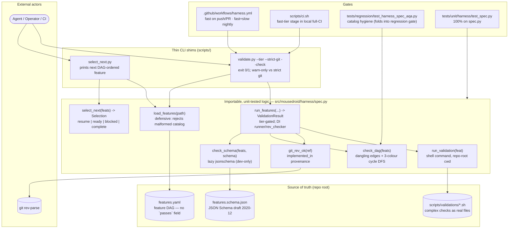

# C4 Component — Spec-Driven Harness (features.yaml · validate.py · select_next.py)

> The spec-alignment layer that closes the *completeness-by-presence* gap: a
> schema-validated feature catalog (`features.yaml`) plus a runner that holds the
> single rule — **a feature is `done` only when its `validation_command` exits 0**.
> There is no hand-set `passes` flag to game. Additive to the existing CI; the
> 30 Hz reactive loop and the rover runtime are untouched (this is a CI/agent
> tooling surface, not a runtime dependency of the rover brain).
>
> Companion to `docs/architecture/ADR-012-spec-driven-harness.md` (the decision +
> deviations), `docs/architecture/c4-overview.md` (Levels 1–2), and `HARNESS_SPEC.md`
> (the operating manual + agent session protocol).

## Component Diagram

## Key contracts (the non-negotiables)

| Contract | Where | Why |
|---|---|---|
| **No `passes` flag — the command passing is the truth.** A `done` feature whose `validation_command` exits non-zero fails CI. | `features.yaml` + `run_features` | Completion can't be inferred from code presence or hand-set. This is the Golden Rule (HARNESS_SPEC.md §10). |
| **Logic lives in an importable, covered package module.** `spec.py` is pure, side-effect-free (no `print`/logging), `mypy --strict`, dependency-injectable (`runner`/`rev_checker`). `scripts/validate.py` + `scripts/select_next.py` are thin shims. | `src/mousedroid/harness/spec.py` | Mirrors the `cli/* → validation/*` split (preflight/pillars). Brings the harness guarantees under the 85% coverage gate instead of leaving them untested in `scripts/`. |
| **`jsonschema` imported lazily.** Importing `spec` never hard-requires it; a missing lib degrades to a recorded warning, not an import crash. | `check_schema` | It is a dev-only dependency; the module must import in any environment. |
| **DAG-respecting selection.** `select_next` resumes `in_progress` first, else the highest-priority `todo` whose `depends_on` are all `done`; otherwise reports blocked edges. | `select_next` | Agents never pick a blocked feature. Single canonical `check_dag` (dangling + cycles) — the AQA test imports it rather than duplicating the DFS. |
| **Provenance, split by strictness.** `implemented_in` is checked via `git rev-parse`. Push/PR is warn-only (feature-branch refs are brittle pre-merge); nightly on the default branch uses `--strict-git`. | `git_rev_ok` + `harness.yml` | A typo'd / unreachable commit ref is caught without blocking the inner loop. CI uses `fetch-depth: 0`. |
| **CWD-robust.** The shims resolve `features.yaml`, validation commands, and git against the repo root. | `scripts/validate.py` / `scripts/select_next.py` | The harness runs correctly from any directory (verified from `/tmp`), not only the repo root. |
| **Tier-gated execution.** `fast` runs every push; `slow`/`hardware` are deferred (nightly / self-hosted Jetson). | `run_features(tiers=...)` | A growing E2E/hardware suite never bottlenecks the inner loop. The `hardware` tier is never run in hosted CI. |
| **`F-001` is not self-referential.** Validated by `scripts/validations/F-001.sh`, not `validate.py --check F-001`. | `scripts/validations/F-001.sh` | The upstream template's `--check F-001` example recurses infinitely. |

## Test surface

| Tier | File | Asserts |
|------|------|---------|
| Unit | `tests/unit/harness/test_spec.py` | Catalog load (valid + malformed), schema pass/fail/missing-lib, DAG dangling + self/multi-node cycles, git provenance, command success/fail/missing, tier gating, strict-git promotion, all `select_next` branches. **100% on `spec.py`.** |
| Regression | `tests/regression/test_harness_spec_aqa.py` | The real `features.yaml` validates against the schema; unique ids; acyclic DAG (imports `check_dag`); `done` features carry command + provenance; referenced `*.sh` exist; runner modules import. |
| Regression | `tests/regression/test_harness_cli_contract.py` | The CLI shims preserve their backwards-compatible contract: `validate.py --tier fast` exits 0 with the `OK:` summary, `--check F-001` exits 0, an unknown id exits 1, and `select_next.py` prints a feature line. |

## Structured surface (operator / agent recipes)

- `python scripts/select_next.py` — the next DAG-ordered feature to work on (do not eyeball `features.yaml`).
- `python scripts/validate.py --tier fast` — inner-loop gate; `--tier fast,slow` nightly; `--tier hardware` on the rover.
- `python scripts/validate.py --check F-005` — run a single feature's command regardless of tier.
- `bash scripts/init.sh` — idempotent baseline bootstrap, ends `baseline ready`.

## Update discipline

When you add / re-scope / remove a feature, edit `features.yaml` and log a one-line rationale in `progress.md`; permanent technical decisions also get an ADR (`docs/architecture/`). When you change the harness *machinery* (schema, runner logic, selection, tiers), update this diagram and `HARNESS_SPEC.md` in the same PR.
