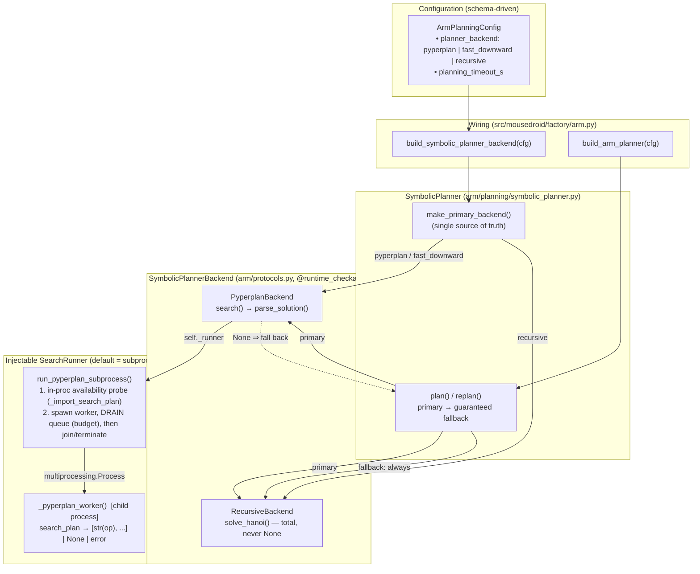

# C4 Component — Symbolic Planner Backends (F-003)

> Layer-1 symbolic planning for the robot-arm platform. Refactored under
> **F-003-FOLLOWUP** from a single `_import_search_plan` seam + in-thread
> timeout into a pluggable, `@runtime_checkable Protocol`-based backend set with
> a hard-interruptible pyperplan subprocess. Upstream callers (replanner, BDI
> loop) always receive a valid plan because a deterministic recursive backend is
> the guaranteed fallback.
>
> Companion to `docs/architecture/c4-arm-platform.md` (Layer 1 in the full arm
> component view) and `docs/architecture/c4-overview.md` (Levels 1–2).

## Component Diagram

## Non-negotiable contracts

- **Protocol DI.** Backends conform to
  `SymbolicPlannerBackend` (`search(domain, problem) -> list[PlanStep] | None`).
  `None` means "this backend could not plan — fall back". `RecursiveBackend` is
  total for valid inputs (never `None`), so `SymbolicPlanner` returns a plan for
  any valid (>= 3-peg) Tower-of-Hanoi configuration.
- **Config-selected, schema-driven.** The primary backend comes
  from `ArmPlanningConfig.planner_backend` via `make_primary_backend` (mirrored
  by `factory.build_symbolic_planner_backend`). `recursive` was **added** to the
  Literal; `pyperplan` (default) and `fast_downward` are preserved — existing
  YAML loads unchanged. `fast_downward` is not yet wired and transparently uses
  the pyperplan backend (logged `planner_backend_not_implemented`).
- **Hard-interruptible search.** Pyperplan runs in a `multiprocessing.Process`.
  A runaway astar search is `terminate()`-d once the `planning_timeout_s` budget
  elapses, rather than orphaning a thread as the prior `ThreadPoolExecutor` did.
  Availability is probed in-process first, so a host without pyperplan (the CI
  default — no `arm` extra) never pays the spawn cost.
- **No queue deadlock.** The runner `get()`s the result **before** `join()`ing
  the worker. A `multiprocessing.Queue` child blocks on exit until the parent
  drains a large item (feeder-thread contract); joining first would deadlock and
  discard a found plan. The `get` timeout is the planning budget; on expiry the
  still-alive worker is hard-terminated.
- **Injectable runner (testability).** `PyperplanBackend(planning_cfg, *,
  runner=run_pyperplan_subprocess)` — the default spawns the subprocess; tests
  inject an in-process fake so parse + fallback logic is exercised without a
  child process. Keyword-only with a default sentinel (pinned by AQA).
- **Structured logging only.** Grep events:
  `symbolic_planner_init`, `planning_start`/`_complete`/`_failed`,
  `planner_primary_no_plan`, `pyperplan_unavailable`, `pyperplan_search_start`,
  `pyperplan_search_timeout`, `pyperplan_search_error`, `pyperplan_no_solution`,
  `pyperplan_search_done`, `planner_backend_not_implemented`,
  `recursive_solve_complete`, `replanning`.

## Test surface

| Tier | File | Pins |
|------|------|------|
| Unit | `tests/unit/arm/test_symbolic_planner.py` | pure helpers, both backends (runner-injection), planner orchestration (primary→fallback, error wrapping), `make_primary_backend`, subprocess unavailable/api-drift/empty-queue, **fork-based hard-terminate + ~400 KB no-deadlock**, `importorskip` real subprocess |
| Unit | `tests/unit/arm/test_arm_factory.py` | `build_symbolic_planner_backend` selection |
| Regression (AQA) | `tests/regression/test_symbolic_planner_backend_aqa.py` | Literal membership + default, Protocol conformance, keyword-only seams, direct-construction backwards-compat |

## Known limitations (out of scope for F-003)

- `fast_downward` is unimplemented (maps to pyperplan).
- The generated Hanoi PDDL currently trips pyperplan's parser and always falls
  back to the recursive solver — tracked as **F-005**. This refactor preserves
  that behaviour (including the multi-line real `Operator.__str__`); it does not
  fix the PDDL generation/parse path.
