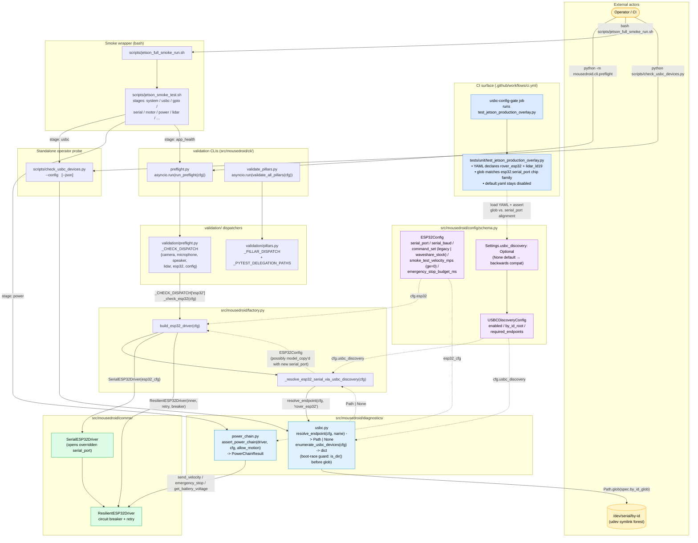

# C4 Component — USB-C Smoke Validation Gate (PR #106)

> The Jetson-side validation chain that confirms the Wave Rover is wired
> right and reachable before the orchestrator opens the serial port.
> Added in PR #106 to handle two operational realities: (1) rovers are
> swapped between bench units (each CP2102N chip has a unique by-id
> serial, so a literal `esp32.serial_port` path breaks the moment a
> different rover is connected); (2) udev sometimes hasn't mounted
> `/dev/serial/by-id/*` when an early-boot probe fires.
>
> Companion to `docs/architecture/c4-overview.md` (Levels 1–2) and
> `docs/runbooks/jetson-rover-smoke.md` (operator workflow).

## Component Diagram

## Resolution chain — `ESP32Config.serial_port`

Walked by `_resolve_esp32_serial_via_usbc_discovery` in
`src/mousedroid/factory.py`. Falls through each guard; the first
condition that holds wins.

| # | Condition | Outcome |
|---|-----------|---------|
| 1 | `cfg.usbc_discovery is None` OR `not cfg.usbc_discovery.enabled` | Return `cfg.esp32` unchanged. Pre-PR YAMLs hit this branch. |
| 2 | `Path(cfg.esp32.serial_port).exists()` | Return `cfg.esp32` unchanged. A pinned operator override is never silently shadowed. |
| 3 | `resolve_endpoint(cfg.usbc_discovery, "rover_esp32") is None` | Log `esp32_serial_port_unresolved` WARN, return `cfg.esp32` unchanged. Driver opens the (stale) literal path and surfaces a clean errno. |
| 4 | Glob matches | `cfg.esp32.model_copy(update={"serial_port": str(resolved)})`. Log `esp32_serial_port_overridden` (with `literal` + `resolved` keys). `cfg.esp32` is NOT mutated (Pydantic model_copy). |

## Boot-race guard — `Path.glob` on missing root

`Path.glob()` on a directory that does not exist raises
`FileNotFoundError` in Python 3.10/3.11 (not an empty iterator). On a
fresh Jetson before `udevd` mounts the `/dev/serial/by-id/*` symlink
forest, a pre-PR call would crash the smoke harness with an uncaught
`OSError`. Both `enumerate_usbc_devices` and `resolve_endpoint` guard
with `if not cfg.by_id_root.is_dir()` and return structured `MISSING` /
`None` so the harness sees a clean FAIL list.

## Failure-mode matrix

| Symptom | Where it shows up | Resolver branch | Operator fix |
|---|---|---|---|
| `usbc` stage FAIL during smoke | `usbc.log` has `usbc_endpoint_missing` | (probe runs before factory) | Reseat the USB-C cable; confirm the rover-side port is the data port, not power-only. |
| Container starts but rover doesn't move | Orchestrator log has `esp32_serial_port_unresolved` | Branch 3 | Set `MOUSEDROID_USBC_DISCOVERY__REQUIRED_ENDPOINTS__0__BY_ID_GLOB=...` to a glob that matches the live chip, OR update YAML literal. |
| Rover-swap broke comms; literal path is stale | Orchestrator log has `esp32_serial_port_overridden` | Branch 4 (override fired) | Nothing to fix — the override re-pointed at the live chip. Confirm via the structured `resolved=` log field. |
| Pre-udev boot; no symlinks yet | Smoke log has `usbc_by_id_root_missing` | (probe sees structured MISSING) | Wait for udev settle; smoke wrapper retries on the next blocking-stage pass. Long-term: add a systemd `Wants=udev-settle.service` to the smoke runner unit. |
| YAML drift between glob and `esp32.serial_port` chip family | CI `usbc-config-gate` fails | (regression test, pre-merge) | Update either the glob or the literal so both reference the same CP210x family. |

## Related diagrams

- `docs/architecture/c4-overview.md` — Levels 1 (Context) and 2
  (Container) for the whole system.
- `docs/architecture/c4-orchestrator.md` — the 30 Hz sense-plan-act
  loop that consumes the (possibly overridden) `SerialESP32Driver`.
- `docs/architecture/c4-dashboard-proxy.md` — the workstation-side
  reverse proxy used to verify dashboard endpoints once the rover is
  up and the orchestrator is serving telemetry.
