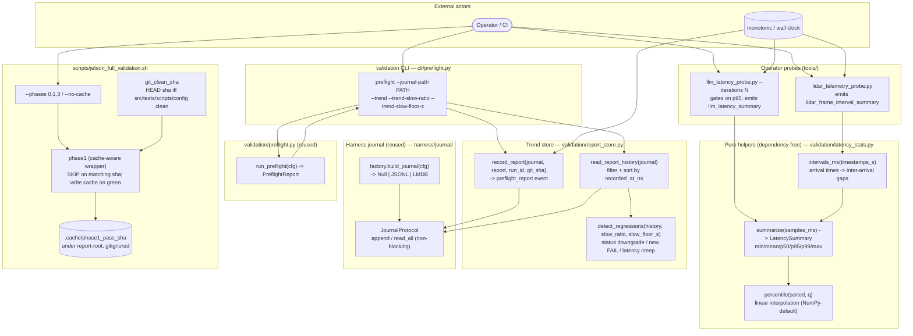

# C4 Component — Validation Efficiency (latency stats · trend store · phase caching)

> The runtime/resource-efficiency layer bolted onto the existing Jetson
> validation harness. It answers three questions the binary, single-shot
> harness could not: *how slow is the tail?* (latency percentiles), *is the
> rover degrading over time?* (run-over-run trend store), and *can we skip work
> that hasn't changed?* (phase-1 caching). All three are additive and opt-in —
> defaults preserve byte-identical legacy behaviour.
>
> Companion to `docs/architecture/c4-usbc-smoke.md` (the smoke gate that runs
> just before this), `docs/architecture/c4-overview.md` (Levels 1–2), and
> `docs/runbooks/jetson-full-validation.md` (operator workflow).

## Component Diagram

## Key contracts (the non-negotiables)

| Contract | Where | Why |
|---|---|---|
| **Pure helpers stay pure.** `summarize` / `percentile` / `intervals_ms` do no I/O, read no clock, render no verdict. | `validation/latency_stats.py` | Deterministic + unit-testable; the *caller* owns the pass/fail decision against its config-supplied target (no hardcoded threshold in the maths). |
| **p95 gate, not single-sample.** `--iterations 1` == legacy single-shot (p95 of one sample = that sample); `>1` gates on p95. | `tools/llm_latency_probe.py` | Absorbs cloud/GPU tail variance without failing on one unlucky round-trip. Backwards compatible at the default. |
| **Reuse the journal — no parallel store.** The trend store writes a `preflight_report` event through `JournalProtocol`; works with Null/JSONL/LMDB via `factory.build_journal(cfg)`. | `validation/report_store.py` | The journal already solves non-blocking append, bounded-memory iteration, durable ordering. Modularity: the store depends only on the protocol. |
| **Wall-clock ordering.** `recorded_at_ns = time.time_ns()` in the payload; history sorts on it. | `validation/report_store.py` | Stable across reboots, unlike the journal's monotonic entry stamp (LMDB keys reset per process). |
| **Dual-gated latency creep.** A slowdown is flagged only when it exceeds BOTH `slow_ratio` AND `slow_floor_s`. | `detect_regressions` | The absolute floor suppresses noise on sub-50 ms checks where a 1.5× jump is meaningless. Both are operator-tunable via CLI (no hardcoded call site). |
| **Phase-1 cache keyed on clean source SHA.** `git_clean_sha` echoes HEAD only when the tree under `src/tests/scripts/config/pyproject.toml` is clean; a dirty tree forces a miss. Cache written only on a fully-green run. | `scripts/jetson_full_validation.sh` | Static CI is a pure function of committed source. A dirty tree must never be masked by a stale green. Hardware/live phases are never cached. |
| **Lazy sensor re-exports.** `validation/__init__` re-exports the numpy/cv2/pyaudio `runtime` helpers via PEP 562 `__getattr__`. | `validation/__init__.py` | Importing the pure modules never drags the sensor stack in. Backwards compatible — names still resolve on access. Locked by `tests/regression/test_validation_import_decoupling.py`. |

## Test surface

| Tier | File | Asserts |
|------|------|---------|
| Unit | `tests/unit/validation/test_latency_stats.py` | Percentile correctness, `intervals_ms`, edge cases. |
| Unit | `tests/unit/validation/test_report_store.py` | Record/read roundtrip, malformed-entry tolerance, all regression classes, custom thresholds, NullJournal safety. |
| Unit | `tests/unit/validation/test_init_lazy_exports.py` | In-process `__getattr__` resolution + AttributeError. |
| Unit | `tests/unit/cli/test_preflight_cli.py` | `--journal-path` / `--trend` / threshold flags / FAIL-exit. |
| Integration | `tests/integration/test_validation_report_store_integration.py` | Store through factory `build_journal` for JSONL **and** LMDB + NullJournal default. |
| Regression | `tests/regression/test_validation_import_decoupling.py` | Subprocess guard: pure modules don't import numpy/cv2; lazy re-exports resolve. |
| Smoke | `tests/smoke/test_jetson_full_validation_sanity.py` | Script arg surface (`--phases`, `--no-cache`, dry-run). |

## Structured-log events (operator grep recipes)

- `llm_latency_summary` — `gate_ms`, `p95_ms`, `passed` (probe verdict).
- `lidar_frame_interval_summary` — frame inter-arrival jitter percentiles.
- `preflight_report_recorded` — a run was appended to the trend journal.
- `trend_run_recorded` / `trend_evaluated` (DEBUG) — CLI trend path.
- `static CI (cached)` (bash `record PASS`) — phase-1 cache hit.
