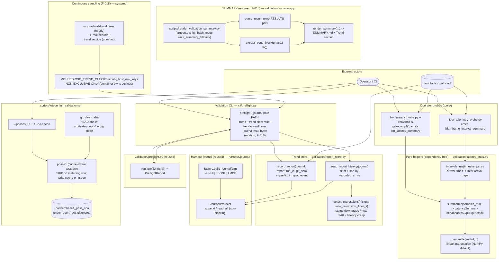

# C4 Component — Validation Efficiency (latency stats · trend store · summary renderer · trend timer · phase caching · Phase-1 OOM guard)

> The runtime/resource-efficiency layer bolted onto the existing Jetson
> validation harness. It answers four questions the binary, single-shot
> harness could not: *how slow is the tail?* (latency percentiles), *is the
> rover degrading over time?* (run-over-run trend store), *can we skip work
> that hasn't changed?* (phase-1 caching), and *how do we survive constrained
> memory on the Jetson?* (Phase-1 OOM guard — PR #161). All are additive and
> opt-in — defaults preserve byte-identical legacy behaviour.
>
> Companion to `docs/architecture/c4-usbc-smoke.md` (the smoke gate that runs
> just before this), `docs/architecture/c4-overview.md` (Levels 1–2), and
> `docs/runbooks/jetson-full-validation.md` (operator workflow).

## Phase-1 OOM guard (PR #161) — resource-efficiency companion

The Jetson has ~7.4 GB RAM; a running mousedroid daemon plus the container
`ci.sh` invocation (pytest + coverage + torch + LMDB) routinely SIGKILL'd with
`rc=137`. The wrapper's `run_phase1_ci_container` guards against this with a
two-tier strategy that ties directly into the efficiency-layer's contract:
*surface degradation as WARN, never as silent PASS or unhandled FAIL*.

- **First attempt:** `docker exec ... bash -lc "ulimit -v ${PHASE1_CI_ULIMIT_KB} && bash scripts/ci.sh"` (default 6 GB). ulimit lets Python raise `MemoryError` before the OOM killer wins, so failures are diagnosable rather than a bare 137.
- **Retry (on rc=137, gated by `${PHASE1_CI_OOM_RETRY}`):** tighter vmem cap (`${PHASE1_CI_RETRY_ULIMIT_KB}`, default 5 GB) AND `MOUSEDROID_CI_SLIM=1`. `ci.sh` gates its Perf/Regression/E2E stages behind that env var; slim retry runs Unit+Property+Integration+coverage (the core signal — never gated) and skips the memory-heaviest tiers. Perf/Regression/E2E coverage isn't lost repository-wide — Phase 2's `pytest -m hardware` step catches those tiers in a hardware-owning environment.
- **Verdict:** PASS on first-attempt success; **WARN** on retry-success (`"OOM on first attempt; passed on slim-mode retry"`); FAIL when the retry also fails.

Contracts (17 source-text pins in `tests/regression/test_jetson_phase1_oom_guard.py`) enforce: env-overridable tunables with defaults, ulimit applied BEFORE ci.sh, retry gated on `rc==137` only, operator kill-switch, WARN on retry-success, and Unit+Property+Integration+coverage always in the mandatory path (never inside the SLIM conditional). Tunable env vars: `MOUSEDROID_VALIDATION_PHASE1_CI_ULIMIT_KB`, `_RETRY_ULIMIT_KB`, `_OOM_RETRY` — all documented in the `jetson_full_validation.sh` header alongside the existing `MOUSEDROID_VALIDATION_*` family.

## Component Diagram

## Key contracts (the non-negotiables)

| Contract | Where | Why |
|---|---|---|
| **Pure helpers stay pure.** `summarize` / `percentile` / `intervals_ms` do no I/O, read no clock, render no verdict. | `validation/latency_stats.py` | Deterministic + unit-testable; the *caller* owns the pass/fail decision against its config-supplied target (no hardcoded threshold in the maths). |
| **p95 gate, not single-sample.** `--iterations 1` == legacy single-shot (p95 of one sample = that sample); `>1` gates on p95. | `tools/llm_latency_probe.py` | Absorbs cloud/GPU tail variance without failing on one unlucky round-trip. Backwards compatible at the default. |
| **Reuse the journal — no parallel store.** The trend store writes a `preflight_report` event through `JournalProtocol`; works with Null/JSONL/LMDB via `factory.build_journal(cfg)`. | `validation/report_store.py` | The journal already solves non-blocking append, bounded-memory iteration, durable ordering. Modularity: the store depends only on the protocol. |
| **Wall-clock ordering.** `recorded_at_ns = time.time_ns()` in the payload; history sorts on it. | `validation/report_store.py` | Stable across reboots, unlike the journal's monotonic entry stamp (LMDB keys reset per process). |
| **Dual-gated latency creep.** A slowdown is flagged only when it exceeds BOTH `slow_ratio` AND `slow_floor_s`. | `detect_regressions` | The absolute floor suppresses noise on sub-50 ms checks where a 1.5× jump is meaningless. Both are operator-tunable via CLI (no hardcoded call site). |
| **Phase-1 cache keyed on clean source SHA.** `git_clean_sha` echoes HEAD only when the tree under `src/tests/scripts/config/pyproject.toml` is clean; a dirty tree forces a miss. Cache written only on a fully-green run. | `scripts/jetson_full_validation.sh` | Static CI is a pure function of committed source. A dirty tree must never be masked by a stale green. Hardware/live phases are never cached. |
| **Timer runs non-exclusive checks only.** `mousedroid-trend.service` defaults to `--checks config,host_env_keys` and its ExecStart may never name camera/lidar/esp32/microphone/speaker. | `scripts/mousedroid-trend.service` + `tests/regression/test_trend_timer_units.py` | The orchestrator container owns the devices; a concurrent open corrupts both readers. Full device trends come only from Phase 2 (container stopped). |
| **Separate timer journal.** The timer journals to its own path (default `/var/lib/mousedroid/trend/preflight.jsonl`), never the full-run journal. | `scripts/mousedroid-trend.service` | 2-check timer runs and all-check harness runs have incomparable `total_elapsed_s` — sharing a journal would flag bogus latency-creep regressions. |
| **Rotation is capped + fail-safe.** `--journal-max-bytes` rotates to `<path>.1` (single generation); `max_bytes<=0` disables rotation; a failed `replace()` degrades to `journal_rotate_failed`, never a crash. | `report_store.rotate_journal_if_needed` | SD-card growth cap (the `journalctl --vacuum-size=50M` precedent) that can never thrash-rotate or take down the timer-driven preflight. |
| **Summary renderer is pure + fallback-safe.** `validation/summary.py` renders the table + a Trend section (mined from the Phase-2 `--trend` output); the bash `write_summary` falls back to the inline table when the renderer/python is unavailable. | `validation/summary.py`, `scripts/jetson_full_validation.sh` | Python-less hosts still get a SUMMARY.md; the logic under coverage is the tested path, the fallback is executed by a bash-harness regression test. |
| **Lazy sensor re-exports.** `validation/__init__` re-exports the numpy/cv2/pyaudio `runtime` helpers via PEP 562 `__getattr__`. | `validation/__init__.py` | Importing the pure modules never drags the sensor stack in. Backwards compatible — names still resolve on access. Locked by `tests/regression/test_validation_import_decoupling.py`. |

## Test surface

| Tier | File | Asserts |
|------|------|---------|
| Unit | `tests/unit/validation/test_latency_stats.py` | Percentile correctness, `intervals_ms`, edge cases. |
| Unit | `tests/unit/validation/test_report_store.py` | Record/read roundtrip, malformed-entry tolerance, all regression classes, custom thresholds, NullJournal safety. |
| Unit | `tests/unit/validation/test_init_lazy_exports.py` | In-process `__getattr__` resolution + AttributeError. |
| Unit | `tests/unit/cli/test_preflight_cli.py` | `--journal-path` / `--trend` / threshold flags / FAIL-exit. |
| Integration | `tests/integration/test_validation_report_store_integration.py` | Store through factory `build_journal` for JSONL **and** LMDB + NullJournal default. |
| Regression | `tests/regression/test_validation_import_decoupling.py` | Subprocess guard: pure modules don't import numpy/cv2; lazy re-exports resolve. |
| Smoke | `tests/smoke/test_jetson_full_validation_sanity.py` | Script arg surface (`--phases`, `--no-cache`, dry-run). |
| Unit | `tests/unit/validation/test_summary.py` | Row parsing, trend-block mining (exact `RegressionReport.render_text()` shape), Trend-section render + placeholder. |
| Unit | `tests/unit/scripts/test_render_validation_summary.py` | Shim CLI contract incl. missing/absent-log tolerance. |
| Regression | `tests/regression/test_trend_timer_units.py` | Non-exclusive `--checks` subset, separate journal path, rotation flags threaded, env-indirected ExecStart. |
| Regression | `tests/regression/test_jetson_full_validation_script.py` | Journal threading under `REPORT_ROOT`, env tunables documented, `write_summary_fallback` executed for real (python-less harness). |

## Structured-log events (operator grep recipes)

- `llm_latency_summary` — `gate_ms`, `p95_ms`, `passed` (probe verdict).
- `lidar_frame_interval_summary` — frame inter-arrival jitter percentiles.
- `preflight_report_recorded` — a run was appended to the trend journal.
- `trend_run_recorded` / `trend_evaluated` (DEBUG) — CLI trend path.
- `static CI (cached)` (bash `record PASS`) — phase-1 cache hit.
- `journal_rotated` / `journal_rotate_failed` — `--journal-max-bytes` rotation fired / degraded (F-018).
- `validation_summary_rendered` (DEBUG) — SUMMARY.md produced by the Python renderer.
- `host_env_check_skipped` / `host_env_keys_missing` / `host_env_keys_ok` — the F-017 host-env key-set check (names only, never values).
