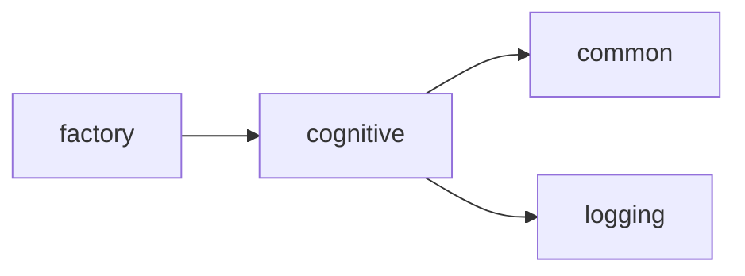
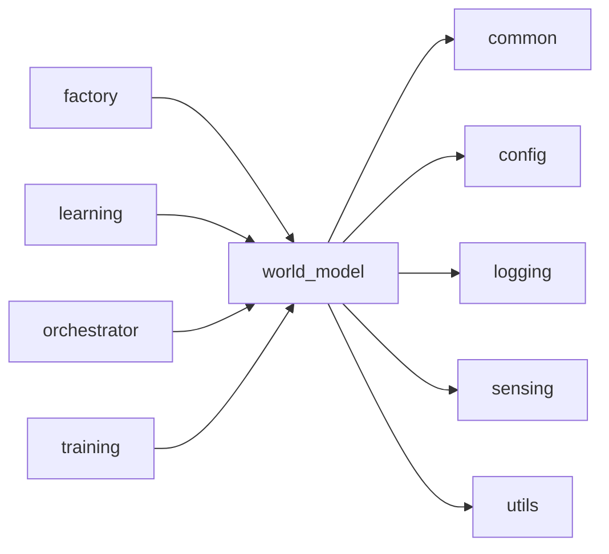
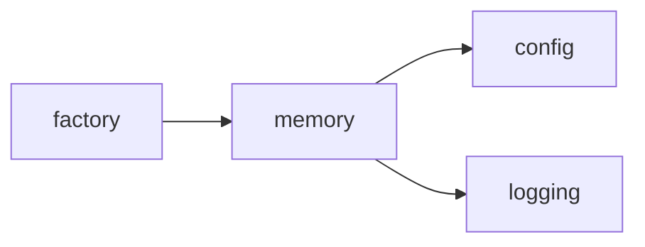
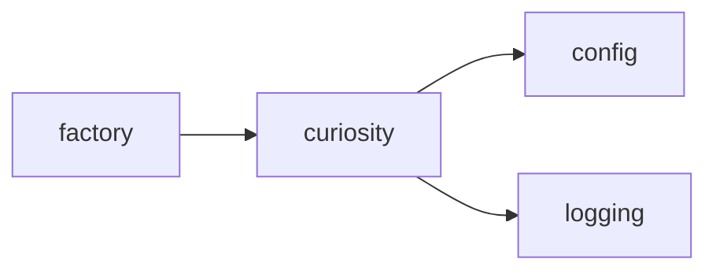
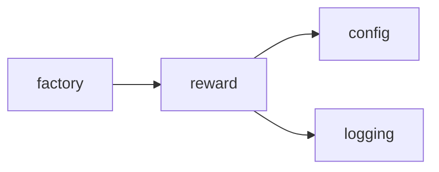
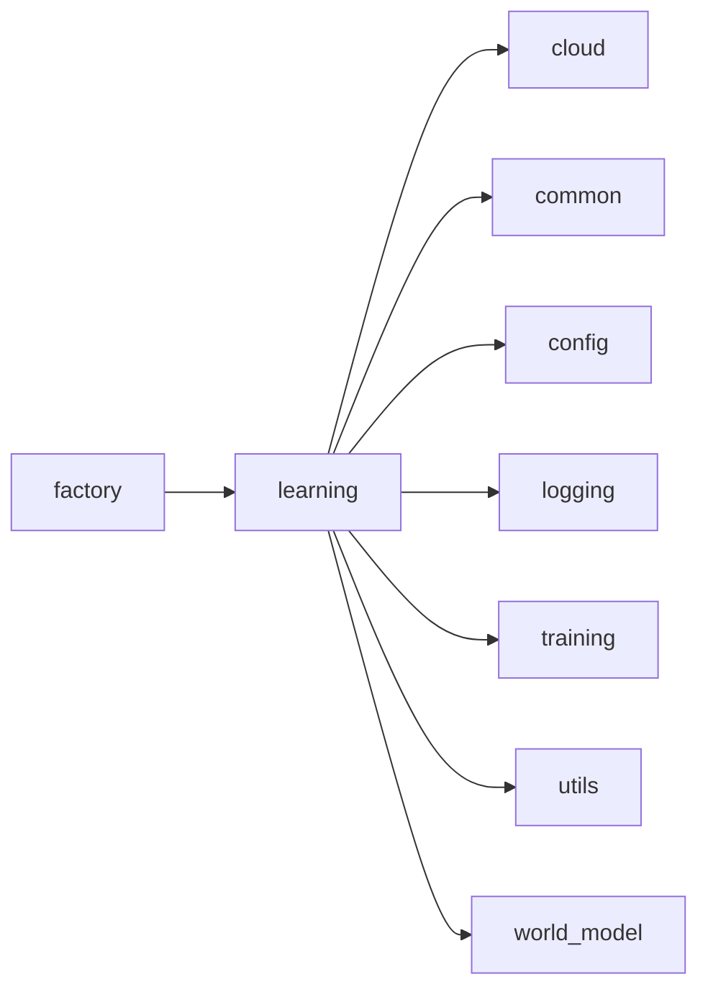
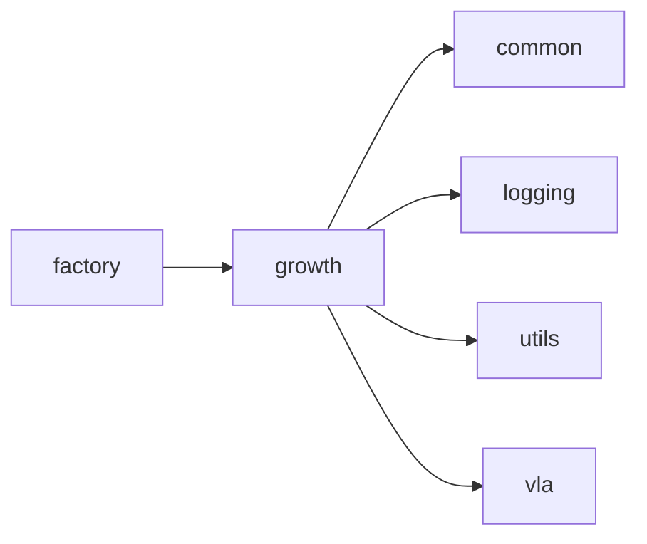
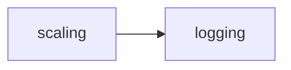
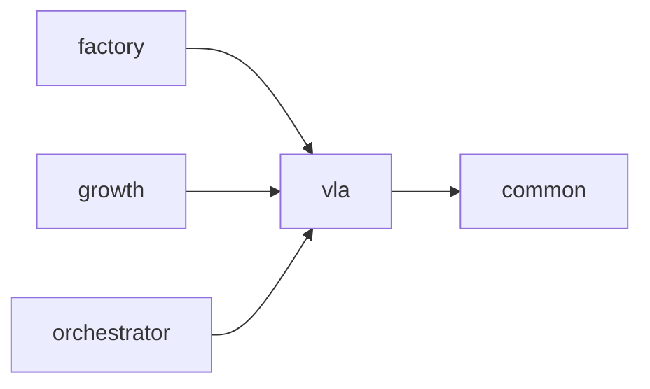

<!-- Generated by scripts/generate_package_map.py — do not edit by hand. Run `make package-map` to regenerate. -->

# Package import map — Cognitive pillars

> **This is an import map, not a dataflow map.** Edges are `ast`-parsed
> `mousedroid.<package>` imports with `TYPE_CHECKING` blocks filtered out. In a
> factory-first DI codebase the import graph and the runtime seams diverge by
> design: `factory` has many outbound package edges and `config` many inbound
> because architectural invariants 1-2 require it, and the live seams run
> through injected Protocols that `ast` cannot see. Read each section as
> "what imports what", not "what talks to what at runtime".

Epic id: `cognitive`. Index: [`package-map.md`](../package-map.md).

## `cognitive`

**Purpose:** Cognitive architecture — BDI, metacognition, and constitutional RL.

**Imports:** `common`, `logging`

**Dependents:** `factory`

## `world_model`

**Purpose:** World model — RSSM, dual-stream RSSM, encoder, and MCTS planner.

**Imports:** `common`, `config`, `logging`, `sensing`, `utils`

**Dependents:** `factory`, `learning`, `orchestrator`, `training`

## `memory`

**Purpose:** Layered memory system — episodic, semantic, and working memory.

**Imports:** `config`, `logging`

**Dependents:** `factory`

## `curiosity`

**Purpose:** Curiosity-driven exploration — Intrinsic Curiosity Module.

**Imports:** `config`, `logging`

**Dependents:** `factory`

## `reward`

**Purpose:** Multi-objective reward modeling.

**Imports:** `config`, `logging`

**Dependents:** `factory`

## `learning`

**Purpose:** Continual learning — EWC and progressive networks.

**Imports:** `cloud`, `common`, `config`, `logging`, `training`, `utils`, `world_model`

**Dependents:** `factory`

## `growth`

**Purpose:** Knowledge distillation for model growth.

**Imports:** `common`, `logging`, `utils`, `vla`

**Dependents:** `factory`

## `meta`

**Purpose:** Meta-learning — in-context learning and MAML.

**Imports:** `logging`

**Dependents:** *(none)*

## `scaling`

**Purpose:** Scaling — Mixture of Experts and adaptive compute.

**Imports:** `logging`

**Dependents:** *(none)*

## `vla`

**Purpose:** Vision-Language-Action policy package (Phase 3a).

**Imports:** `common`

**Dependents:** `factory`, `growth`, `orchestrator`

