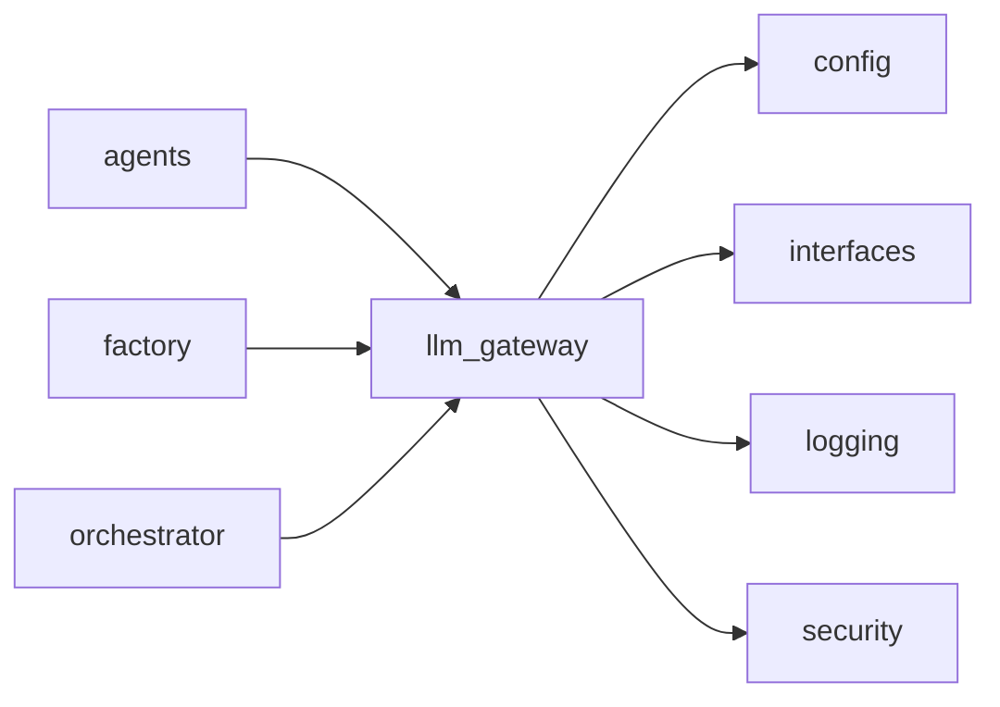
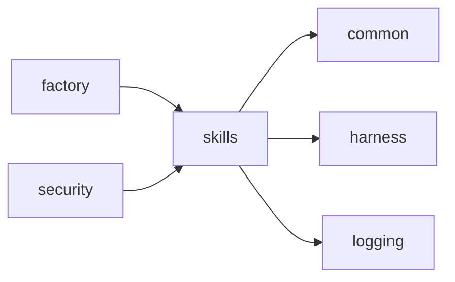
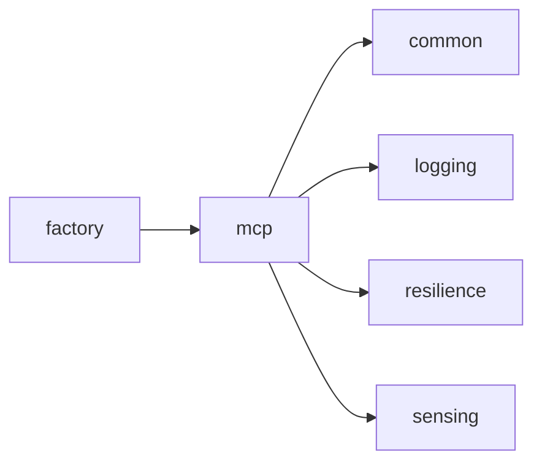
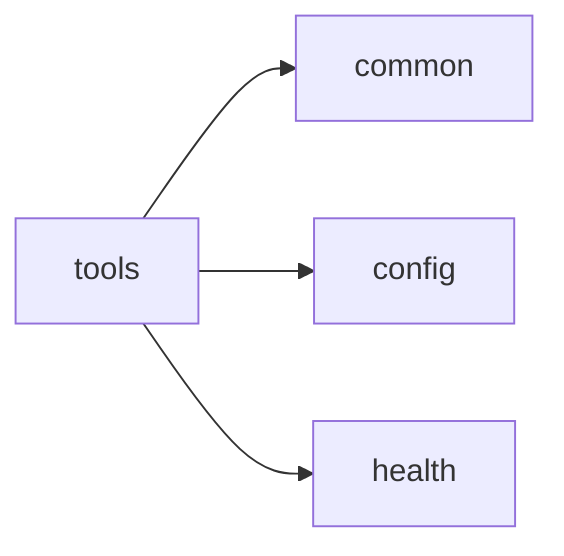
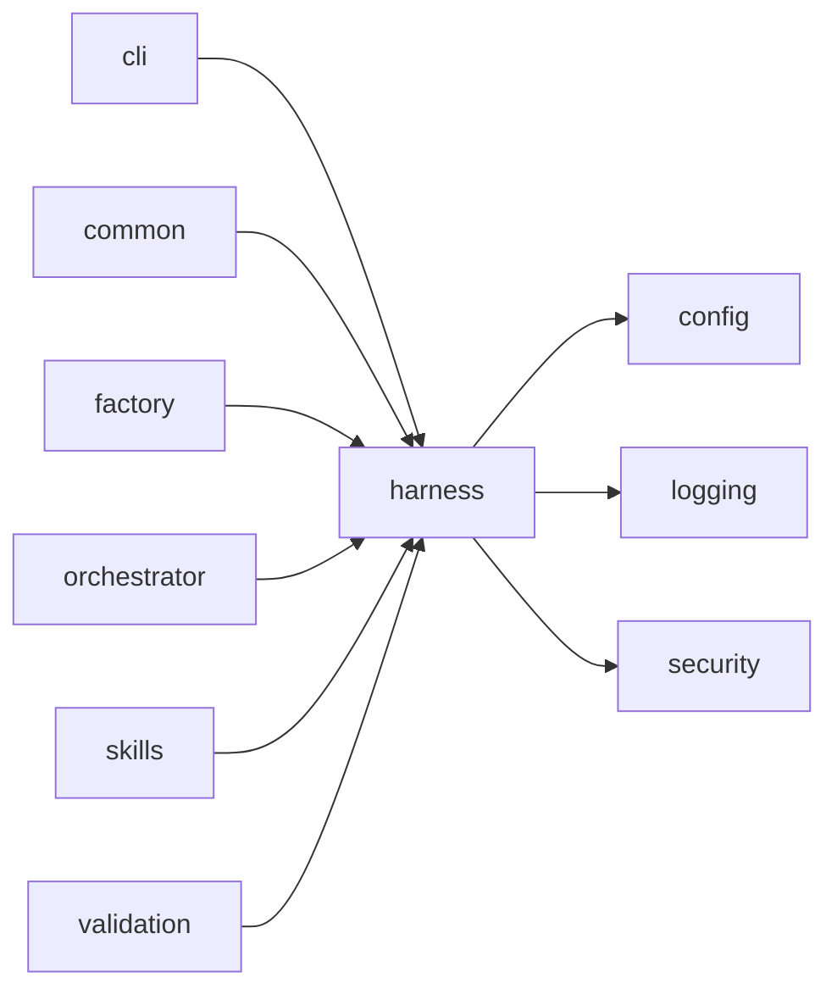

<!-- Generated by scripts/generate_package_map.py — do not edit by hand. Run `make package-map` to regenerate. -->

# Package import map — Deliberative brain and agent tooling

> **This is an import map, not a dataflow map.** Edges are `ast`-parsed
> `mousedroid.<package>` imports with `TYPE_CHECKING` blocks filtered out. In a
> factory-first DI codebase the import graph and the runtime seams diverge by
> design: `factory` has many outbound package edges and `config` many inbound
> because architectural invariants 1-2 require it, and the live seams run
> through injected Protocols that `ast` cannot see. Read each section as
> "what imports what", not "what talks to what at runtime".

Epic id: `deliberative`. Index: [`package-map.md`](../package-map.md).

## `llm_gateway`

**Purpose:** LLM gateway for natural-language goal translation.

**Imports:** `config`, `interfaces`, `logging`, `security`

**Dependents:** `agents`, `factory`, `orchestrator`

## `skills`

**Purpose:** Skill / sub-agent registry for the agent harness.

**Imports:** `common`, `harness`, `logging`

**Dependents:** `factory`, `security`

## `mcp`

**Purpose:** MCP (Model Context Protocol) server module.

**Imports:** `common`, `logging`, `resilience`, `sensing`

**Dependents:** `factory`

## `tools`

**Purpose:** Tool registry for agent capabilities.

**Imports:** `common`, `config`, `health`

**Dependents:** *(none)*

## `harness`

**Purpose:** Agent harness — deterministic exoskeleton around the orchestrator.

**Imports:** `config`, `logging`, `security`

**Dependents:** `cli`, `common`, `factory`, `orchestrator`, `skills`, `validation`

