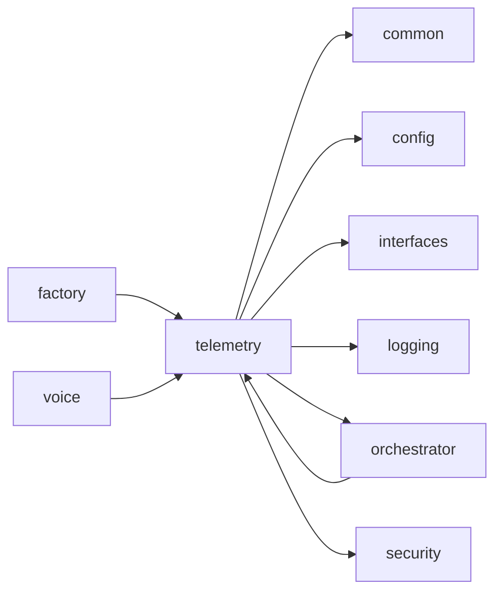
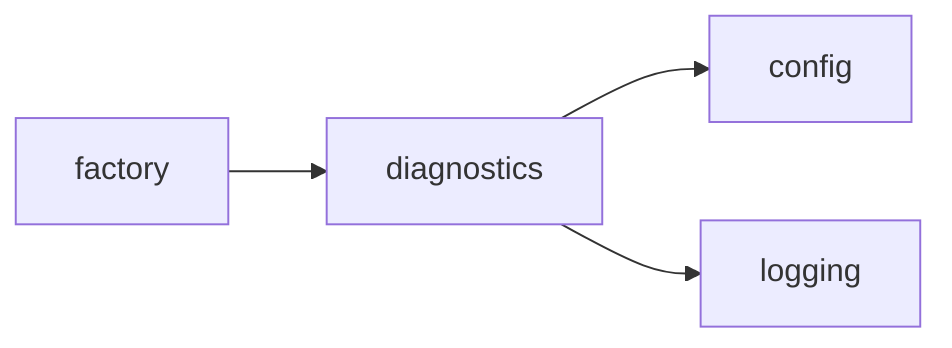
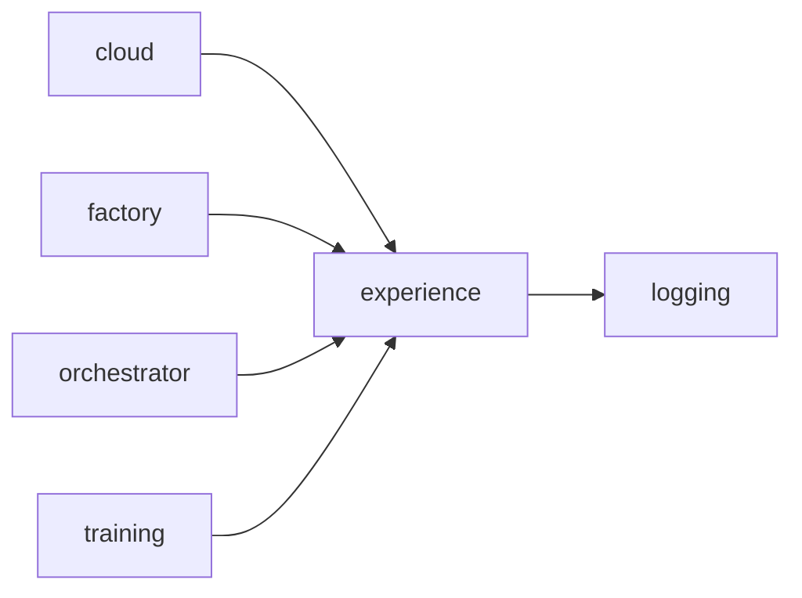
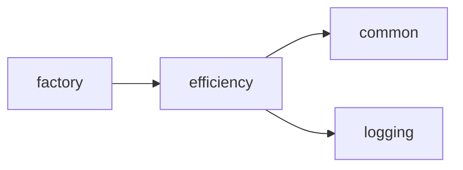

<!-- Generated by scripts/generate_package_map.py — do not edit by hand. Run `make package-map` to regenerate. -->

# Package import map — Observability and experience

> **This is an import map, not a dataflow map.** Edges are `ast`-parsed
> `mousedroid.<package>` imports with `TYPE_CHECKING` blocks filtered out. In a
> factory-first DI codebase the import graph and the runtime seams diverge by
> design: `factory` has many outbound package edges and `config` many inbound
> because architectural invariants 1-2 require it, and the live seams run
> through injected Protocols that `ast` cannot see. Read each section as
> "what imports what", not "what talks to what at runtime".

Epic id: `observability`. Index: [`package-map.md`](../package-map.md).

## `telemetry`

**Purpose:** Telemetry server, Prometheus metrics registry, and live-state publishing.

**Imports:** `common`, `config`, `interfaces`, `logging`, `orchestrator`, `security`

**Dependents:** `factory`, `orchestrator`, `voice`

## `diagnostics`

**Purpose:** Standalone diagnostics helpers shared by smoke scripts and tests.

**Imports:** `config`, `logging`

**Dependents:** `factory`

## `experience`

**Purpose:** Experience logging and serialization.

**Imports:** `logging`

**Dependents:** `cloud`, `factory`, `orchestrator`, `training`

## `efficiency`

**Purpose:** Efficiency -- TensorRT optimization and power profiling.

**Imports:** `common`, `logging`

**Dependents:** `factory`

