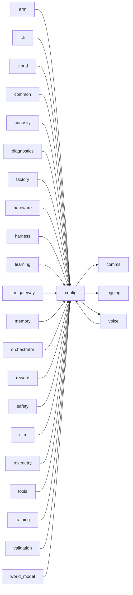
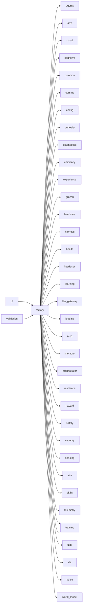
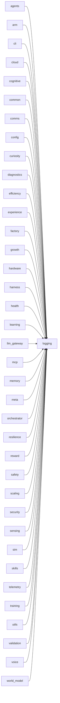
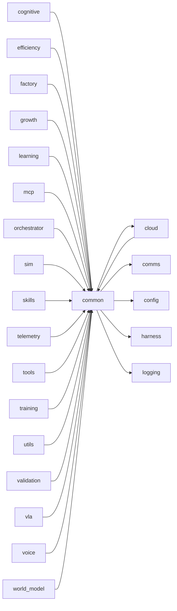
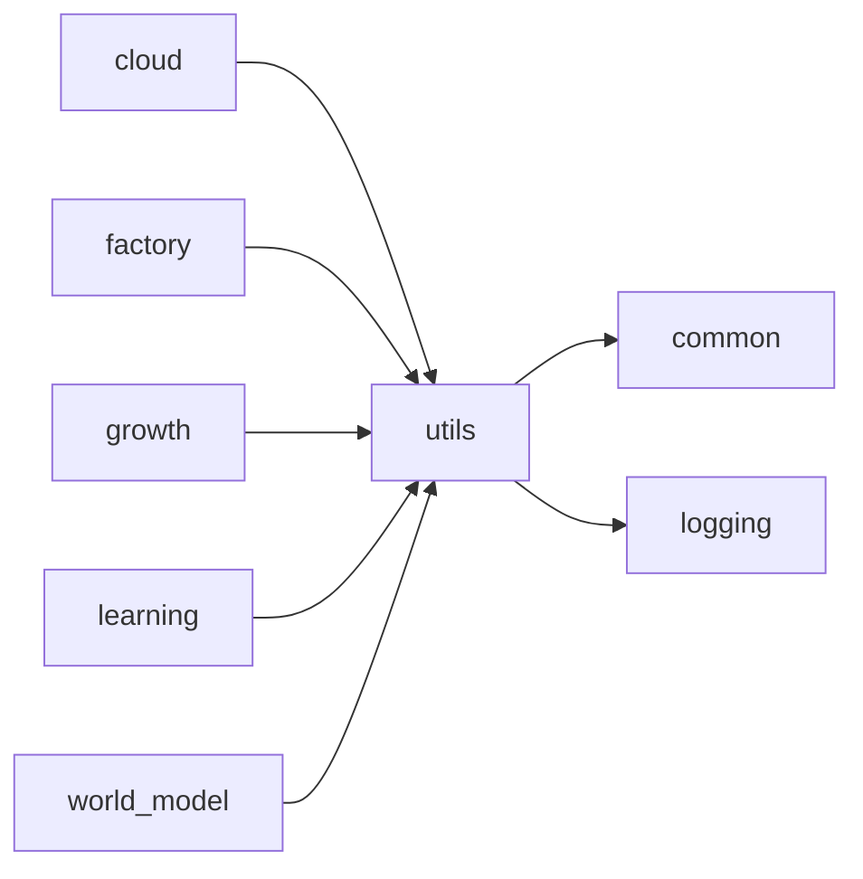
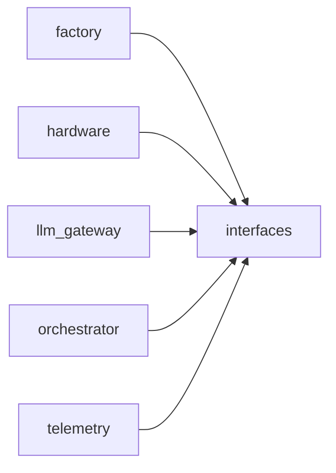
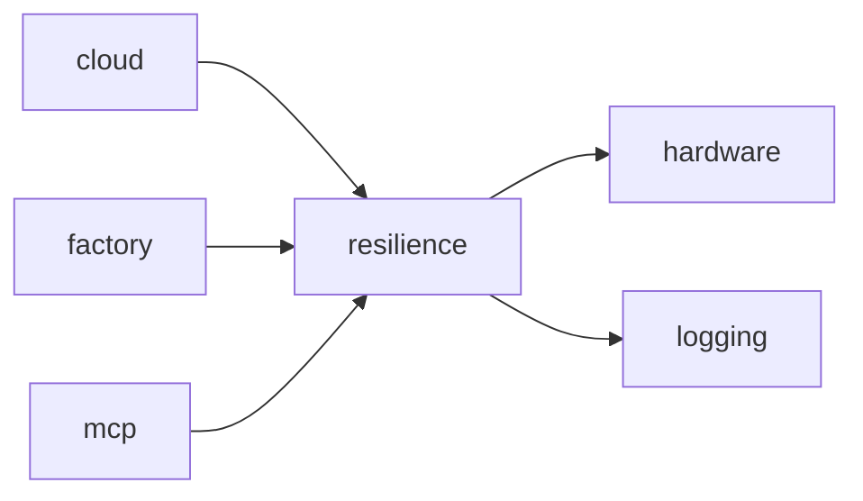
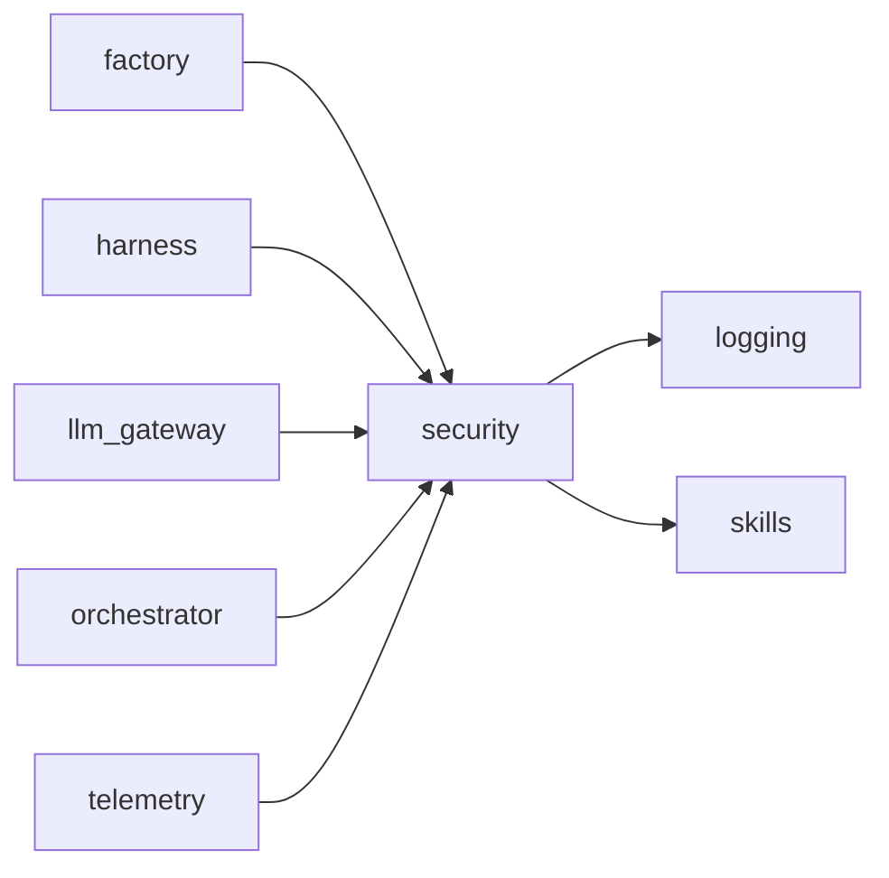

<!-- Generated by scripts/generate_package_map.py — do not edit by hand. Run `make package-map` to regenerate. -->

# Package import map — Shared kernel and composition

> **This is an import map, not a dataflow map.** Edges are `ast`-parsed
> `mousedroid.<package>` imports with `TYPE_CHECKING` blocks filtered out. In a
> factory-first DI codebase the import graph and the runtime seams diverge by
> design: `factory` has many outbound package edges and `config` many inbound
> because architectural invariants 1-2 require it, and the live seams run
> through injected Protocols that `ast` cannot see. Read each section as
> "what imports what", not "what talks to what at runtime".

Epic id: `platform`. Index: [`package-map.md`](../package-map.md).

## `config`

**Purpose:** Configuration schema and YAML loader.

**Imports:** `comms`, `logging`, `voice`

**Dependents:** `arm`, `cli`, `cloud`, `common`, `curiosity`, `diagnostics`, `factory`, `hardware`, `harness`, `learning`, `llm_gateway`, `memory`, `orchestrator`, `reward`, `safety`, `sim`, `telemetry`, `tools`, `training`, `validation`, `voice`, `world_model`

## `factory`

**Purpose:** Platform factory functions — build all components via dependency injection.

**Imports:** `agents`, `arm`, `cloud`, `cognitive`, `common`, `comms`, `config`, `curiosity`, `diagnostics`, `efficiency`, `experience`, `growth`, `hardware`, `harness`, `health`, `interfaces`, `learning`, `llm_gateway`, `logging`, `mcp`, `memory`, `orchestrator`, `resilience`, `reward`, `safety`, `security`, `sensing`, `sim`, `skills`, `telemetry`, `training`, `utils`, `vla`, `voice`, `world_model`

**Dependents:** `cli`, `training`, `validation`

## `logging`

**Purpose:** Structured logging setup.

**Imports:** *(none)*

**Dependents:** `agents`, `arm`, `cli`, `cloud`, `cognitive`, `common`, `comms`, `config`, `curiosity`, `diagnostics`, `efficiency`, `experience`, `factory`, `growth`, `hardware`, `harness`, `health`, `learning`, `llm_gateway`, `mcp`, `memory`, `meta`, `orchestrator`, `resilience`, `reward`, `safety`, `scaling`, `security`, `sensing`, `sim`, `skills`, `telemetry`, `training`, `utils`, `validation`, `voice`, `world_model`

## `common`

**Purpose:** Common utilities for MouseDroid.

**Imports:** `cloud`, `comms`, `config`, `harness`, `logging`

**Dependents:** `cloud`, `cognitive`, `efficiency`, `factory`, `growth`, `learning`, `mcp`, `orchestrator`, `sim`, `skills`, `telemetry`, `tools`, `training`, `utils`, `validation`, `vla`, `voice`, `world_model`

## `utils`

**Purpose:** Shared utility modules.

**Imports:** `common`, `logging`

**Dependents:** `cloud`, `factory`, `growth`, `learning`, `world_model`

## `interfaces`

**Purpose:** Domain protocols and interface definitions for MouseDroid.

**Imports:** *(none)*

**Dependents:** `factory`, `hardware`, `llm_gateway`, `orchestrator`, `telemetry`

## `resilience`

**Purpose:** Resilience primitives — circuit breaker, retry, and resilient wrappers.

**Imports:** `hardware`, `logging`

**Dependents:** `cloud`, `factory`, `mcp`

## `security`

**Purpose:** Security primitives shared across NL command channels.

**Imports:** `logging`, `skills`

**Dependents:** `factory`, `harness`, `llm_gateway`, `orchestrator`, `telemetry`

