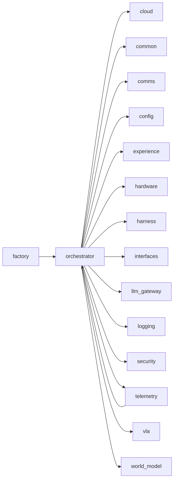
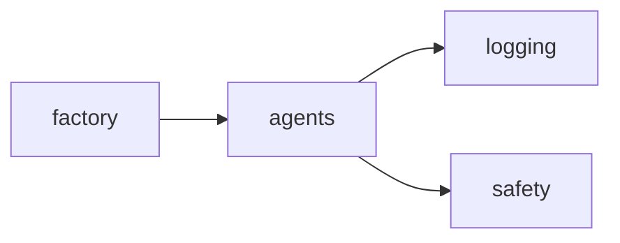
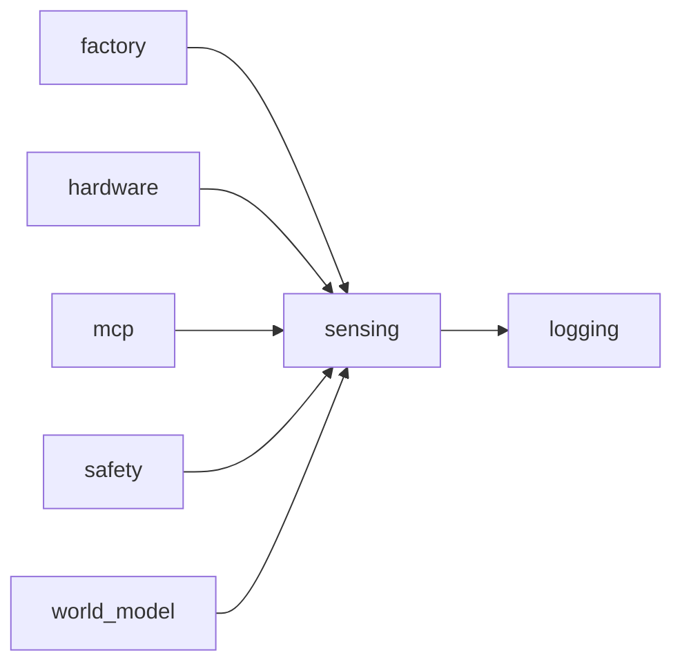
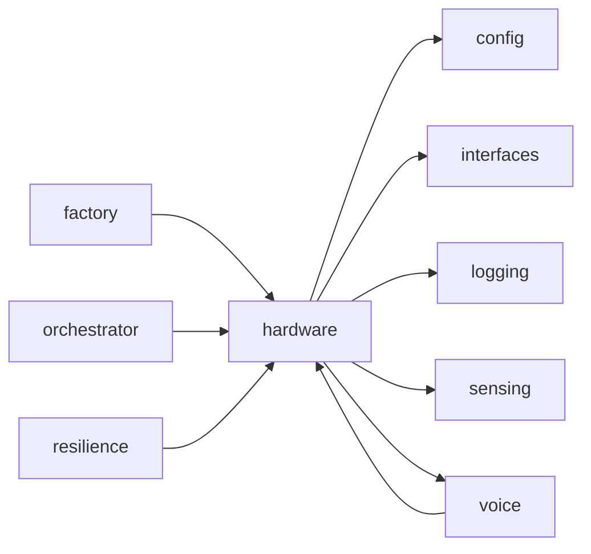
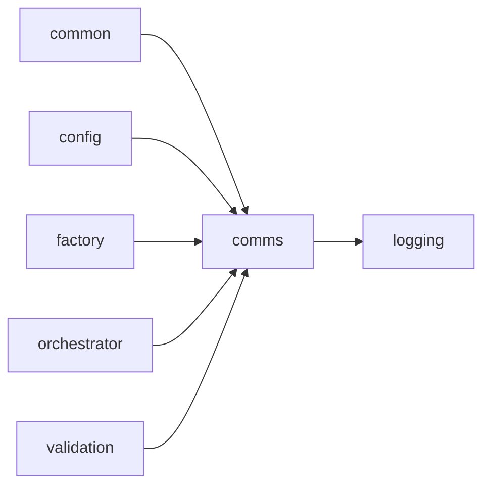
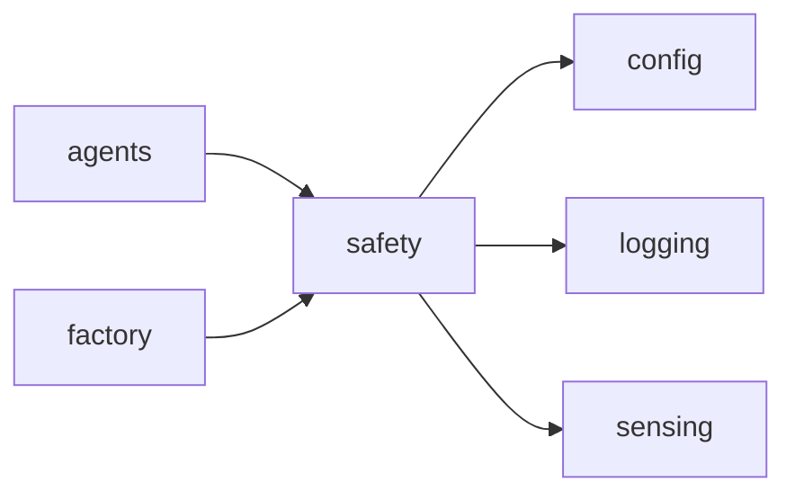
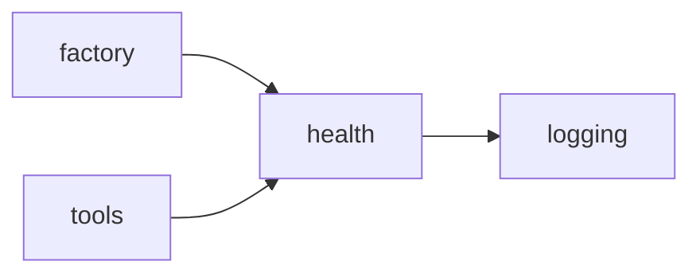
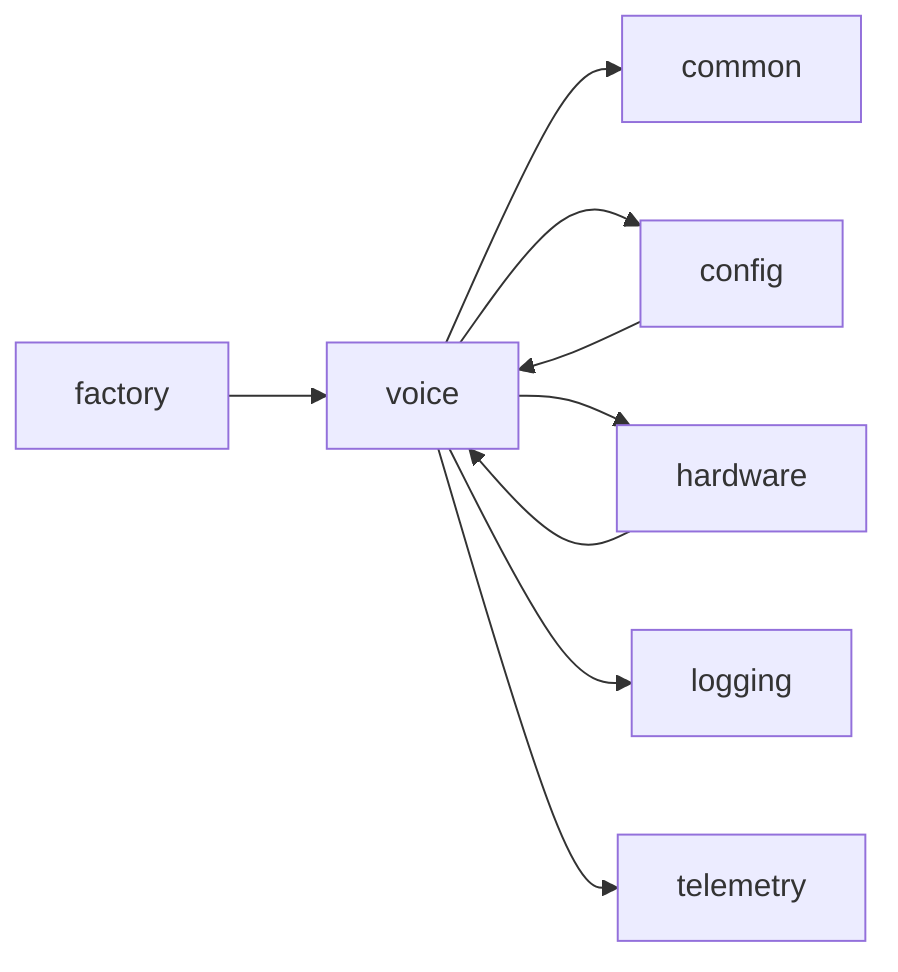

<!-- Generated by scripts/generate_package_map.py — do not edit by hand. Run `make package-map` to regenerate. -->

# Package import map — Runtime loop and embodiment

> **This is an import map, not a dataflow map.** Edges are `ast`-parsed
> `mousedroid.<package>` imports with `TYPE_CHECKING` blocks filtered out. In a
> factory-first DI codebase the import graph and the runtime seams diverge by
> design: `factory` has many outbound package edges and `config` many inbound
> because architectural invariants 1-2 require it, and the live seams run
> through injected Protocols that `ast` cannot see. Read each section as
> "what imports what", not "what talks to what at runtime".

Epic id: `runtime`. Index: [`package-map.md`](../package-map.md).

## `orchestrator`

**Purpose:** Main sense-plan-act orchestrator.

**Imports:** `cloud`, `common`, `comms`, `config`, `experience`, `hardware`, `harness`, `interfaces`, `llm_gateway`, `logging`, `security`, `telemetry`, `vla`, `world_model`

**Dependents:** `factory`, `telemetry`

## `agents`

**Purpose:** MouseDroid navigation agents.

**Imports:** `logging`, `safety`

**Dependents:** `factory`

## `sensing`

**Purpose:** Sensor management and observation bundles.

**Imports:** `logging`

**Dependents:** `factory`, `hardware`, `mcp`, `safety`, `world_model`

## `hardware`

**Purpose:** Hardware driver protocols.

**Imports:** `config`, `interfaces`, `logging`, `sensing`, `voice`

**Dependents:** `factory`, `orchestrator`, `resilience`, `voice`

## `comms`

**Purpose:** ESP32 communication drivers and protocol.

**Imports:** `logging`

**Dependents:** `common`, `config`, `factory`, `orchestrator`, `validation`

## `safety`

**Purpose:** Safety monitoring and Three Laws enforcement.

**Imports:** `config`, `logging`, `sensing`

**Dependents:** `agents`, `factory`

## `health`

**Purpose:** Health monitoring and watchdog for Jetson hardware.

**Imports:** `logging`

**Dependents:** `factory`, `tools`

## `voice`

**Purpose:** Rocky voice engine — personality-driven speech output for the Mouse Droid.

**Imports:** `common`, `config`, `hardware`, `logging`, `telemetry`

**Dependents:** `config`, `factory`, `hardware`

