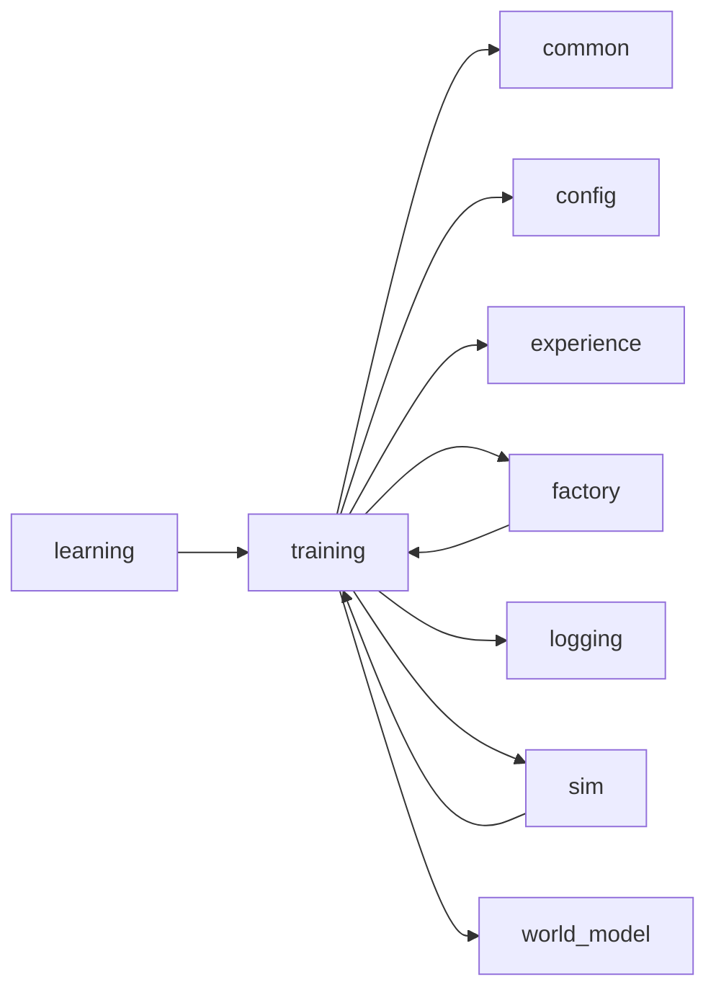
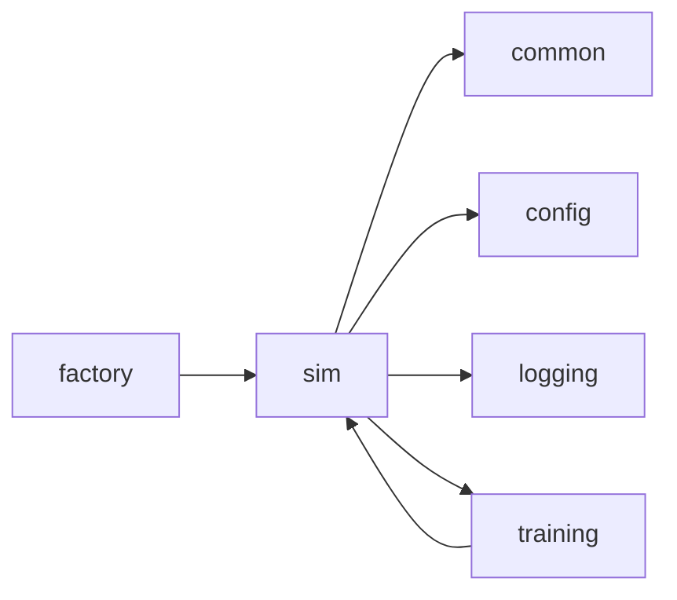
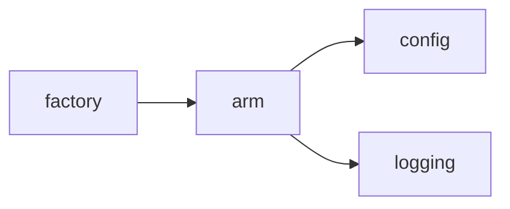
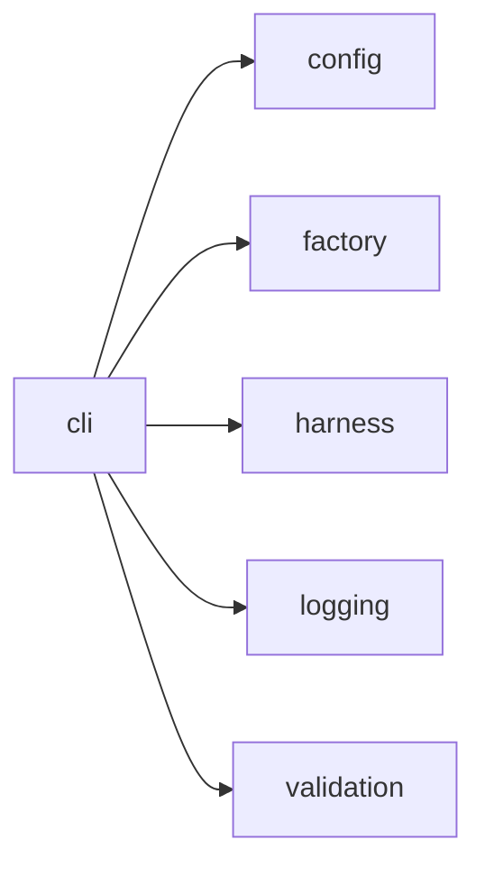
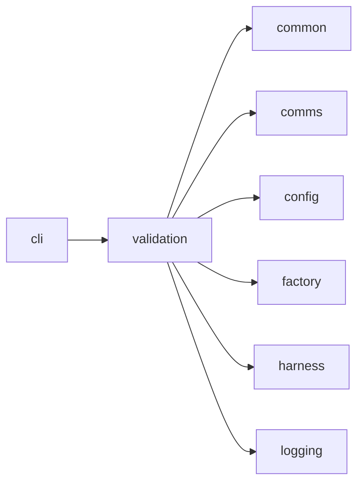
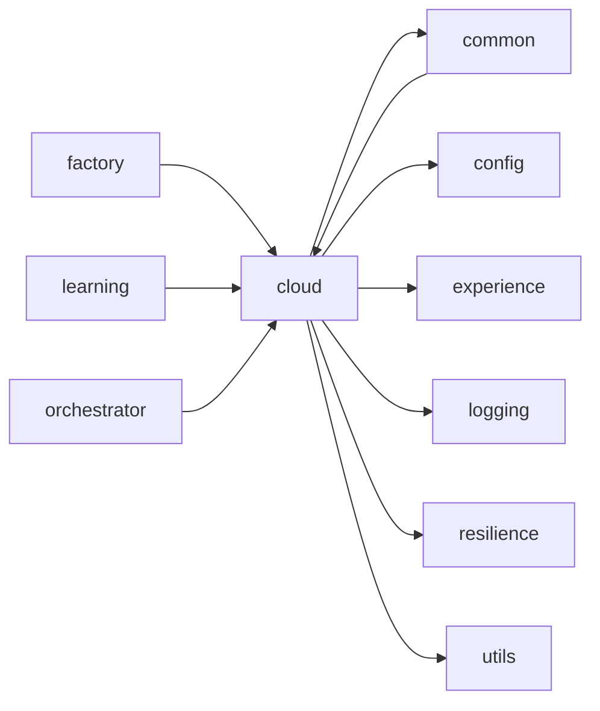

<!-- Generated by scripts/generate_package_map.py — do not edit by hand. Run `make package-map` to regenerate. -->

# Package import map — Training, simulation, and operator surfaces

> **This is an import map, not a dataflow map.** Edges are `ast`-parsed
> `mousedroid.<package>` imports with `TYPE_CHECKING` blocks filtered out. In a
> factory-first DI codebase the import graph and the runtime seams diverge by
> design: `factory` has many outbound package edges and `config` many inbound
> because architectural invariants 1-2 require it, and the live seams run
> through injected Protocols that `ast` cannot see. Read each section as
> "what imports what", not "what talks to what at runtime".

Epic id: `training_and_ops`. Index: [`package-map.md`](../package-map.md).

## `training`

**Purpose:** GPU pre-training pipeline for MouseDroid (ADR-005).

**Imports:** `common`, `config`, `experience`, `factory`, `logging`, `sim`, `world_model`

**Dependents:** `factory`, `learning`, `sim`

## `sim`

**Purpose:** Simulation backends for 4WD rover sim-to-real training.

**Imports:** `common`, `config`, `logging`, `training`

**Dependents:** `factory`, `training`

## `arm`

**Purpose:** Robot arm training platform — Tower of Hanoi to laundry sorting.

**Imports:** `config`, `logging`

**Dependents:** `factory`

## `cli`

**Purpose:** Operator CLI entry points (``python -m mousedroid.cli.<name>``).

**Imports:** `config`, `factory`, `harness`, `logging`, `validation`

**Dependents:** *(none)*

## `validation`

**Purpose:** Validation helpers for Jetson smoke and hardware checks.

**Imports:** `common`, `comms`, `config`, `factory`, `harness`, `logging`

**Dependents:** `cli`

## `cloud`

**Purpose:** GCP Digital Twin cloud integration — telemetry bridge, experience export, and training.

**Imports:** `common`, `config`, `experience`, `logging`, `resilience`, `utils`

**Dependents:** `common`, `factory`, `learning`, `orchestrator`

