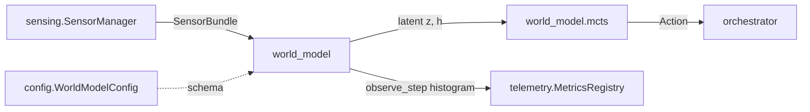

# Design: `mouse-droid-agents-md-directory-docs` (F-053)

Each section is a decision with its rejected alternatives. Nothing here is built yet.

**Governing constraint.** `proposal.md` §2 establishes that an `AGENTS.md` added to this repository
today is inert — a root `CLAUDE.md` exists, so Claude reads `CLAUDE.md` files only. **D-3 therefore
lands before any content is written.** Writing 45 files first and wiring them later would ship, for
some window, exactly the defect this repository keeps finding in its own work.

---

## D-1 — Direction of truth: `AGENTS.md` is the body, `CLAUDE.md` imports it

**Decision.** For every in-scope directory, `AGENTS.md` holds the prose and `CLAUDE.md` — where one
exists — becomes an `@AGENTS.md` import followed by Claude-specific content only. This is the
pattern the Claude Code documentation names for keeping one file every tool shares:

```markdown
@AGENTS.md

## Claude Code
<anything Claude-specific, below the import>
```

**Why this direction and not the reverse.** Thirty-plus agents read `AGENTS.md`; one reads
`CLAUDE.md`. This repository already runs two non-Claude reviewers on its pull requests — Devin
Review and CodeRabbit both posted on #233 — so content that lives only in `CLAUDE.md` is invisible
to the tools reviewing the code. Putting the body in the file more tools read, and importing it into
the one Claude reads, costs one line per directory and loses nothing.

**Rejected: `AGENTS.md` as a second, parallel layer.** Two files per directory describing the same
folder is a drift factory, and this repository has already paid for that: `test_doc_reconciliation_aqa.py`
exists because prose surfaces contradicted the tree, and F-052's own audit found a false
`description=` produced by two changes that never touched the same file. The Claude Code docs make
the cost explicit — "if two rules contradict each other, Claude may pick one arbitrarily."

**Rejected: a symlink.** Ruled out on Windows grounds in `proposal.md` §2, on this repository's own
`test-windows` history rather than on preference. Also, Edit and Write refuse to write through a
symlink, so every future edit would hit a tool refusal.

**Rejected: the `claude-md-and-agents-md` setting.** Not committable — ignored in project and local
settings files. A mechanism each developer must opt into individually is not a repository decision.

## D-2 — Division of labour: purpose versus contract

**Decision.** The two filenames carry different genres, and the split is testable:

| file | answers | changes when |
|---|---|---|
| `AGENTS.md` | *What is this folder for? What flows in and out? Which packages does it touch?* | the architecture changes |
| `CLAUDE.md` | *What must never be weakened here?* — numbered invariants, freeze notices, mock discipline | a contract changes |

The eight existing nested `CLAUDE.md` contracts are **not** rewritten. `src/mousedroid/world_model/CLAUDE.md`'s
numbered invariants, `src/mousedroid/telemetry/CLAUDE.md`'s success-path-recording rule and `src/mousedroid/arm/CLAUDE.md`'s F-008
freeze notice stay exactly where they are and stay authoritative. What moves into `AGENTS.md` is the
folder-purpose description — the genre the request asked for and the genre the 16 `agent.md` files
were gesturing at.

**The rule that keeps them from drifting:** an invariant is stated in exactly one file. `AGENTS.md`
may *point* at a contract ("invariants: see `CLAUDE.md` in this directory") but never restate one.
A restated invariant is a future contradiction, and task 4.3 gates it.

## D-3 — Wire first, then write; and prove the wiring

**Decision.** Phase 1 is the import seam and its test, before a single folder description is
authored.

1. Root `CLAUDE.md` gains `@AGENTS.md` as its first line.
2. Each of the eight directories with a nested `CLAUDE.md` gains `@AGENTS.md` (relative paths
   resolve against the importing file, so the bare name is correct).
3. `tests/regression/test_f053_aqa.py` asserts the invariant that matters: **for every directory
   containing an `AGENTS.md`, if that directory also contains a `CLAUDE.md`, the `CLAUDE.md` imports
   it.** A directory whose `AGENTS.md` nothing imports and nothing reads fails.

That last test is the whole point of this design. It is the difference between documentation and
loadable documentation, and it is checkable by reading two files.

**Import-parsing detail that the test must respect:** `@path` parsing skips code spans and fenced
blocks, so a backticked `` `@AGENTS.md` `` is *not* an import. The test must look for the bare form,
or it will pass on a mention. This is the same trap that made an earlier ordering assertion in this
repository match a comment instead of the code it meant to pin.

**Precondition, stated not assumed:** native reading needs Claude Code v2.1.277+. The import path
works regardless of version, which is a second reason to prefer it — it does not put a floor under
the toolchain.

## D-4 — Two surfaces, split by purpose: ~9 instruction files, one generated map

**Decision, revised after the reconciliation audit.** The first draft of this section said "one
`AGENTS.md` per top-level package — 45 files". Four verified constraints refuse that, and none of
them is a matter of taste:

1. `pyproject.toml:244` excludes `**/CLAUDE.md` and `**/agent.md` from the wheel but **not**
   `AGENTS.md`, so 40 new files under `src/mousedroid/` would ship to PyPI. My plan would have
   introduced that.
2. `docs/planning/TECH_DEBT_REMEDIATION_PLAN.md` has **already ruled** on this genre: `agent.md` is
   a persona stub restating `CLAUDE.md` and `AGENTS.md`, flagged as drift and never resolved, action
   **Delete/merge**. It also records that invariants already live in four places. Adding a fifth
   ungated surface contradicts a decision this repository has written down.
3. The root `AGENTS.md` is 23,125 bytes against `doc_hygiene.py`'s 20,000-byte budget, and widening
   that gate is already deferred because it would land red.
4. `src/mousedroid/agents/` is scanned by the skill loader (`harness_mcp.py:394`), which globs
   `*.md` — so an `AGENTS.md` there interacts with skill registration.

**So the work splits by what each surface is for:**

| surface | scope | content | cost |
|---|---|---|---|
| `AGENTS.md` | the 8 directories that already hold a `CLAUDE.md`, plus `tests/` — **9 files** | agent instructions + one diagram, ≤40 lines | loaded per package on Read |
| `docs/architecture/package-map.md` | **all 41 packages** | folder function, inputs/outputs, dependents — **generated from the import graph** | zero agent tokens |

The nine are not an arbitrary subset: they are exactly the directories where a sibling `AGENTS.md`
would otherwise be *shadowed* by their `CLAUDE.md` (D-3), which makes them the only places the import
seam is load-bearing. Every other package inherits the root file through nested discovery.

**Why generated, for the 41.** A hand-written folder description rots — the 16 `agent.md` files are
the proof, and their `Key Files` lists are the part that rotted. A map derived from
`ast`-parsed imports states what each package *actually* depends on and who depends on it, cannot
drift from the tree, and regenerates in CI. It also answers the request for every folder, which the
nine-file version does not.

**A gate either way.** `test_f053_aqa.py` pins the nine as an enumerated frozenset following the
`_GATED_FACTORY_FILES` precedent (`tests/regression/test_f042_aqa.py:14-20`), never a directory
prefix that silently absorbs future packages, and asserts the generated map is current by
regenerating it and diffing.

## D-5 — Mermaid: one diagram per folder, scoped to its seam, parse-gated

**Decision.** Every `AGENTS.md` carries exactly one `flowchart` showing that folder's **dataflow
role**: what enters, what leaves, and which packages it speaks to through Protocols. Not a file
tree, not a class diagram.



**Why this shape.** It is stable against the churn that made the existing `Key Files` lists rot: it
changes when a Protocol boundary moves, which is exactly when the description should change. It also
mirrors what `docs/architecture/c4-overview.md` asserts one level up, so the two can be
cross-checked rather than drifting independently.

**Two gates, because an unrendered diagram is a lie with syntax highlighting:**

1. Every fence parses. A rendering check runs over each diagram; a fence that does not render fails.
2. Every node label naming a repo path or symbol resolves. This extends the rule
   `tools/validate_skill_commands.py` already applies to skills.

**Rejected: diagrams only where they help.** Tempting, and ordinarily right — but "where they help"
is unfalsifiable, and the request asked for mermaid. One diagram per file with a fixed shape and two
gates is checkable; a judgement call per folder is not.

## D-6 — Subagents: fan out the authoring, and keep a skill

**Decision.** 45 folder descriptions is a genuine fan-out, and CLAUDE.md I-6 directs delegation.
The split:

| agent | brief |
|---|---|
| `doc-reconciler` | author a batch of `AGENTS.md`, each written from the folder's actual imports and Protocols |
| `peer-reviewer` | adversarial pass: find one false statement per file, or report the file clean with evidence |
| `config-guardian` | no hardcoded thresholds or paths restated from schema into prose |
| `test-engineer` | the three gates of D-3/D-4/D-5, and the F-053 regression pair |

**Briefs must be disprove-shaped, not confirm-shaped.** "Verify this description is accurate" returns
"accurate". "Find a statement in this file the tree contradicts" returns findings. Every defect the
four-agent pass found on the last change came from the second form.

**A skill, because this recurs.** `.claude/skills/agents-md-authoring/SKILL.md` captures the
procedure: derive purpose from imports and Protocols, never from filenames; one diagram of the
stated shape; point at contracts, never restate them; run the three gates. The next package added to
this repository needs the same procedure, and `tests/regression/test_claude_workforce_aqa.py:290`
will require the skill to be indexed in `SKILLS.md`.

**Caveat worth writing down:** a subagent configured to skip project instructions skips `AGENTS.md`
and `CLAUDE.md` too. So an authoring subagent must be *handed* the relevant contract in its brief
rather than assumed to have loaded it.

## D-7 — Where the persona content goes

**Decision.** The 16 `agent.md` files are persona prompts — *"You are the **World Model
Architect**"*. That content does not belong in a folder-purpose document, and it does not belong in
`AGENTS.md`, whose genre is build/test/convention guidance.

It belongs in `.claude/agents/`, which is where this repository already keeps 7 specialist personas
under a validated contract: `max_lines: 60`, required frontmatter `name`/`description`/`tools`, bare
tool names only, enforced by `tests/regression/test_claude_workforce_aqa.py:182-257`.

So each `agent.md` is **split, not deleted**:

- the folder-purpose half → that directory's `AGENTS.md`
- the persona half → evaluated against `.claude/agents/`, and promoted to a real agent definition
  only where it earns one. Fourteen near-identical "you are the X architect" stubs do not each
  warrant a subagent; most of their content is already covered by the existing seven.

**Rejected: delete them outright.** Three files are referenced by tests
(`test_doc_reconciliation_aqa.py:46`, `test_ci_gate_wiring_aqa.py:825`,
`src/mousedroid/skills/loaders.py:7,103`); a blind delete breaks a green suite and discards the one thing those
stubs do carry, which is a statement of intent per subsystem.

## D-9 — Token budget, and the delete test as a gate

**Decision.** Every `AGENTS.md` is capped at **40 lines including its diagram**, and every line must
pass the delete test: *would a competent developer who had never seen this repo get this wrong?*

This is a direct response to the evidence in `proposal.md` §7 — these files cost context on every
invocation, and the measured effect of adding them is small or negative. A 40-line cap against the
~150 the guidance suggests leaves room for the diagram while keeping the whole 45-file layer smaller
than the single root `AGENTS.md` is today.

**The gate, not the guideline.** `test_f053_aqa.py` asserts the line cap, and task 3.3 forbids
restating a convention the root already states. The 16 existing `agent.md` files are the worked
example of the failure: every one repeats "no hardcoded values", "structlog not print()",
"Protocol-based DI" — all three already in the root `CLAUDE.md`, and the second already enforced by
`ruff` `T20`. Fourteen copies of a rule that a linter enforces is pure token cost with negative
information value.

**What each file may contain, then:** what this folder is for, its inputs and outputs, the packages
it talks to, a pointer to its contract. Nothing a reader could infer from the root instructions or
from the linter.

**Rejected: no cap, trust review.** The existing 403-line root `AGENTS.md` and the 16 stub files are
both what happens without a cap — one too long to be read carefully, the rest too thin to be worth
reading. A number a test can check is the only version of this that holds.

## D-10 — The wheel, and three defects this change must not introduce

**Decision.** Four one-line changes land in Phase 1, before any content, because each is a way this
change could silently do harm:

1. **`pyproject.toml:244` gains `"**/AGENTS.md"`.** Without it the distribution ships internal agent
   instructions to PyPI. The existing comment names the exact harm for the other two patterns; this
   is the same harm with a filename the list predates. A test asserts all three patterns are present,
   so the next agent-facing filename cannot slip through either.
2. **`src/mousedroid/agents/` is excluded from the `AGENTS.md` set**, or its file is verified to carry
   no YAML front matter. The skill loader globs `*.md` there; a front-matter-bearing `AGENTS.md`
   becomes a registered skill, which is not what anyone wants from a folder description.
3. **The root `AGENTS.md` is not enlarged.** It is already 1.16× over the 20 KB budget that
   `doc_hygiene.py` applies to `NEXT_STEPS.md` today, and widening that gate to cover more files is
   deferred precisely because files like this one would fail it. This change may shrink it; it may not
   grow it.
4. **The prior decision is honoured or superseded in writing.** `TECH_DEBT_REMEDIATION_PLAN.md` says
   delete/merge `agent.md`. Phase 5 executes that. If any `agent.md` is kept, the reason goes in that
   plan's table, not only here — a decision reversed in a second document is how the four-way
   invariant split happened in the first place.

## D-8 — What this deliberately does not do

- **No file below the first package level.** D-4.
- **No rewrite of the eight nested `CLAUDE.md` contracts.** D-2.
- **No `.claude/rules/` migration.** Path-scoped rules are an adjacent mechanism that loads alongside
  `AGENTS.md` and would suit some cross-cutting content, but mixing a third surface into this change
  triples the review burden for no gain. Recorded as a follow-up, not smuggled in.
- **No toolchain floor.** The import path works on any version; native `AGENTS.md` reading needs
  v2.1.277+ and this change does not require it.
- **No claim that the root `AGENTS.md` is correct.** It is 403 lines and predates this work; this
  change reconciles it against the root `CLAUDE.md` and fixes contradictions found, but a full audit
  of it is its own change.
